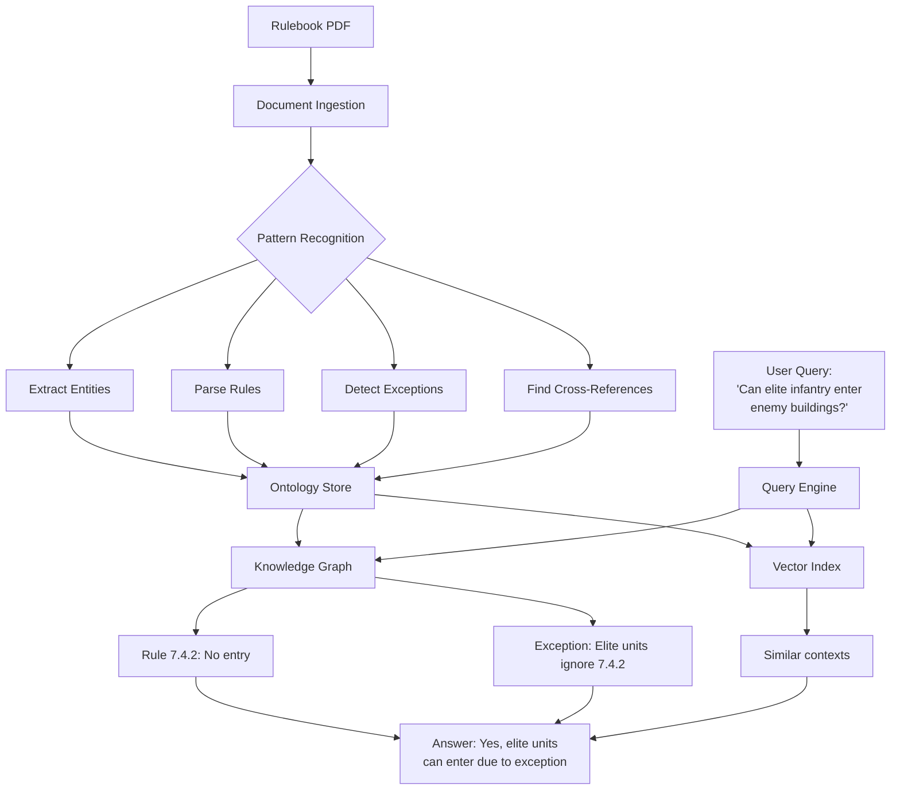
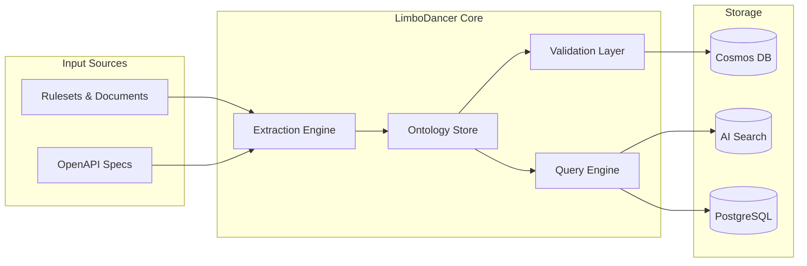
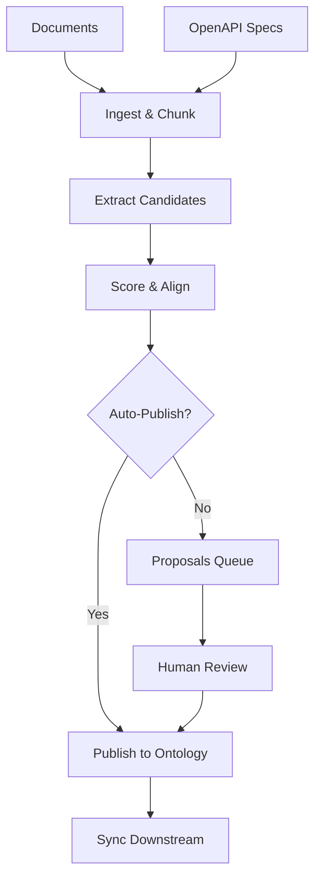

# **LimboDancer.MCP System Design**

## Table of Contents
1. [Overview and Purpose](#overview-and-purpose)
2. [Architecture](#architecture)
3. [Core Ontology Components](#core-ontology-components)
4. [Extraction and Query Capabilities](#extraction-and-query-capabilities)
5. [Ontology Design and Implementation](#ontology-design-and-implementation)
6. [Core Implementation Components](#core-implementation-components)
7. [Development Setup and Tooling](#development-setup-and-tooling)
8. [Use Cases and Benefits](#use-cases-and-benefits)
9. [Roadmap and Milestones](#roadmap-and-milestones)
10. [Source Code Structure](#source-code-structure)

---

## Overview and Purpose

LimboDancer.MCP is an **ontology-first** Model Context Protocol (MCP) server built on **.NET 9** and **Azure**. As a full-featured MCP implementation, it provides tools for session management, memory storage, vector search, and knowledge graph operations. What distinguishes LimboDancer is its deep integration with formal ontologies - every tool, memory item, and graph entity is grounded in a typed semantic model. This enables the system to extract structured knowledge from complex documents (for instance rulesets, rulebooks, govt regulations or legal documents), maintain consistency across data stores, and provide contextually-aware responses to any MCP-compatible AI assistant, such as Claude and ChatGPT for instance.

### Example: Processing a Strategy Game Rulebook

When a user submits a board game rulebook (e.g., "Advanced Squad Leader"), LimboDancer:



1. **Extracts Ontology** - Identifies game entities (units, terrain, weapons), their properties (movement points, firepower), and relationships (line-of-sight rules, stacking limits)

2. **Captures Rule Structure** - Parses numbered rules (e.g., "7.4.2 Infantry may not enter building hexes occupied by enemy units"), creating queryable nodes with cross-references

3. **Handles Exceptions** - Detects special cases ("EXC: Elite units ignore rule 7.4.2") and links them to base rules

4. **Builds Knowledge Graph** - Creates a navigable structure where rules, exceptions, examples, and game states are interconnected

**Benefits**: Instead of searching through a 200-page PDF, users can ask contextual questions like "Can my elite infantry unit enter a building with enemies?" and receive accurate answers that consider all applicable rules, exceptions, and current game state. The system validates rule consistency and flags conflicts during ingestion.

---

## Architecture

### High-Level System Flow



### Multi-Tenant Scope

Every operation is scoped by hierarchical partition keys:
- **Tenant** - Organization boundary
- **Package** - Module grouping (e.g., "rules", "core")
- **Channel** - Version stream (e.g., "current", "v1.0.0")

---

## Core Ontology Components

1. **Entities** - Objects within the rules (units, tokens, game pieces, domain concepts)
2. **Properties** - Attributes and values (stats, costs, capabilities, with owner/range/cardinality)
3. **Relations** - Typed connections between elements (prerequisites, dependencies, typed edges)
4. **Enums** - Categorical values (states, types, phases, closed value sets)
5. **Shapes** - SHACL-like validation templates for data structures
6. **Exceptions** - Rule modifications and special cases
7. **Conditions** - Context-dependent rule activation
8. **References** - Cross-rule linkages and citations
9. **Examples** - Clarifying instances linked to rules
10. **Aliases** - Canonical names + synonyms for robust matching

---

## Extraction and Query Capabilities

### Extraction Process

The extraction engine identifies patterns in structured documents:
- Section headers become entity hierarchies
- Numbered rules become queryable nodes
- Cross-references (e.g., "see 10.4") create bidirectional links
- Exception markers (EXC:, NOTE:) create modifier nodes
- Temporal sequences establish phase-based containers
- Conditional phrases generate prerequisite trees

### Query Capabilities

**Structural Queries:**
- Entity/property lookups
- Relationship traversal
- Exception resolution
- Reference validation

**Contextual Queries:**
- "What rules apply in situation X?"
- "What exceptions modify rule Y?"
- "What's the sequence for action Z?"
- "What are the prerequisites for W?"

### Validation Layer

- Reference integrity checking
- Circular dependency detection
- Terminology consistency
- Completeness verification
- Conflict identification between rules

---

## Ontology Design and Implementation

### MCP Tool Interface

The system provides a set of MCP tools for ontology extraction, query, and validation operations, implemented as .NET classes with JSON schema definitions.

### Key Features

1. **Dynamic Node Creation** - Discovers node types from document patterns
2. **Relationship Mining** - Extracts connections from natural language
3. **State Management** - Tracks conditional rule activation
4. **Example Integration** - Links examples to their parent rules
5. **Multi-format Support** - Handles various rulebook structures

### Generation Pipeline



### Governance

- **Approval Gates**: New classes require human review
- **Constraints**: SHACL-style validators enforce rules
- **Provenance**: Every artifact tracks source documents
- **Versioning**: Channels enable controlled evolution

### Export Formats

- **JSON-LD**: Native format with @context
- **Turtle/RDF**: For external reasoning systems
- **Graph Schema**: Vertex/edge manifest for Gremlin

---

## Core Implementation Components

### 1. Persistence Baseline (EF Core + Postgres)

**Files**: `src/LimboDancer.MCP.Storage/{ChatDbContext.cs, Entities.cs}`, migrations

**Key Entities**:
```csharp
[Table("sessions")]
public class Session
{
    [Key] public Guid Id { get; set; }
    [MaxLength(256)] public string Title { get; set; } = string.Empty;
    public DateTimeOffset CreatedAt { get; set; } = DateTimeOffset.UtcNow;
}

[Table("messages")]
public class Message
{
    [Key] public long Id { get; set; }
    public Guid SessionId { get; set; }
    [MaxLength(32)] public string Role { get; set; } = "user";
    public string Content { get; set; } = string.Empty;
    public DateTimeOffset Ts { get; set; } = DateTimeOffset.UtcNow;
}
```

### 2. Vector Index for Azure AI Search (Hybrid)

**Files**: `src/LimboDancer.MCP.Vector.AzureSearch/{SearchIndexBuilder.cs, VectorStore.cs}`

**Features**:
- Hybrid search (BM25 + vector)
- Ontology filters (class, uri, tags)
- Multi-tenant support via tenant/package/channel fields

### 3. Cosmos Gremlin Graph Scaffold

**Files**: `src/LimboDancer.MCP.Graph.CosmosGremlin/{GremlinClientFactory.cs, GraphStore.cs, Preconditions.cs, Effects.cs}`

**Capabilities**:
- Upsert vertices/edges for core classes
- Precondition evaluation helpers
- Effect commit mechanisms
- Tenant-prefixed IDs or property guards

### 4. MCP Tool Surface

**Tools Implemented**:
- `history.get` / `history.append` - Session and message management
- `memory.search` - Vector retrieval with ontology filters
- `graph.query` - Knowledge graph inspection

Each tool's `input_schema` embeds JSON-LD `@context` for ontology-bound fields.

### 5. Planner with Precondition Gate (Not Yet Implemented)

**Planned Files**: `src/LimboDancer.MCP.Core/Planning/{PlanStep.cs, Planner.cs}`

**Planned Design**:
- Multi-step tool orchestration
- Precondition validation against graph state
- Effect management after tool execution
- Typed ReAct implementation for reasoning
- Failure handling and retry strategies

**Note**: This component is needed for intelligent multi-tool scenarios but is not yet implemented.

### 6. HTTP Transport with SSE Events

**Files**: `src/LimboDancer.MCP.McpServer.Http/{AuthExtensions.cs, HttpTransport.cs, ChatStreamEndpoint.cs}`

**Features**:
- Entra ID (Azure AD) JWT authentication
- Server-Sent Events at `/mcp/events`
- Chat streaming endpoints
- Role-based policies (Reader/Operator)

### 7. Operator Console (Blazor Server)

**Pages**:
- Sessions: View/tag sessions and messages
- Memory: Search vector store, manual ingestion
- Graph: Explore KG vertices and edges
- Ingestion: Monitor ingestion pipelines
- Live: SSE event tail and health monitoring

### 8. Developer CLI

**Commands**:
```bash
limbodancer db migrate                  # Run EF migrations
limbodancer vector init --tenant acme   # Initialize AI Search index
limbodancer mem add --file doc.md       # Add to vector store
limbodancer mem search --query "..."    # Search vectors
limbodancer kg ping                     # Test Gremlin connectivity
limbodancer serve --stdio               # Run MCP server
```

---

## Development Setup and Tooling

### Prerequisites
- .NET 9 SDK
- Docker (for local Postgres)
- Azure subscription with:
  - Azure AI Search (Standard or above)
  - Azure OpenAI (for embeddings)
  - Azure Cosmos DB (Gremlin) or Gremlin Emulator

### Local Development Setup

1. **PostgreSQL**:
```bash
docker run --name pg-limbo -e POSTGRES_PASSWORD=postgres -p 5432:5432 -d postgres:16
```

2. **Configuration** (`appsettings.Development.json`):
```json
{
  "Persistence": {
    "ConnectionString": "Host=localhost;Port=5432;Database=limbodancer_dev;Username=postgres;Password=postgres"
  },
  "Search": {
    "Endpoint": "https://<search>.search.windows.net",
    "ApiKey": "<key>",
    "Index": "ldm-memory"
  },
  "OpenAI": {
    "Endpoint": "https://<aoai>.openai.azure.com",
    "ApiKey": "<key>",
    "EmbeddingModel": "text-embedding-3-large"
  },
  "Gremlin": {
    "Host": "<acct>.gremlin.cosmos.azure.com",
    "Port": "443",
    "Database": "ldm",
    "Graph": "kg",
    "Key": "<primary-key>"
  }
}
```

### Bootstrap Script

A PowerShell script (`scripts\bootstrap.ps1`) creates the complete solution structure:
- Creates all projects with proper references
- Adds required NuGet packages
- Generates initial file stubs
- Sets up project dependencies

---

## Use Cases and Benefits

### Use Cases

- **Complex wargame rules** (ASL, GMT games)
- **RPG systems** (D&D, Pathfinder)
- **Board game manuals**
- **Legal/regulatory documents**
- **Technical specifications**
- **API documentation**
- **Business process definitions**

### Benefits

- **Dynamic Knowledge** - Transforms static rules into queryable, dynamic knowledge graphs
- **Intelligent Assistance** - Enables context-aware rule application and assistance
- **Consistency Validation** - Ensures rule consistency across complex systems
- **Conditional Logic Support** - Handles complex conditional and exception-based logic
- **Contextual Application** - Provides rule guidance based on current game/system state
- **Cross-Reference Resolution** - Automatically resolves and validates rule references
- **Version Control** - Manages rule evolution through channel-based versioning

---

## Roadmap and Milestones

### Guiding Principles
- Built in **.NET 9**
- Hosted in **Azure Container Apps**
- **MCP runtime** = stateless headless worker/web API
- **Blazor Server UI** = operator/console only (separate container, sticky sessions)
- **Ontology is first-class**: every tool, memory, and KG entry tied to ontology terms
- **Incremental milestones** with acceptance gates

### Milestones

#### Alpha Phase (Milestones 1-3)
- ✅ **Milestone 1 – MCP Skeleton**: Scaffold solution, implement MCP server with stdio + noop tool
- ✅ **Milestone 2 – Persistence**: EF Core + PostgreSQL, basic history persistence
- ✅ **Milestone 3 – Embeddings and Vector Store**: Azure OpenAI integration, hybrid retrieval

#### Beta Phase (Milestones 4-9)
- ✅ **Milestone 4 – Ontology v1**: JSON-LD context, base classes, tool schema mapping
- **Milestone 4.5 – Rule Extraction Engine**: Pattern recognition, exception detection, cross-reference resolution
- **Milestone 4.6 – Advanced Ontology Features**: Conditional activation, example integration, validation framework
- 🔲 **Milestone 5 – Planner + Precondition/Effect Checks**: Typed ReAct loop, KG validation (NOT STARTED)
- ✅ **Milestone 6 – Knowledge Graph Integration**: Cosmos DB Gremlin, context expansion
- ✅ **Milestone 7 – Ingestion Pipeline**: Event-driven document processing
- ✅ **Milestone 8 – HTTP Transport**: Streamable HTTP endpoints, Entra ID auth
- **Milestone 9 – Hardening and Unit Tests**: Testing and debugging
- **Milestone 9.5 – Ontology Query & Validation**: Contextual queries, consistency checking, exception application

#### 1.0 Release (Milestones 10-13)
- **Milestone 10 – Blazor Server Operator Console**: Admin dashboards
- **Milestone 11 – Multi-tenant hardening**: Proven isolation across all components
- **Milestone 12 – Observability & Governance**: OTEL traces, SHACL validators
- **Milestone 13 – Packaging & 1.0 Release**: Containers, CI/CD, documentation

### Implementation Status

#### Complete
- Multi-tenant Cosmos storage with HPK
- In-memory OntologyStore with indexes
- JSON-LD/RDF export services
- Tool schema binding framework
- Basic validators and governance
- Core MCP server implementation
- PostgreSQL persistence layer
- Azure AI Search integration
- HTTP Transport with SSE
- Authentication via Entra ID

#### In Progress
- Ontology Generator for automated extraction
- Change Feed synchronization
- Operator Console review UI
- Gremlin graph implementation

#### Not Started
- Planner with precondition/effect checks
- Rule extraction engine
- Advanced ontology query features

#### Future
- OWL reasoning integration
- Cross-ontology mapping
- Advanced governance rules
- Production hardening
- Comprehensive test coverage

---

## Source Code Structure

### Project Dependencies (.csproj files)

**LimboDancer.MCP.Core** (Base library):
- Target: .NET 9.0
- No external dependencies (contracts only)

**LimboDancer.MCP.Storage**:
- Dependencies: 
  - Microsoft.EntityFrameworkCore 9.0.0
  - Npgsql.EntityFrameworkCore.PostgreSQL 9.0.0
- References: Core

**LimboDancer.MCP.Vector.AzureSearch**:
- Dependencies: Azure.Search.Documents 11.6.0
- References: Core

**LimboDancer.MCP.Graph.CosmosGremlin**:
- Dependencies: Gremlin.Net 3.7.2
- References: Core

**LimboDancer.MCP.McpServer**:
- Dependencies:
  - ModelContextProtocol 0.3.0-preview.3
  - All data layer packages
  - Serilog.AspNetCore 8.0.1
  - OpenTelemetry packages
- References: All internal projects

**LimboDancer.MCP.Cli**:
- Dependencies: System.CommandLine 2.0.0-beta4
- References: All data layer projects

**LimboDancer.MCP.BlazorConsole**:
- Target: ASP.NET Core 9.0
- References: All data layer projects

### Key Implementation Files

**Ontology Implementation**:
- `OntologyStore.cs` - In-memory ontology cache with indexes
- `CosmosOntologyRepo.cs` - Cosmos DB persistence with HPK
- `JsonLdExportService.cs` - JSON-LD export functionality

**MCP Tools**:
- `HistoryGetTool.cs` / `HistoryAppendTool.cs` - Session management
- `MemorySearchTool.cs` - Vector search integration
- `GraphQueryTool.cs` - Knowledge graph queries

**Infrastructure**:
- `SearchIndexBuilder.cs` - Azure AI Search index management
- `GremlinClientFactory.cs` - Cosmos Gremlin connection pooling
- `AuthExtensions.cs` - Entra ID authentication setup
- `HttpTransport.cs` - Server-Sent Events implementation

---

## Implementation Notes

### Security Considerations
- All operations require tenant scope
- Cross-tenant queries explicitly forbidden
- JWT authentication via Entra ID
- Role-based access control (Reader/Operator)

### Performance Optimizations
- In-memory ontology caching
- Connection pooling for Gremlin
- Hybrid search (vector + BM25)
- Session consistency for Cosmos DB

### Failure Modes and Resilience
- Circuit breakers for LLM throttling
- Graceful degradation to BM25 search
- Retry with backoff for Cosmos 429s
- Dead letter queue for Service Bus

### Future Considerations
- .NET Aspire adoption for local orchestration
- Graph engine evaluation (Cosmos Gremlin vs Neo4j)
- RDF/OWL reasoning integration
- Advanced planner (DAG/graph executor)

---

*This document represents the complete LimboDancer.MCP system design, combining architectural vision with concrete implementation details. The source code serves as the authoritative reference for all implementation specifics.*