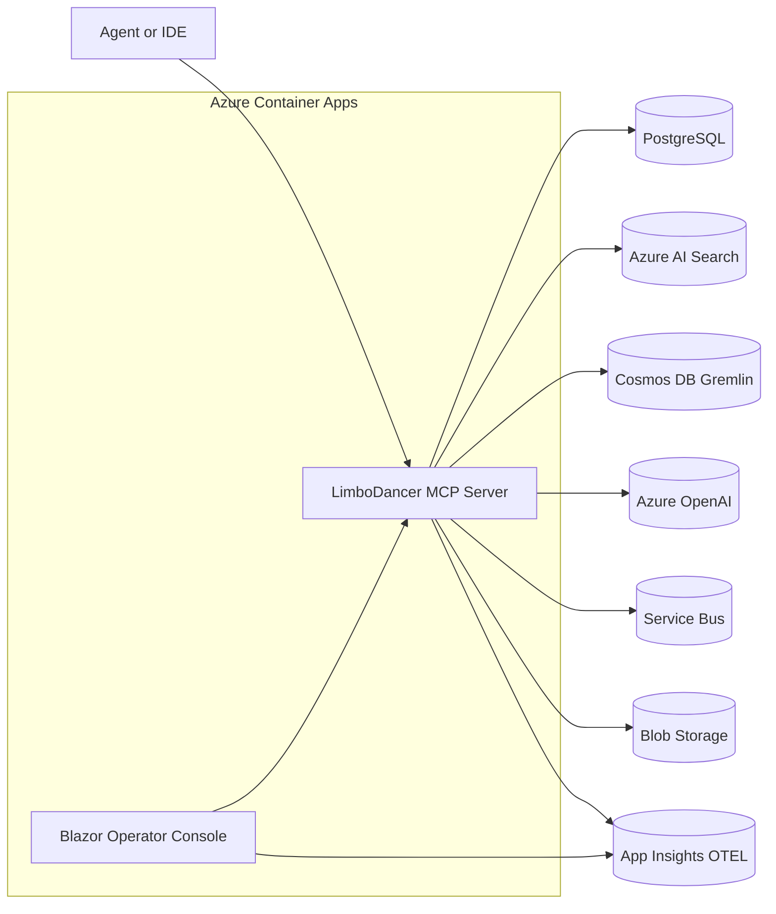
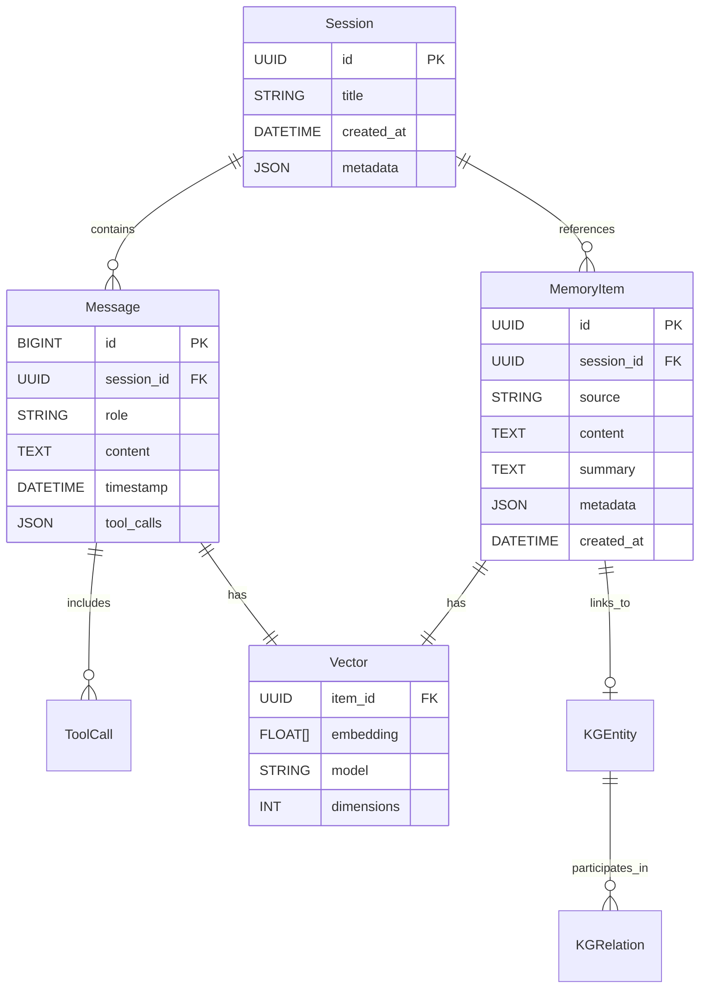
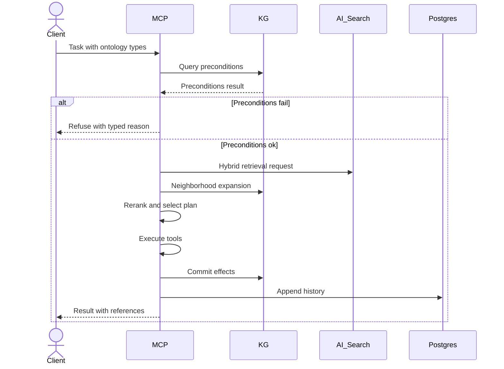
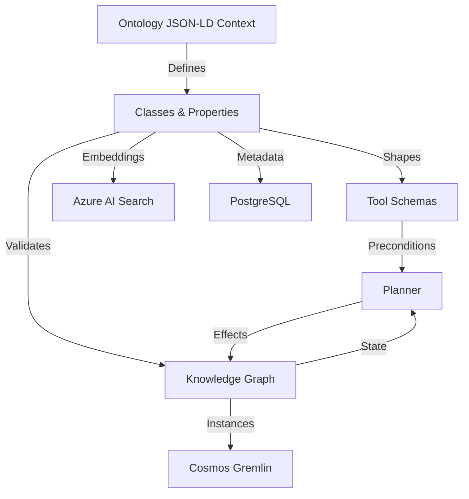
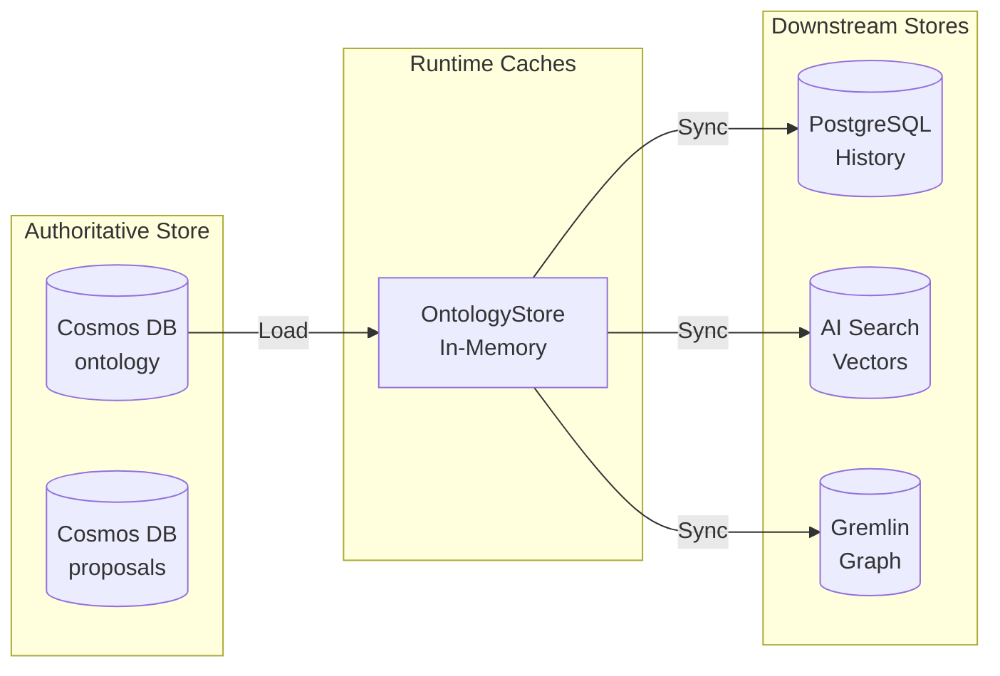
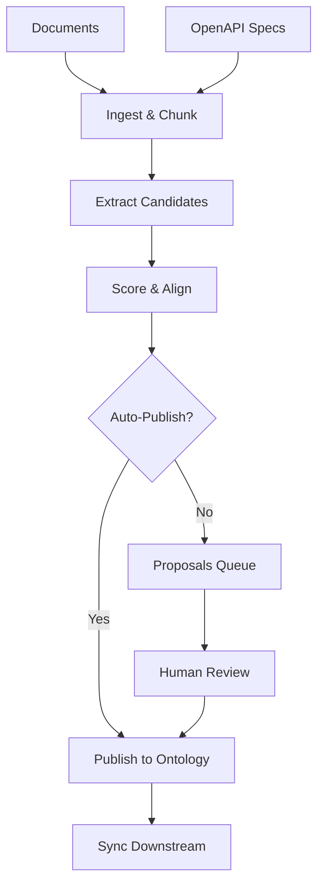

# **LimboDancer.MCP System Design**

## Table of Contents
1. [Overview and Purpose](#overview-and-purpose)
2. [Architecture](#architecture)
3. [Ontology Design and Implementation](#ontology-design-and-implementation)
4. [Core Implementation Components](#core-implementation-components)
5. [Development Setup and Tooling](#development-setup-and-tooling)
6. [Roadmap and Milestones](#roadmap-and-milestones)
7. [Source Code Structure](#source-code-structure)

---

## Overview and Purpose

LimboDancer.MCP is a **.NET 9** reimplementation of Cipher's memory layer and Model Context Protocol (MCP) server, adapted to **Azure-first architecture** with strong **ontology integration**.

It provides:
* **MCP runtime**: headless worker/web API exposing tools over stdio and HTTP
* **Persistence and memory**: relational history, vector store, and knowledge graph
* **Ontology-driven planning**: typed schemas, preconditions, and effects
* **Operator UI**: Blazor Server console for inspection and governance

### Platform Targets
* **Language & Runtime**: .NET 9
* **Hosting**: Azure Container Apps (MCP runtime + Blazor console as separate containers)
* **Data Stores**:
  * PostgreSQL Flexible Server – sessions, history, metadata
  * Azure AI Search – vector and BM25 hybrid search
  * Cosmos DB Gremlin API – ontology-backed knowledge graph
  * Azure Blob Storage – artifacts, summaries, audit bundles
* **LLMs**: Azure OpenAI (chat and embeddings) via Microsoft.Extensions.AI
* **Events**: Azure Service Bus for ingestion and workflow signals
* **Observability**: Application Insights with OpenTelemetry

### High-Level Architecture



---

## Architecture

### Core Projects Structure

```
/src
  LimboDancer.MCP.Core          // contracts, DTOs, result types
  LimboDancer.MCP.Storage       // EF Core models + migrations
  LimboDancer.MCP.Vector.AzureSearch // Azure AI Search integration
  LimboDancer.MCP.Graph.CosmosGremlin // Cosmos Gremlin graph integration
  LimboDancer.MCP.Llm           // Azure OpenAI adapters
  LimboDancer.MCP.Ontology      // ontology context, schemas, validators
  LimboDancer.MCP.McpServer     // MCP runtime (stdio + HTTP)
  LimboDancer.MCP.Cli           // CLI for dev and operators
  LimboDancer.MCP.BlazorConsole // Operator/admin UI
```

### Data Model



### Multi-Tenant Architecture

All requests carry an explicit **ontology scope** `{ tenant, package, channel }`. The planner, precondition checks, retrieval, and effect commits must propagate this scope end-to-end:

* **Planner & tools:** every step includes `{tenant,package,channel}` when invoking tools
* **Retrieval:** AI Search queries filter on `tenant` (and optionally `package`,`channel`)
* **Knowledge Graph:** all traversals and upserts are scoped to the same tenant (partition or property guard)
* **History:** session and message reads/writes are scoped by tenant (service-level guard; column optional)
* **Observability:** logs/traces tag the scope for isolation and triage

### Action Lifecycle



---

## Ontology Design and Implementation

LimboDancer.MCP uses ontology as its **semantic backbone**, providing a formal vocabulary that ensures AI agents, tools, and services interpret and reason about information consistently. The ontology layer enables typed planning, reasoning, validation, and governance across the distributed system.

### Core Architecture



### Key Distinctions

* **Ontology** = Schema and rules (classes, properties, constraints)  
* **Knowledge Graph** = Data instances (actual entities and relationships)  
* **Taxonomy** = Lightweight categorical hierarchies for filtering

### Multi-Tenant Architecture

Every ontology artifact is scoped by **hierarchical partition keys**:
- **Tenant** - Organization boundary
- **Package** - Module grouping (e.g., "travel", "core")
- **Channel** - Version stream (e.g., "current", "v1.3.0")

Cross-tenant queries are explicitly forbidden. All operations require full `{tenant, package, channel}` scope.

### Storage Architecture



### Ontology Artifacts

- **Classes (EntityDef)**: Domain concepts like `Person`, `Trip`, `Reservation`, `Tool`
- **Properties (PropertyDef)**: Attributes with owner, range, cardinality (e.g., `Reservation.status`)
- **Relations (RelationDef)**: Typed edges between classes (e.g., `Reservation --forTrip--> Trip`)
- **Enums (EnumDef)**: Closed value sets (e.g., status ∈ {Active, Canceled})
- **Aliases (AliasDef)**: Canonical names + synonyms for robust matching
- **Shapes (ShapeDef)**: SHACL-like validation constraints per class

### Generation Pipeline



---

## Core Implementation Components

### 1. Persistence Baseline (EF Core + Postgres)

**Files**: `src/LimboDancer.MCP.Storage/{ChatDbContext.cs, Entities.cs}`, migrations

**Key Entities**:
```csharp
[Table("sessions")]
public class Session
{
    [Key] public Guid Id { get; set; }
    [MaxLength(256)] public string Title { get; set; } = string.Empty;
    public DateTimeOffset CreatedAt { get; set; } = DateTimeOffset.UtcNow;
}

[Table("messages")]
public class Message
{
    [Key] public long Id { get; set; }
    public Guid SessionId { get; set; }
    [MaxLength(32)] public string Role { get; set; } = "user";
    public string Content { get; set; } = string.Empty;
    public DateTimeOffset Ts { get; set; } = DateTimeOffset.UtcNow;
}
```

### 2. Vector Index for Azure AI Search (Hybrid)

**Files**: `src/LimboDancer.MCP.Vector.AzureSearch/{SearchIndexBuilder.cs, VectorStore.cs}`

**Features**:
- Hybrid search (BM25 + vector)
- Ontology filters (class, uri, tags)
- Multi-tenant support via tenant/package/channel fields

### 3. Cosmos Gremlin Graph Scaffold

**Files**: `src/LimboDancer.MCP.Graph.CosmosGremlin/{GremlinClientFactory.cs, GraphStore.cs, Preconditions.cs, Effects.cs}`

**Capabilities**:
- Upsert vertices/edges for core classes
- Precondition evaluation helpers
- Effect commit mechanisms
- Tenant-prefixed IDs or property guards

### 4. MCP Tool Surface

**Tools Implemented**:
- `history.get` / `history.append` - Session and message management
- `memory.search` - Vector retrieval with ontology filters
- `graph.query` - Knowledge graph inspection

Each tool's `input_schema` embeds JSON-LD `@context` for ontology-bound fields.

### 5. Planner with Precondition Gate

**Files**: `src/LimboDancer.MCP.Core/Planning/{PlanStep.cs, Planner.cs}`

**Typed ReAct Implementation**:
```csharp
public sealed class PlanStep
{
    public string Thought { get; init; } = "";
    public string ToolName { get; init; } = "";
    public IReadOnlyDictionary<string, object?> Arguments { get; init; }
    public PlanDecision Decision { get; init; } = PlanDecision.Proceed;
    public string? RefusalReason { get; init; }
}
```

### 6. HTTP Transport with SSE Events

**Files**: `src/LimboDancer.MCP.McpServer.Http/{Auth.cs, SseEndpoints.cs}`

**Features**:
- Entra ID (Azure AD) JWT authentication
- Server-Sent Events at `/mcp/events`
- Role-based policies (Reader/Operator)

### 7. Operator Console (Blazor Server)

**Pages**:
- Sessions: View/tag sessions and messages
- Memory: Search vector store, manual ingestion
- Graph: Explore KG vertices and edges
- Ingestion: Monitor ingestion pipelines
- Live: SSE event tail and health monitoring

### 8. Developer CLI

**Commands**:
```bash
limbodancer db migrate                  # Run EF migrations
limbodancer vector init --tenant acme   # Initialize AI Search index
limbodancer mem add --file doc.md       # Add to vector store
limbodancer mem search --query "..."    # Search vectors
limbodancer kg ping                     # Test Gremlin connectivity
limbodancer serve --stdio               # Run MCP server
```

---

## Development Setup and Tooling

### Prerequisites
- .NET 9 SDK
- Docker (for local Postgres)
- Azure subscription with:
  - Azure AI Search (Standard or above)
  - Azure OpenAI (for embeddings)
  - Azure Cosmos DB (Gremlin) or Gremlin Emulator

### Local Development Setup

1. **PostgreSQL**:
```bash
docker run --name pg-limbo -e POSTGRES_PASSWORD=postgres -p 5432:5432 -d postgres:16
```

2. **Configuration** (`appsettings.Development.json`):
```json
{
  "Persistence": {
    "ConnectionString": "Host=localhost;Port=5432;Database=limbodancer_dev;Username=postgres;Password=postgres"
  },
  "Search": {
    "Endpoint": "https://<search>.search.windows.net",
    "ApiKey": "<key>",
    "Index": "ldm-memory"
  },
  "OpenAI": {
    "Endpoint": "https://<aoai>.openai.azure.com",
    "ApiKey": "<key>",
    "EmbeddingModel": "text-embedding-3-large"
  },
  "Gremlin": {
    "Host": "<acct>.gremlin.cosmos.azure.com",
    "Port": "443",
    "Database": "ldm",
    "Graph": "kg",
    "Key": "<primary-key>"
  }
}
```

### Bootstrap Script

A PowerShell script (`scripts\bootstrap.ps1`) creates the complete solution structure:
- Creates all projects with proper references
- Adds required NuGet packages
- Generates initial file stubs
- Sets up project dependencies

---

## Roadmap and Milestones

### Guiding Principles
- Built in **.NET 9**
- Hosted in **Azure Container Apps**
- **MCP runtime** = stateless headless worker/web API
- **Blazor Server UI** = operator/console only (separate container, sticky sessions)
- **Ontology is first-class**: every tool, memory, and KG entry tied to ontology terms
- **Incremental milestones** with acceptance gates

### Milestones

#### Alpha Phase (Milestones 1-3)
- ✅ **Milestone 1 – MCP Skeleton**: Scaffold solution, implement MCP server with stdio + noop tool
- ✅ **Milestone 2 – Persistence**: EF Core + PostgreSQL, basic history persistence
- ✅ **Milestone 3 – Embeddings and Vector Store**: Azure OpenAI integration, hybrid retrieval

#### Beta Phase (Milestones 4-9)
- ✅ **Milestone 4 – Ontology v1**: JSON-LD context, base classes, tool schema mapping
- ✅ **Milestone 5 – Planner + Precondition/Effect Checks**: Typed ReAct loop, KG validation
- ✅ **Milestone 6 – Knowledge Graph Integration**: Cosmos DB Gremlin, context expansion
- ✅ **Milestone 7 – Ingestion Pipeline**: Event-driven document processing
- ✅ **Milestone 8 – HTTP Transport**: Streamable HTTP endpoints, Entra ID auth
- **Milestone 9 – Hardening and Unit Tests**: Testing and debugging

#### 1.0 Release (Milestones 10-13)
- **Milestone 10 – Blazor Server Operator Console**: Admin dashboards
- **Milestone 11 – Multi-tenant hardening**: Proven isolation across all components
- **Milestone 12 – Observability & Governance**: OTEL traces, SHACL validators
- **Milestone 13 – Packaging & 1.0 Release**: Containers, CI/CD, documentation

---

## Source Code Structure

### Project Dependencies (.csproj files)

**LimboDancer.MCP.Core** (Base library):
- Target: .NET 9.0
- No external dependencies (contracts only)

**LimboDancer.MCP.Storage**:
- Dependencies: 
  - Microsoft.EntityFrameworkCore 9.0.0
  - Npgsql.EntityFrameworkCore.PostgreSQL 9.0.0
- References: Core

**LimboDancer.MCP.Vector.AzureSearch**:
- Dependencies: Azure.Search.Documents 11.6.0
- References: Core

**LimboDancer.MCP.Graph.CosmosGremlin**:
- Dependencies: Gremlin.Net 3.7.2
- References: Core

**LimboDancer.MCP.McpServer**:
- Dependencies:
  - ModelContextProtocol 0.3.0-preview.3
  - All data layer packages
  - Serilog.AspNetCore 8.0.1
  - OpenTelemetry packages
- References: All internal projects

**LimboDancer.MCP.Cli**:
- Dependencies: System.CommandLine 2.0.0-beta4
- References: All data layer projects

**LimboDancer.MCP.BlazorConsole**:
- Target: ASP.NET Core 9.0
- References: All data layer projects

### Key Implementation Files

**Ontology Implementation**:
- `OntologyStore.cs` - In-memory ontology cache with indexes
- `CosmosOntologyRepo.cs` - Cosmos DB persistence with HPK
- `JsonLdExportService.cs` - JSON-LD export functionality

**MCP Tools**:
- `HistoryGetTool.cs` / `HistoryAppendTool.cs` - Session management
- `MemorySearchTool.cs` - Vector search integration
- `GraphQueryTool.cs` - Knowledge graph queries

**Infrastructure**:
- `SearchIndexBuilder.cs` - Azure AI Search index management
- `GremlinClientFactory.cs` - Cosmos Gremlin connection pooling
- `Auth.cs` - Entra ID authentication setup
- `SseEndpoints.cs` - Server-Sent Events implementation

---

## Implementation Notes

### Security Considerations
- All operations require tenant scope
- Cross-tenant queries explicitly forbidden
- JWT authentication via Entra ID
- Role-based access control (Reader/Operator)

### Performance Optimizations
- In-memory ontology caching
- Connection pooling for Gremlin
- Hybrid search (vector + BM25)
- Session consistency for Cosmos DB

### Failure Modes and Resilience
- Circuit breakers for LLM throttling
- Graceful degradation to BM25 search
- Retry with backoff for Cosmos 429s
- Dead letter queue for Service Bus

### Future Considerations
- .NET Aspire adoption for local orchestration
- Graph engine evaluation (Cosmos Gremlin vs Neo4j)
- RDF/OWL reasoning integration
- Advanced planner (DAG/graph executor)

---

*This document represents the complete LimboDancer.MCP system design, combining architectural vision with concrete implementation details. The source code serves as the authoritative reference for all implementation specifics.*