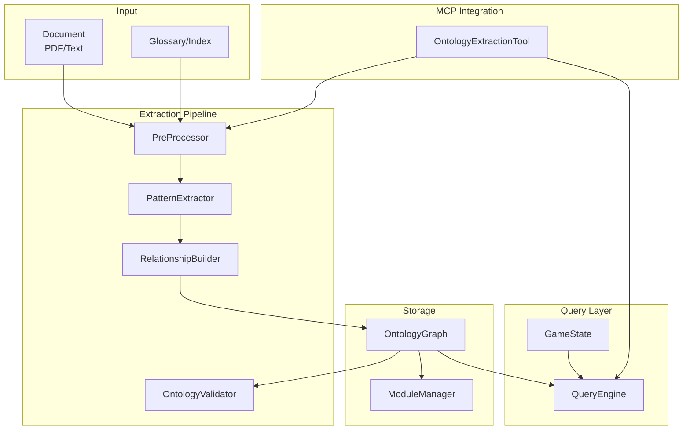
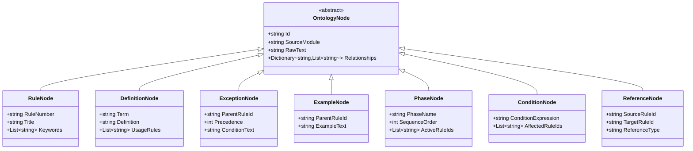
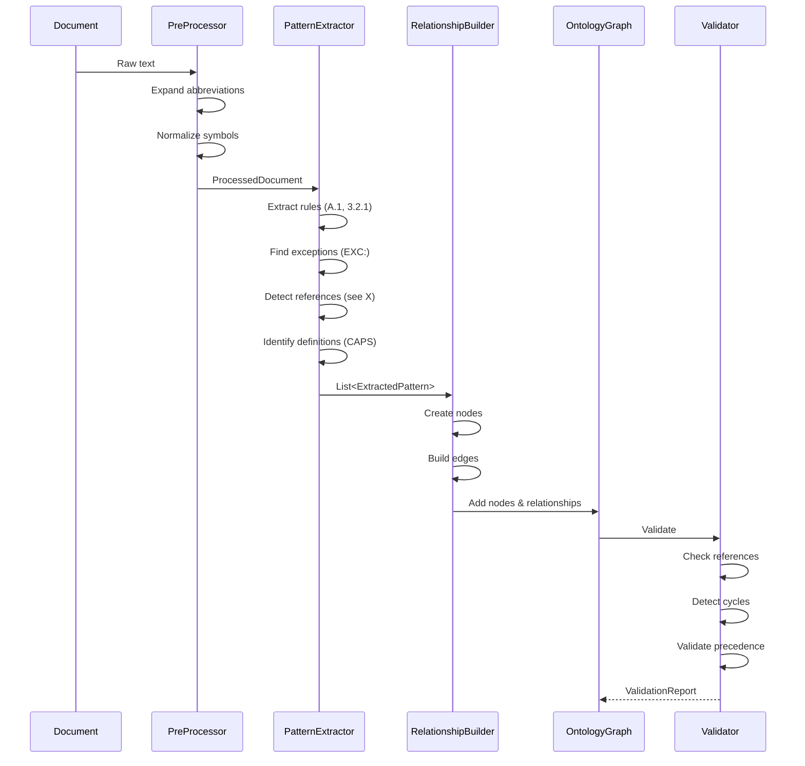
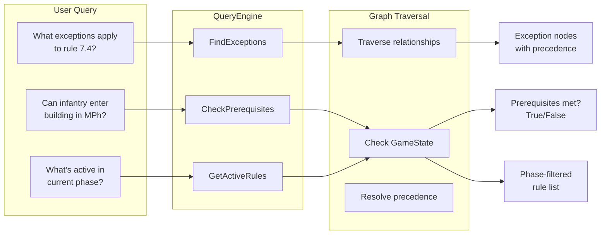

# Phase 3: Ontology Extraction Engine Design Plan

## Overview

The Ontology Extraction Engine transforms complex rulebooks into queryable knowledge graphs, handling sophisticated patterns like ASL's nested exceptions, cross-references, and conditional logic.

## System Architecture



## Node Type Hierarchy



## Extraction Pipeline Flow



## Query Engine Workflow



## Class Relationships

```mermaid
classDiagram
    class ExtractionPipeline {
        -PreProcessor preProcessor
        -PatternExtractor patternExtractor
        -RelationshipBuilder relationshipBuilder
        +Extract(Document) OntologyGraph
    }
    
    class PreProcessor {
        -Dictionary~string,string~ abbreviations
        -Dictionary~string,string~ symbols
        +Process(RawDocument) ProcessedDocument
    }
    
    class PatternExtractor {
        +ExtractPatterns(ProcessedDocument) List~ExtractedPattern~
    }
    
    class RelationshipBuilder {
        +BuildRelationships(List~OntologyNode~) void
    }
    
    class OntologyGraph {
        -Dictionary~string,OntologyNode~ nodes
        -Dictionary~string,List~Edge~~ edges
        +AddNode(OntologyNode) void
        +AddEdge(fromId, toId, type) void
    }
    
    class OntologyQueryEngine {
        -OntologyGraph graph
        +FindExceptions(ruleId) List~ExceptionNode~
        +GetActiveRules(GameState) List~RuleNode~
        +CheckPrerequisites(action, GameState) ValidationResult
    }
    
    class ModuleManager {
        +ResolveRuleId(localId, module) string
        +CheckCompatibility(module1, module2) bool
    }
    
    class OntologyValidator {
        +Validate(OntologyGraph) ValidationReport
    }
    
    class GameState {
        +string CurrentPhase
        +Dictionary~string,object~ StateVariables
    }
    
    ExtractionPipeline --> PreProcessor
    ExtractionPipeline --> PatternExtractor
    ExtractionPipeline --> RelationshipBuilder
    ExtractionPipeline --> OntologyGraph
    OntologyQueryEngine --> OntologyGraph
    OntologyQueryEngine --> GameState
    OntologyValidator --> OntologyGraph
    ModuleManager --> OntologyGraph
```



## Core Architecture Details

### Pre-Processing Pipeline
- Abbreviation expansion using glossary lookups
- Symbol normalization (∆ → "Leadership DRM NA")
- Term standardization (CAPS terms → definitions)
- Module/source identification

### Node Types
1. **Rule Nodes** - Primary statements (A.1, 3.1.1)
2. **Definition Nodes** - CAPS terms with special meanings
3. **Exception Nodes** - EXC:, NOTE: modifications
4. **Example Nodes** - EX: clarifications
5. **Reference Nodes** - Cross-rule links
6. **Phase Nodes** - Temporal containers
7. **Condition Nodes** - Prerequisites and state dependencies

### Extraction Patterns
```
References: "(see X)", "[applications: Y, Z]"
Exceptions: "except when", "unless", "EXC:"
Prerequisites: "must first", "cannot... unless"
Temporal: "during X phase", "after Y"
Definitions: "ADJACENT (definition): rules"
Abbreviations: "DRM (Die Roll Modifier)"
```

### Relationship Types
- `references` - Bidirectional cross-references
- `modifies` - Exception hierarchy with precedence
- `requires` - Prerequisites and dependencies
- `active_during` - Phase-based activation
- `overrides` - Conflict resolution
- `defines` - Term to definition mapping

### Query Capabilities
```typescript
interface QueryEngine {
  // Structural
  findExceptions(ruleId: string): ExceptionNode[]
  resolveReferences(ruleId: string): RuleNode[]
  getDefinition(term: string): DefinitionNode
  
  // Contextual
  getActiveRules(gameState: GameState): RuleNode[]
  checkPrerequisites(action: string, state: GameState): boolean
  resolveConflicts(rules: RuleNode[]): RuleNode
}
```

### Validation Layer
- Reference integrity (all citations resolve)
- Circular dependency detection
- Terminology consistency
- Module compatibility
- Precedence validation

### Module Management
- Track source documents/expansions
- Version compatibility checking
- Inter-module dependency resolution
- Namespace isolation for rule IDs

This architecture handles ASL-level complexity while remaining generic for any structured ruleset.

## C# Class Definitions

Class definitions, organized into logical groups:
* **Node Types** (8 classes): Core ontology elements representing rules, definitions, exceptions, examples, phases, conditions, and references
* **Extraction Pipeline** (4 classes): Components for processing documents from raw text to structured nodes
* **Storage & Query** (3 classes): Graph storage and query engine for navigating the ontology
* **Validation & Support** (4 classes): Integrity checking, state management, and helper classes
* **MCP Integration** (1 class): Tool interface for AI assistant integration

Each class includes its C# definition and a description of its role in transforming complex rulebooks into queryable knowledge graphs.

### Node Types

**OntologyNode** (abstract base class)
```csharp
public abstract class OntologyNode
{
    public string Id { get; set; }
    public string SourceModule { get; set; }
    public string RawText { get; set; }
    public Dictionary<string, List<string>> Relationships { get; set; }
}
```
Base class for all ontology elements. Provides common properties for identification, source tracking, and relationship management.

**RuleNode**
```csharp
public class RuleNode : OntologyNode
{
    public string RuleNumber { get; set; }
    public string Title { get; set; }
    public List<string> Keywords { get; set; }
}
```
Represents primary rule statements (e.g., "3.1 RALLY PHASE"). Forms the backbone of the ontology graph.

**DefinitionNode**
```csharp
public class DefinitionNode : OntologyNode
{
    public string Term { get; set; }
    public string Definition { get; set; }
    public List<string> UsageRules { get; set; }
}
```
Captures special game terms (e.g., "ADJACENT"). Links definitions to all rules where they're used.

**ExceptionNode**
```csharp
public class ExceptionNode : OntologyNode
{
    public string ParentRuleId { get; set; }
    public int Precedence { get; set; }
    public string ConditionText { get; set; }
}
```
Represents rule exceptions (EXC:, NOTE:). Includes precedence for conflict resolution.

**ExampleNode**
```csharp
public class ExampleNode : OntologyNode
{
    public string ParentRuleId { get; set; }
    public string ExampleText { get; set; }
}
```
Contains clarifying examples (EX:). Links to parent rules for context.

**PhaseNode**
```csharp
public class PhaseNode : OntologyNode
{
    public string PhaseName { get; set; }
    public int SequenceOrder { get; set; }
    public List<string> ActiveRuleIds { get; set; }
}
```
Represents game phases/states. Manages which rules are active during each phase.

**ConditionNode**
```csharp
public class ConditionNode : OntologyNode
{
    public string ConditionExpression { get; set; }
    public List<string> AffectedRuleIds { get; set; }
}
```
Captures conditional logic ("if X then Y"). Links conditions to affected rules.

**ReferenceNode**
```csharp
public class ReferenceNode : OntologyNode
{
    public string SourceRuleId { get; set; }
    public string TargetRuleId { get; set; }
    public string ReferenceType { get; set; }
}
```
Represents cross-references between rules. Enables bidirectional navigation.

### Extraction Pipeline

**ExtractionPipeline**
```csharp
public class ExtractionPipeline
{
    private readonly PreProcessor _preProcessor;
    private readonly PatternExtractor _patternExtractor;
    private readonly RelationshipBuilder _relationshipBuilder;
    
    public OntologyGraph Extract(Document doc) { }
}
```
Orchestrates the entire extraction process from raw document to ontology graph.

**PreProcessor**
```csharp
public class PreProcessor
{
    private readonly Dictionary<string, string> _abbreviations;
    private readonly Dictionary<string, string> _symbols;
    
    public ProcessedDocument Process(RawDocument doc) { }
}
```
Normalizes text by expanding abbreviations, converting symbols, and standardizing terms.

**PatternExtractor**
```csharp
public class PatternExtractor
{
    public List<ExtractedPattern> ExtractPatterns(ProcessedDocument doc) { }
}
```
Uses regex and NLP to identify rule patterns, exceptions, references, and definitions.

**RelationshipBuilder**
```csharp
public class RelationshipBuilder
{
    public void BuildRelationships(List<OntologyNode> nodes) { }
}
```
Creates edges between nodes based on extracted patterns and semantic relationships.

### Storage & Query

**OntologyGraph**
```csharp
public class OntologyGraph
{
    private readonly Dictionary<string, OntologyNode> _nodes;
    private readonly Dictionary<string, List<Edge>> _edges;
    
    public void AddNode(OntologyNode node) { }
    public void AddEdge(string fromId, string toId, RelationType type) { }
}
```
In-memory graph structure storing nodes and relationships. Core data structure for queries.

**OntologyQueryEngine**
```csharp
public class OntologyQueryEngine
{
    private readonly OntologyGraph _graph;
    
    public List<ExceptionNode> FindExceptions(string ruleId) { }
    public List<RuleNode> GetActiveRules(GameState state) { }
    public ValidationResult CheckPrerequisites(string action, GameState state) { }
}
```
Provides high-level query interface for rule lookups, exception resolution, and state-based queries.

**ModuleManager**
```csharp
public class ModuleManager
{
    public string ResolveRuleId(string localId, string module) { }
    public bool CheckCompatibility(string module1, string module2) { }
}
```
Handles multi-module scenarios (base game + expansions). Manages namespaces and compatibility.

### Validation & Support

**OntologyValidator**
```csharp
public class OntologyValidator
{
    public ValidationReport Validate(OntologyGraph graph) { }
}
```
Ensures ontology integrity: reference resolution, cycle detection, precedence validation.

**GameState**
```csharp
public class GameState
{
    public string CurrentPhase { get; set; }
    public Dictionary<string, object> StateVariables { get; set; }
}
```
Represents current game/system state. Used for contextual queries and rule activation.

**ExtractedPattern**
```csharp
public class ExtractedPattern
{
    public PatternType Type { get; set; }
    public string Text { get; set; }
    public int Position { get; set; }
}
```
Intermediate representation of identified patterns before node creation.

**Edge**
```csharp
public class Edge
{
    public string FromId { get; set; }
    public string ToId { get; set; }
    public RelationType Type { get; set; }
    public int Weight { get; set; }
}
```
Represents relationships between nodes. Weight used for precedence and importance.

### MCP Integration

**OntologyExtractionTool**
```csharp
public class OntologyExtractionTool : IMcpTool
{
    public Task<OntologyGraph> ExtractOntology(string documentPath) { }
    public Task<QueryResult> Query(string ontologyId, Query query) { }
}
```
MCP tool interface exposing ontology extraction and query capabilities to AI assistants.