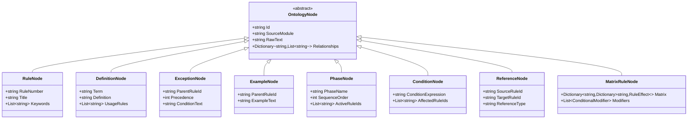

# Phase 3: Ontology Extraction Engine Design Plan

## Overview

The Ontology Extraction Engine transforms complex rulebooks into queryable knowledge graphs, handling sophisticated patterns like ASL's nested exceptions, cross-references, and conditional logic. The system preserves canonical rule identifiers and integrates spatial reference data for complete rule interpretation.

## Critical Design Principles

### 1. Canonical Rule ID Preservation
- **Rule IDs are Sacred**: ASL Rule IDs (A.1, B.23.71, 10.211) must be preserved exactly as primary keys
- **No ID Translation**: Never convert to internal IDs - the community uses these exact references
- **Hierarchical Understanding**: System must understand that "10.211" is child of "10.21" → "10.2" → "10"
- **Module Namespacing**: Support Part A (A.1), Part B (B.23), module-specific (RB.1, KGP.1)

### 2. Reference Data Integration
- **JSON Document Store**: Map and hex data stored as reference documents, not graph nodes
- **Generic Properties**: Hex data enriches GameState without special structures
- **Pre-computed LOS**: Line of Sight calculations stored for query performance
- **Extensible Design**: Support for charts, tables, and other reference materials

### 3. Dynamic State Management
- **Base + Modifications**: Pre-computed base terrain with dynamic overlay
- **Unified Hex State**: Single model for terrain changes and unit positions
- **Modification Patterns**: Store how terrain changes affect LOS
- **Runtime Calculation**: Apply modifications to base calculations

## System Architecture


## Node Type Hierarchy



## Extraction Pipeline Flow


## Query Engine Workflow


## Class Relationships


## Core Architecture Details

### Pre-Processing Pipeline
- **Abbreviation Expansion**: LOS → Line of Sight, MF → Movement Factor
- **Symbol Normalization**: ∆ → "Leadership DRM NA"
- **Term Standardization**: Preserve CAPS for defined terms (ADJACENT, KNOWN)
- **Context Preservation**: Maintain "IN" vs "in" for depression rules
- **Module/Source Identification**: Track which document rules come from

### Node Types
1. **Rule Nodes** - Primary statements with preserved IDs (A.1, 3.1.1)
2. **Definition Nodes** - CAPS terms with special meanings
3. **Exception Nodes** - EXC:, NOTE: with precedence weights
4. **Example Nodes** - EX: clarifications with hex references
5. **Reference Nodes** - Cross-rule links preserving exact IDs
6. **Phase Nodes** - Temporal containers for phase-specific rules
7. **Condition Nodes** - Prerequisites and state dependencies
8. **Matrix Rule Nodes** - Multi-dimensional rule tables (terrain charts)

### Extraction Patterns
```
References: "(see X)", "[applications: Y, Z]", "per X"
Exceptions: "except when", "unless", "EXC:", nested exceptions
Prerequisites: "must first", "cannot... unless", "requires"
Temporal: "during X phase", "after Y", "in the APh"
Definitions: "ADJACENT (definition): rules", CAPS terms
Abbreviations: "DRM (Die Roll Modifier)", "LOS (Line of Sight)"
Matrix Rules: Terrain Charts, Combat Tables
```

### Relationship Types
- `references` - Bidirectional cross-references with exact rule IDs
- `modifies` - Exception hierarchy with precedence weights
- `requires` - Prerequisites and dependencies
- `active_during` - Phase-based activation
- `overrides` - Conflict resolution with priority
- `defines` - Term to definition mapping
- `child_of` - Hierarchical rule structure (10.211 → 10.21)

### Reference Data Structure

```json
{
  "metadata": {
    "type": "board",
    "id": "1",
    "version": "6.9"
  },
  "dimensions": { "width": 33, "height": 10 },
  "hexes": {
    "K3": {
      "terrain": "Woods",
      "level": 1,
      "features": ["Woods"],
      "los": {
        "P5": {
          "clear": false,
          "blockedBy": ["L4", "M4", "N4"],
          "blockingTerrain": ["Woods", "Building"]
        }
      }
    }
  }
}
```

### Dynamic State Model

ASL terrain is dynamic - buildings become rubble, woods burn, bridges are destroyed. Combined with unit movement, every hex requires state tracking:

```csharp
public class HexState {
    public string Coordinate { get; set; }
    public string BaseTerrain { get; set; }      // Original from JSON
    public string CurrentTerrain { get; set; }   // After modifications
    public List<Unit> Units { get; set; }        // Dynamic occupants
    public List<Counter> Counters { get; set; }  // Smoke, wrecks, etc.
}

public class TerrainModification {
    public string OriginalTerrain { get; set; }
    public string CurrentTerrain { get; set; }
    public bool IsPermanent { get; set; }
    public int? DurationRemaining { get; set; }  // For smoke
}

public class GameBoard {
    private JsonDocument BaseTerrainData { get; set; }  // Pre-computed
    public Dictionary<string, HexState> Hexes { get; set; }
    
    public bool CheckLOS(string from, string to) {
        // 1. Start with pre-computed base LOS
        var baseLOS = GetBaseLOS(from, to);
        
        // 2. Apply terrain modifications
        foreach (var hex in GetLOSPath(from, to)) {
            if (Hexes[hex].CurrentTerrain != Hexes[hex].BaseTerrain) {
                baseLOS = ApplyModificationPattern(baseLOS, hex);
            }
            
            // 3. Check dynamic blockers (units, smoke)
            if (HasLOSBlocker(Hexes[hex])) return false;
        }
        
        return baseLOS;
    }
}
```

### LOS Modification Patterns

```json
{
  "losModificationRules": {
    "building_to_rubble": {
      "heightChange": -1,
      "losEffect": "degrades",
      "pattern": "adjacentHexesBecomeVisible"
    },
    "woods_to_blaze": {
      "heightChange": 0,
      "losEffect": "hindrance",
      "hindranceAdded": 2
    },
    "smoke": {
      "hindranceAdded": 3,
      "blockingThreshold": 6,
      "duration": "variable"
    }
  }
}
```

### Query Capabilities
```csharp
interface IQueryEngine {
  // Structural - using canonical rule IDs
  findExceptions(ruleId: string): ExceptionNode[]
  resolveReferences(ruleId: string): RuleNode[]
  getDefinition(term: string): DefinitionNode
  
  // Contextual with reference data
  getActiveRules(gameState: GameState): RuleNode[]
  checkPrerequisites(action: string, state: GameState): boolean
  resolveConflicts(rules: RuleNode[]): RuleNode
  checkLOS(fromHex: string, toHex: string): LOSResult
  
  // Reference data integration
  loadReferenceData(key: string, jsonContent: string): void
  enrichStateWithLocation(state: GameState, location: string): void
}
```

### Validation Layer
- **Rule ID Integrity**: All rule IDs match canonical format
- **Reference Resolution**: All "(see X)" citations resolve to existing rules
- **Circular Dependency Detection**: Identify and handle rule cycles
- **Terminology Consistency**: CAPS terms have definitions
- **Module Compatibility**: Cross-module references validated
- **Precedence Validation**: Exception chains have valid precedence
- **Completeness Checking**: No orphaned rules or broken links

### Module Management
- **Canonical ID Preservation**: Never modify ASL rule numbering
- **Source Document Tracking**: Know which PDF/module rules come from
- **Version Compatibility**: Handle rule updates across editions
- **Namespace Management**: Part A/B/module-specific rules coexist
- **Cross-Module Resolution**: References work across documents

### Performance Optimizations
- **Pre-computed LOS Data**: No runtime LOS calculations
- **Indexed Rule Access**: O(1) lookup by canonical rule ID
- **Cached Query Results**: Common queries stored
- **Lazy Reference Loading**: Load hex data only when needed
- **Efficient Graph Traversal**: Optimized for deep exception chains

This architecture handles ASL-level complexity while remaining generic for any structured ruleset. The integration of reference data through JSON documents maintains system genericity while enabling sophisticated spatial and contextual queries.

## How the Complete System Works

### 1. **Rule Extraction Phase**
When you input the ASL rulebook:
```csharp
// The extraction pipeline preserves exact rule IDs
var ruleNode = new RuleNode {
    Id = "A6.41",  // Preserved exactly as in rulebook
    RuleNumber = "A6.41",
    Title = "Blind Hexes",
    RawText = "Three blind hexes (1 [normal Hex; 6.4] +2 [extra Blind Hexes])..."
};
```

### 2. **Board Data Integration**
Hex management approach:
```json
{
  "K3": {
    "terrain": "Woods",
    "level": 1,
    "los": {
      "P5": {
        "clear": false,
        "blockedBy": ["L4", "M4", "N4"],
        "blockingTerrain": ["Woods", "Building"]
      }
    }
  }
}
```

### 3. **Runtime Query Flow**
When you ask: **"Can infantry in woods at K3 see the building at P5?"**
```csharp
// Claude translates to structured queries
var state = new GameState();

// 1. Enrich state with hex data
queryEngine.EnrichStateWithHexData(state, "K3");  
queryEngine.EnrichStateWithHexData(state, "P5");
// State now has: terrain_K3="Woods", terrain_P5="Stone Building"

// 2. Check pre-computed LOS
var hasLOS = queryEngine.CheckLOS("K3", "P5");  // Returns false

// 3. Find applicable rules
state.StateVariables["has_los"] = hasLOS;
state.StateVariables["unit_type"] = "infantry";
var rules = graph.GetActiveRules(state);

// 4. Traverse exceptions
var losRules = graph.GetNodeByRuleId("A6.1");  // LOS rules
var exceptions = queryEngine.FindExceptions("A6.1");
// Finds woods blocking LOS, building TEM modifiers, etc.
```

### 4. **Claude's Orchestration Role**
Claude acts as the intelligent interface:
- **Natural Language Understanding**: Parses "Can infantry in woods..." into structured queries
- **Multi-Tool Orchestration**: Calls both ontology queries and reference data lookups
- **Context Synthesis**: Combines rule nodes, exceptions, and spatial data
- **Strategic Interpretation**: Goes beyond rules to suggest tactical implications

### 5. **Example Complete Interaction**
```
You: "I have a squad in hex 3K3 facing an enemy in stone building at 3P5. 
     What are my options during the Prep Fire Phase?"

System Processing:
1. Load hex data → K3 (Woods), P5 (Stone Building Level 2)
2. Check LOS → Blocked by intervening woods
3. Query active rules for Prep Fire Phase
4. Find exceptions for firing from woods
5. Check prerequisites for special actions

Claude's Response:
"Your squad in the woods at K3 cannot directly fire at P5 because LOS is 
blocked by woods hexes at L4, M4, and N4 (per rule A6.1). Your options are:

1. **Assault Move** - Move to L4 (2 MF) to gain LOS for subsequent fire
2. **Prep Fire elsewhere** - Target visible hexes like K5 or M3
3. **Hold fire** - Maintain concealment for Defensive First Fire (+2 TEM)

Note: The stone building at P5 would provide +3 TEM if you could see it."
```

## C# Class Definitions

### Node Types

**OntologyNode** (abstract base class)
```csharp
public abstract class OntologyNode
{
    public string Id { get; set; }  // Canonical rule ID preserved
    public string SourceModule { get; set; }
    public string RawText { get; set; }
    public Dictionary<string, List<string>> Relationships { get; set; }
}
```
Base class for all ontology elements. ID preserves exact rule numbering from source.

**RuleNode**
```csharp
public class RuleNode : OntologyNode
{
    public string RuleNumber { get; set; }  // "A.1", "B.23.71" - never modified
    public string Title { get; set; }
    public List<string> Keywords { get; set; }
    public string ParentRuleId { get; set; }  // For hierarchical navigation
}
```
Represents primary rule statements. RuleNumber is the canonical ASL identifier.

**DefinitionNode**
```csharp
public class DefinitionNode : OntologyNode
{
    public string Term { get; set; }  // Preserved in original CAPS
    public string Definition { get; set; }
    public List<string> UsageRules { get; set; }
}
```
Captures special game terms. Maintains case-sensitive term format.

**ExceptionNode**
```csharp
public class ExceptionNode : OntologyNode
{
    public string ParentRuleId { get; set; }
    public int Precedence { get; set; }
    public string ConditionText { get; set; }
    public List<string> NestedExceptions { get; set; }  // For EXC within EXC
}
```
Represents rule exceptions with support for nested exception chains.

**ExampleNode**
```csharp
public class ExampleNode : OntologyNode
{
    public string ParentRuleId { get; set; }
    public string ExampleText { get; set; }
    public List<string> ReferencedLocations { get; set; }  // ["3K3", "3P5"]
}
```
Contains clarifying examples. Extracts hex references for validation.

**PhaseNode**
```csharp
public class PhaseNode : OntologyNode
{
    public string PhaseName { get; set; }
    public int SequenceOrder { get; set; }
    public List<string> ActiveRuleIds { get; set; }
}
```
Represents game phases/states. Manages which rules are active during each phase.

**ConditionNode**
```csharp
public class ConditionNode : OntologyNode
{
    public string ConditionExpression { get; set; }
    public List<string> AffectedRuleIds { get; set; }
}
```
Captures conditional logic. Expressions can reference generic state properties.

**ReferenceNode**
```csharp
public class ReferenceNode : OntologyNode
{
    public string SourceRuleId { get; set; }
    public string TargetRuleId { get; set; }  // Exact rule ID preserved
    public string ReferenceType { get; set; }  // "see", "per", "application"
}
```
Represents cross-references between rules using canonical IDs.

**MatrixRuleNode**
```csharp
public class MatrixRuleNode : OntologyNode
{
    public Dictionary<string, Dictionary<string, RuleEffect>> Matrix { get; set; }
    public List<ConditionalModifier> Modifiers { get; set; }
}
```
Handles multi-dimensional rule tables like terrain charts.

### Extraction Pipeline

**ExtractionPipeline**
```csharp
public class ExtractionPipeline
{
    private readonly PreProcessor _preProcessor;
    private readonly PatternExtractor _patternExtractor;
    private readonly RelationshipBuilder _relationshipBuilder;
    
    public OntologyGraph Extract(Document doc) { }
}
```
Orchestrates the entire extraction process from raw document to ontology graph.

**PreProcessor**
```csharp
public class PreProcessor
{
    private readonly Dictionary<string, string> _abbreviations;
    private readonly Dictionary<string, string> _symbols;
    private readonly HashSet<string> _preservedCapsTerms;
    
    public ProcessedDocument Process(RawDocument doc) { }
    private string PreserveRuleIds(string text) { }  // Never modify A.1, B.23.71
}
```
Normalizes text while preserving critical formatting and rule IDs.

**PatternExtractor**
```csharp
public class PatternExtractor
{
    public List<ExtractedPattern> ExtractPatterns(ProcessedDocument doc) { }
    private ExceptionChain ExtractNestedExceptions(string text) { }
    private List<string> ExtractLocationReferences(string text) { }
}
```
Enhanced to handle nested exceptions and location references.

**RelationshipBuilder**
```csharp
public class RelationshipBuilder
{
    public void BuildRelationships(List<OntologyNode> nodes) { }
    private void BuildHierarchy(List<RuleNode> rules) { }  // 10.211 → 10.21
    private void ResolveExceptionPrecedence(List<ExceptionNode> exceptions) { }
}
```
Creates edges including rule hierarchy based on numbering.

### Storage & Query

**OntologyGraph**
```csharp
public class OntologyGraph
{
    private readonly Dictionary<string, OntologyNode> _nodes;  // Keyed by rule ID
    private readonly Dictionary<string, List<Edge>> _edges;
    
    public void AddNode(OntologyNode node) { }
    public void AddEdge(string fromId, string toId, RelationType type) { }
    public OntologyNode GetNodeByRuleId(string ruleId) { }  // Direct lookup
}
```
In-memory graph structure with fast rule ID lookups.

**OntologyQueryEngine**
```csharp
public class OntologyQueryEngine
{
    private readonly OntologyGraph _graph;
    private readonly Dictionary<string, JsonDocument> _referenceData;
    private readonly GameBoard _gameBoard;  // Dynamic state
    
    public List<ExceptionNode> FindExceptions(string ruleId) { }
    public List<RuleNode> GetActiveRules(GameState state) { }
    public ValidationResult CheckPrerequisites(string action, GameState state) { }
    
    // Enhanced for dynamic state
    public bool CheckLOS(string from, string to) 
    {
        return _gameBoard.CheckLOS(from, to);
    }
    
    private void EnrichStateWithHexData(GameState state, string location) 
    {
        var hexState = _gameBoard.Hexes[location];
        state.StateVariables[$"terrain_{location}"] = hexState.CurrentTerrain;
        state.StateVariables[$"units_{location}"] = hexState.Units.Count;
        state.StateVariables[$"has_smoke_{location}"] = hexState.Counters.Any(c => c.Type == "Smoke");
    }
}
```
Enhanced with reference data capabilities for spatial queries.

**ModuleManager**
```csharp
public class ModuleManager
{
    public string ResolveRuleId(string localId, string module) { }
    public bool CheckCompatibility(string module1, string module2) { }
    public string GetCanonicalRuleId(string ruleReference) { }
}
```
Ensures rule IDs remain canonical across modules.

### Validation & Support

**OntologyValidator**
```csharp
public class OntologyValidator
{
    public ValidationReport Validate(OntologyGraph graph) { }
    private bool ValidateRuleIdFormat(string ruleId) { }  // A.1, B.23.71 format
    private List<string> FindOrphanedReferences(OntologyGraph graph) { }
}
```
Enhanced validation including rule ID format checking.

**GameState**
```csharp
public class GameState
{
    public string CurrentPhase { get; set; }
    public Dictionary<string, object> StateVariables { get; set; }
    
    // Generic property addition for reference data
    public void AddContextProperty(string key, object value) { }
}
```
Remains generic while supporting enrichment from reference data.

**ExtractedPattern**
```csharp
public class ExtractedPattern
{
    public PatternType Type { get; set; }
    public string Text { get; set; }
    public int Position { get; set; }
    public string RuleId { get; set; }  // Preserved from source
}
```
Includes rule ID preservation from extraction.

**Edge**
```csharp
public class Edge
{
    public string FromId { get; set; }  // Canonical rule ID
    public string ToId { get; set; }    // Canonical rule ID
    public RelationType Type { get; set; }
    public int Weight { get; set; }
}
```
Uses canonical rule IDs for all connections.

### Dynamic State Management

**HexState**
```csharp
public class HexState
{
    public string Coordinate { get; set; }
    public string BaseTerrain { get; set; }      // Original from JSON
    public string CurrentTerrain { get; set; }   // After modifications
    public List<Unit> Units { get; set; }        // Dynamic occupants
    public List<Counter> Counters { get; set; }  // Smoke, wrecks, blazes
}
```
Represents current state of a hex, tracking both terrain changes and occupants.

**Unit**
```csharp
public class Unit
{
    public string Id { get; set; }
    public string Type { get; set; }  // Infantry, Vehicle, Gun
    public string Nationality { get; set; }
    public bool BlocksLOS { get; set; }  // Vehicles, wrecks
    public Dictionary<string, object> Attributes { get; set; }
}
```
Dynamic game piece that moves between hexes.

**Counter**
```csharp
public class Counter
{
    public string Type { get; set; }  // Smoke, Rubble, Blaze, Wreck
    public int? DurationRemaining { get; set; }
    public Dictionary<string, object> Effects { get; set; }
}
```
Terrain modifiers placed during gameplay.

**GameBoard**
```csharp
public class GameBoard
{
    private JsonDocument BaseTerrainData { get; set; }
    public Dictionary<string, HexState> Hexes { get; set; }
    
    public bool CheckLOS(string from, string to)
    {
        // Combines pre-computed base with dynamic modifications
    }
    
    public void ApplyTerrainChange(string hex, string newTerrain)
    {
        Hexes[hex].CurrentTerrain = newTerrain;
        // Update affected LOS calculations
    }
}
```
Manages dynamic board state, combining static base data with runtime changes.

### MCP Integration

**OntologyExtractionTool**
```csharp
public class OntologyExtractionTool : IMcpTool
{
    public Task<OntologyGraph> ExtractOntology(string documentPath) { }
    public Task<QueryResult> Query(string ontologyId, Query query) { }
    public Task LoadReferenceData(string ontologyId, string key, string jsonPath) { }
}
```
Extended to support reference data loading alongside rule extraction.