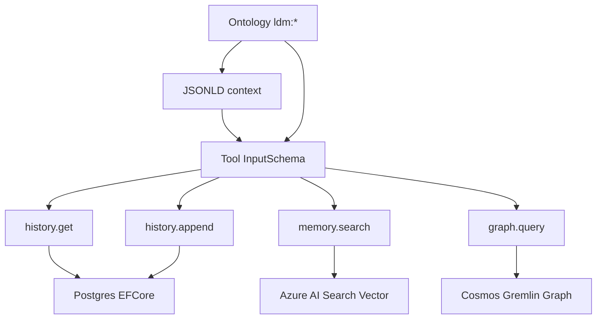

# 4. **MCP tool surface for history/memory/graph (first useful tools)**

   * Files: `src/LimboDancer.MCP.McpServer/Tools/{HistoryGetTool.cs, HistoryAppendTool.cs, MemorySearchTool.cs, GraphQueryTool.cs}`.
   * Each tool’s `input_schema` should embed your JSON-LD `@context` (ontology-bound fields) like we did for `cancelReservation`.
   * Why: Makes the server actually useful while we wire KG/vector; aligns with the design map and ontology-first approach. &#x20;
   
---
   
> Ontology context:
> - **Ontology constants and JSON-LD:** `_0. Ontology Implementation in CSharp.md`
> - Merge `JsonLdContext.GetContextJson()` into each tool `input_schema`.
> - Use `@id` on fields to bind to `ldm:*` CURIEs (e.g., `ldm:Reservation`, `ldm:status`).
   
---

## Tools

## Ontology Binding And Tool Flow



Each tool schema merges the JSON-LD `@context` and sets `@id` per field so clients and downstream services can reason over the ontology terms consistently.


* `History*` tools use `IChatHistoryStore` (from your persistence baseline).
* `MemorySearchTool` uses `VectorStore` (Azure AI Search).
* `GraphQueryTool` uses `GraphStore` (Cosmos Gremlin) for simple read queries.
* `HistoryGetTool.cs` also defines a tiny `IMcpTool` interface and a shared helper `ToolSchema` used by all four tools.

 To wire these into your MCP server, enumerate instances of `IMcpTool` in DI and map them into `ListToolsHandler` / `CallToolHandler` (snippet at the end).


---

## `src/LimboDancer.MCP.McpServer/Tools/HistoryGetTool.cs`

```csharp
using System.Text.Json;
using System.Text.Json.Nodes;
using LimboDancer.MCP.Ontology;
using LimboDancer.MCP.Storage;
using LimboDancer.MCP.Core;
using ModelContextProtocol.Protocol;

namespace LimboDancer.MCP.McpServer.Tools;

/// <summary>Shared contract for MCP tools.</summary>
internal interface IMcpTool
{
    string Name { get; }
    Tool ToolDescriptor { get; }
    Task<CallToolResult> CallAsync(Dictionary<string, object?> args, CancellationToken ct);
}

/// <summary>Helpers to build MCP JSON Schemas with JSON-LD @context.</summary>
internal static class ToolSchema
{
    public static JsonElement Build(Action<JsonObject, JsonObject, JsonArray> build)
    {
        var schema = new JsonObject
        {
            ["type"] = "object",
            ["properties"] = new JsonObject(),
            ["required"]   = new JsonArray()
        };

        // Merge JSON-LD @context so clients can see ontology bindings
        if (JsonNode.Parse(JsonLdContext.GetContextJson()) is JsonObject ctx &&
            ctx.TryGetPropertyValue("@context", out var ctxVal))
        {
            schema["@context"] = ctxVal;
        }

        var props = (JsonObject)schema["properties"]!;
        var req   = (JsonArray) schema["required"]!;
        build(schema, props, req);

        return JsonSerializer.Deserialize<JsonElement>(schema.ToJsonString());
    }

    public static void Prop(JsonObject props, string name, string type, string? ontologyId = null, string? title = null)
    {
        var o = new JsonObject { ["type"] = type };
        if (!string.IsNullOrWhiteSpace(ontologyId)) o["@id"] = ontologyId;
        if (!string.IsNullOrWhiteSpace(title))      o["title"] = title;
        props[name] = o;
    }
}

/// <summary>
/// Get messages for a session (paged).
/// </summary>
public sealed class HistoryGetTool : IMcpTool
{
    public string Name => "history.get";
    public Tool ToolDescriptor { get; }

    private readonly IChatHistoryStore _history;

    public HistoryGetTool(IChatHistoryStore history)
    {
        _history = history;

        ToolDescriptor = new Tool
        {
            Name = Name,
            Description = "Get chat history messages for a session (paged).",
            InputSchema = ToolSchema.Build((schema, props, req) =>
            {
                ToolSchema.Prop(props, "sessionId", "string", Ldm.Classes.Session, "SessionId");
                ToolSchema.Prop(props, "take",      "integer", null, "Page size (default 100)");
                ToolSchema.Prop(props, "skip",      "integer", null, "Offset (default 0)");
                req.Add("sessionId");
            })
        };
    }

    public async Task<CallToolResult> CallAsync(Dictionary<string, object?> args, CancellationToken ct)
    {
        if (!args.TryGetValue("sessionId", out var sidObj) || sidObj is null)
            throw new McpException("Missing required argument 'sessionId'.");

        if (!Guid.TryParse(sidObj.ToString(), out var sessionId))
            throw new McpException("Invalid 'sessionId' (expected GUID).");

        var take = args.TryGetValue("take", out var tObj) && tObj is not null && int.TryParse(tObj.ToString(), out var tVal) ? tVal : 100;
        var skip = args.TryGetValue("skip", out var sObj) && sObj is not null && int.TryParse(sObj.ToString(), out var sVal) ? sVal : 0;

        var msgs = await _history.GetMessagesAsync(sessionId, take: take, skip: skip, ct: ct);

        var payload = new
        {
            sessionId = sessionId,
            count = msgs.Count,
            messages = msgs.Select(m => new
            {
                id = m.Id,
                role = m.Role.ToString().ToLowerInvariant(),
                content = m.Content,
                createdAt = m.CreatedAt
            })
        };

        return new CallToolResult
        {
            Content = [ new TextContentBlock { Type = "text", Text = JsonSerializer.Serialize(payload) } ]
        };
    }
}
```

---

## `src/LimboDancer.MCP.McpServer/Tools/HistoryAppendTool.cs`

```csharp
using System.Text.Json;
using System.Text.Json.Nodes;
using LimboDancer.MCP.Ontology;
using LimboDancer.MCP.Storage;
using LimboDancer.MCP.Core;
using ModelContextProtocol.Protocol;

namespace LimboDancer.MCP.McpServer.Tools;

/// <summary>
/// Append a message to a session.
/// </summary>
public sealed class HistoryAppendTool : IMcpTool
{
    public string Name => "history.append";
    public Tool ToolDescriptor { get; }

    private readonly IChatHistoryStore _history;

    public HistoryAppendTool(IChatHistoryStore history)
    {
        _history = history;

        ToolDescriptor = new Tool
        {
            Name = Name,
            Description = "Append a message (user/assistant/tool) to a session.",
            InputSchema = ToolSchema.Build((schema, props, req) =>
            {
                ToolSchema.Prop(props, "sessionId", "string", Ldm.Classes.Session, "SessionId");
                ToolSchema.Prop(props, "role",      "string", Ldm.Properties.Role, "user | assistant | tool");
                ToolSchema.Prop(props, "content",   "string", Ldm.Properties.Content, "Message text");
                // Optionally include toolCallsJson if role == tool
                ToolSchema.Prop(props, "toolCallsJson", "string", Ldm.Properties.ToolCalls, "JSON (optional)");
                req.Add("sessionId"); req.Add("role"); req.Add("content");
            })
        };
    }

    public async Task<CallToolResult> CallAsync(Dictionary<string, object?> args, CancellationToken ct)
    {
        if (!args.TryGetValue("sessionId", out var sidObj) || sidObj is null)
            throw new McpException("Missing required argument 'sessionId'.");
        if (!Guid.TryParse(sidObj.ToString(), out var sessionId))
            throw new McpException("Invalid 'sessionId' (expected GUID).");

        if (!args.TryGetValue("role", out var roleObj) || roleObj is null)
            throw new McpException("Missing required argument 'role'.");
        var roleStr = roleObj.ToString()!.ToLowerInvariant();

        MessageRole role = roleStr switch
        {
            "user" => MessageRole.User,
            "assistant" => MessageRole.Assistant,
            "tool" => MessageRole.Tool,
            _ => throw new McpException("Invalid 'role' (expected: user|assistant|tool).")
        };

        if (!args.TryGetValue("content", out var contentObj) || contentObj is null)
            throw new McpException("Missing required argument 'content'.");
        var content = contentObj.ToString() ?? "";

        System.Text.Json.JsonDocument? toolCalls = null;
        if (args.TryGetValue("toolCallsJson", out var tcObj) && tcObj is not null && !string.IsNullOrWhiteSpace(tcObj.ToString()))
        {
            try { toolCalls = JsonDocument.Parse(tcObj!.ToString()!); }
            catch { throw new McpException("Invalid 'toolCallsJson' (must be valid JSON)."); }
        }

        var msg = await _history.AppendMessageAsync(sessionId, role, content, toolCalls, ct);

        var payload = new
        {
            id = msg.Id,
            sessionId = sessionId,
            role = role.ToString().ToLowerInvariant(),
            createdAt = msg.CreatedAt
        };

        return new CallToolResult
        {
            Content = [ new TextContentBlock { Type = "text", Text = JsonSerializer.Serialize(payload) } ]
        };
    }
}
```

---

## `src/LimboDancer.MCP.McpServer/Tools/MemorySearchTool.cs`

```csharp
using System.Text.Json;
using LimboDancer.MCP.Ontology;
using LimboDancer.MCP.Vector.AzureSearch;
using ModelContextProtocol.Protocol;

namespace LimboDancer.MCP.McpServer.Tools;

/// <summary>
/// Hybrid search (BM25 + vector) over Azure AI Search with ontology filters.
/// </summary>
public sealed class MemorySearchTool : IMcpTool
{
    public string Name => "memory.search";
    public Tool ToolDescriptor { get; }

    private readonly VectorStore _vector;

    public MemorySearchTool(VectorStore vector)
    {
        _vector = vector;

        ToolDescriptor = new Tool
        {
            Name = Name,
            Description = "Hybrid search across memory index with ontology filters (class, uri, tags).",
            InputSchema = ToolSchema.Build((schema, props, req) =>
            {
                // Either queryText OR vectorBase64 required
                ToolSchema.Prop(props, "queryText",   "string", Ldm.Properties.Query, "BM25 / semantic query text");
                ToolSchema.Prop(props, "vectorBase64","string", Ldm.Properties.Embedding, "Base64(float32[]) optional");

                ToolSchema.Prop(props, "k", "integer", null, "Top K (default 8)");

                // Filters
                ToolSchema.Prop(props, "ontologyClass", "string", Ldm.Classes.MemoryItem, "Filter: ontology class");
                ToolSchema.Prop(props, "uriEquals",     "string", Ldm.Properties.Uri,      "Filter: exact URI");
                props["tagsAny"] = new System.Text.Json.Nodes.JsonObject
                {
                    ["type"] = "array",
                    ["items"] = new System.Text.Json.Nodes.JsonObject { ["type"] = "string" },
                    ["title"] = "Filter: any tag matches"
                };

                // none strictly required to allow "*" vector-only or text-only; but enforce one at runtime
            })
        };
    }

    public async Task<CallToolResult> CallAsync(Dictionary<string, object?> args, CancellationToken ct)
    {
        args.TryGetValue("queryText", out var qObj);
        var queryText = qObj?.ToString();

        float[]? vector = null;
        if (args.TryGetValue("vectorBase64", out var vecObj) && vecObj is not null && !string.IsNullOrWhiteSpace(vecObj.ToString()))
        {
            try
            {
                var bytes = Convert.FromBase64String(vecObj!.ToString()!);
                // interpret as float32 little-endian
                var floats = new float[bytes.Length / 4];
                Buffer.BlockCopy(bytes, 0, floats, 0, bytes.Length);
                vector = floats;
            }
            catch
            {
                throw new McpException("Invalid 'vectorBase64' (must be base64-encoded float32 array).");
            }
        }

        if (vector is null && string.IsNullOrWhiteSpace(queryText))
            throw new McpException("Provide either 'queryText' or 'vectorBase64'.");

        var k = 8;
        if (args.TryGetValue("k", out var kObj) && kObj is not null && int.TryParse(kObj.ToString(), out var kParsed) && kParsed > 0) k = kParsed;

        var filters = new VectorStore.SearchFilters();
        if (args.TryGetValue("ontologyClass", out var ocObj) && ocObj is not null) filters.OntologyClass = ocObj.ToString();
        if (args.TryGetValue("uriEquals", out var uriObj) && uriObj is not null) filters.UriEquals = uriObj.ToString();
        if (args.TryGetValue("tagsAny", out var tagsObj) && tagsObj is IEnumerable<object?> en)
            filters.TagsAny = en.Where(x => x is not null).Select(x => x!.ToString()!).ToArray();

        var results = await _vector.SearchHybridAsync(queryText, vector, k, filters, ct);

        var payload = new
        {
            count = results.Count,
            items = results.Select(r => new
            {
                r.Id, r.Title, r.Source, r.Chunk, r.OntologyClass, r.Uri, r.Tags, r.Score,
                preview = r.Content?.Length > 240 ? r.Content[..240] + "…" : r.Content
            })
        };

        return new CallToolResult
        {
            Content = [ new TextContentBlock { Type = "text", Text = JsonSerializer.Serialize(payload) } ]
        };
    }
}
```

---

## `src/LimboDancer.MCP.McpServer/Tools/GraphQueryTool.cs`

```csharp
using System.Text.Json;
using LimboDancer.MCP.Ontology;
using LimboDancer.MCP.Graph.CosmosGremlin;
using ModelContextProtocol.Protocol;

namespace LimboDancer.MCP.McpServer.Tools;

/// <summary>
/// Small read-only graph queries: getProperty, edgeExists.
/// </summary>
public sealed class GraphQueryTool : IMcpTool
{
    public string Name => "graph.query";
    public Tool ToolDescriptor { get; }

    private readonly GraphStore _graph;

    public GraphQueryTool(GraphStore graph)
    {
        _graph = graph;

        ToolDescriptor = new Tool
        {
            Name = Name,
            Description = "Query the knowledge graph (read-only): getProperty | edgeExists.",
            InputSchema = ToolSchema.Build((schema, props, req) =>
            {
                ToolSchema.Prop(props, "mode", "string", Ldm.Properties.Kind, "getProperty | edgeExists");

                // getProperty
                ToolSchema.Prop(props, "subjectLabel", "string", Ldm.Properties.Label, "Vertex label (e.g., Reservation)");
                ToolSchema.Prop(props, "subjectId",    "string", Ldm.Properties.Id,    "Vertex id");
                ToolSchema.Prop(props, "property",     "string", Ldm.Properties.Property, "Property key (for getProperty)");

                // edgeExists
                ToolSchema.Prop(props, "outId", "string", Ldm.Properties.Source, "Out-vertex id (for edgeExists)");
                ToolSchema.Prop(props, "edgeLabel","string", Ldm.Properties.Label, "Edge label (for edgeExists)");
                ToolSchema.Prop(props, "inId", "string", Ldm.Properties.Target, "In-vertex id (for edgeExists)");

                req.Add("mode");
            })
        };
    }

    public async Task<CallToolResult> CallAsync(Dictionary<string, object?> args, CancellationToken ct)
    {
        if (!args.TryGetValue("mode", out var mObj) || mObj is null)
            throw new McpException("Missing 'mode' (getProperty|edgeExists).");

        var mode = mObj.ToString()!.ToLowerInvariant();
        switch (mode)
        {
            case "getproperty":
            {
                if (!args.TryGetValue("subjectId", out var idObj) || idObj is null)
                    throw new McpException("Missing 'subjectId'.");
                if (!args.TryGetValue("property", out var propObj) || propObj is null)
                    throw new McpException("Missing 'property'.");

                var value = await _graph.GetVertexPropertyAsync(idObj.ToString()!, propObj.ToString()!, ct);
                var payload = new { subjectId = idObj.ToString(), property = propObj.ToString(), value };
                return new CallToolResult
                {
                    Content = [ new TextContentBlock { Type = "text", Text = JsonSerializer.Serialize(payload) } ]
                };
            }

            case "edgeexists":
            {
                if (!args.TryGetValue("outId", out var outObj) || outObj is null)
                    throw new McpException("Missing 'outId'.");
                if (!args.TryGetValue("edgeLabel", out var elObj) || elObj is null)
                    throw new McpException("Missing 'edgeLabel'.");
                if (!args.TryGetValue("inId", out var inObj) || inObj is null)
                    throw new McpException("Missing 'inId'.");

                var exists = await _graph.EdgeExistsAsync(outObj.ToString()!, elObj.ToString()!, inObj.ToString()!, ct);
                var payload = new { outId = outObj.ToString(), edgeLabel = elObj.ToString(), inId = inObj.ToString(), exists };
                return new CallToolResult
                {
                    Content = [ new TextContentBlock { Type = "text", Text = JsonSerializer.Serialize(payload) } ]
                };
            }

            default:
                throw new McpException("Unsupported mode. Use: getProperty | edgeExists.");
        }
    }
}
```

---

## (Optional) How to wire these into your MCP server

Add them to DI and expose via the SDK’s handlers:

```csharp
// Program.cs (stdio or HTTP server)

// 1) Register tool dependencies (already in your solution):
builder.Services.AddScoped<IMcpTool, HistoryGetTool>();
builder.Services.AddScoped<IMcpTool, HistoryAppendTool>();
builder.Services.AddScoped<IMcpTool, MemorySearchTool>();
builder.Services.AddScoped<IMcpTool, GraphQueryTool>();

// 2) In McpServerOptions:
options.Capabilities = new ServerCapabilities
{
    Tools = new ToolsCapability
    {
        ListToolsHandler = (req, ct) =>
        {
            using var scope = app.Services.CreateScope();
            var tools = scope.ServiceProvider.GetServices<IMcpTool>().Select(t => t.ToolDescriptor).ToArray();
            return ValueTask.FromResult(new ListToolsResult { Tools = [.. tools] });
        },
        CallToolHandler = async (req, ct) =>
        {
            using var scope = app.Services.CreateScope();
            var tool = scope.ServiceProvider.GetServices<IMcpTool>().FirstOrDefault(t => t.Name == req.Params?.Name)
                       ?? throw new McpException($"Unknown tool: {req.Params?.Name}");

            var args = req.Params?.Arguments?.ToDictionary(kv => kv.Key, kv => kv.Value) ?? new Dictionary<string, object?>();
            return await tool.CallAsync(args, ct);
        }
    }
};
```

> These four tools make the server **immediately useful** while the vector/KG pipelines evolve:
>
> * `history.get` / `history.append` enable basic conversation state.
> * `memory.search` gives you retrieval grounded in your ontology filters.
> * `graph.query` lets you inspect KG state and wire preconditions/effects incrementally.
