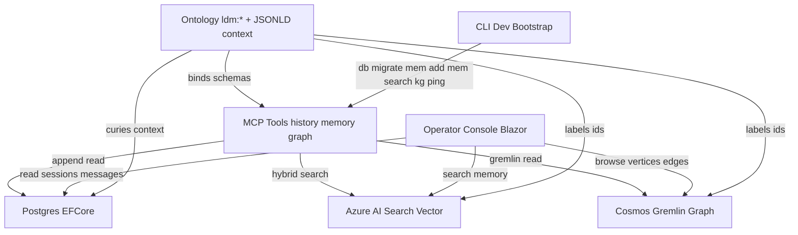
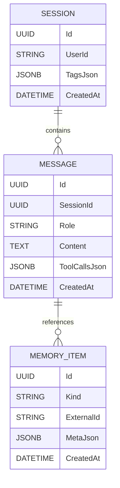
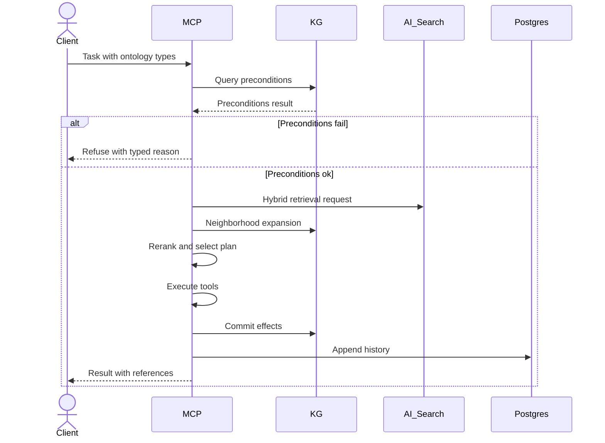

# Knowledge Graphs, Ontologies, and the LimboDancer.MCP Platform

## 1. Why Ontology Matters

Agentic AI systems cannot rely solely on raw embeddings or keyword indices. They require a **shared semantic backbone** that binds:

* **Tools** → to formal input/output schemas.
* **Memories** → to typed entities and relationships.
* **Plans** → to preconditions and effects grounded in state.
* **Governance** → to enforce rules and constraints.

An **ontology** provides this layer of semantics. In LimboDancer.MCP, ontology is first-class: it defines how every session, message, memory item, and tool schema maps to meaningful concepts.

---

## 2. Ontology vs Knowledge Graph

Although related, they serve distinct roles:

* **Ontology** = the **schema and rules**.
  *Formal definitions of classes (Person, Trip, Tool), properties (owns, status, requiresPrecondition), and constraints (e.g., a Reservation must belong to a Person). Expressed as JSON-LD contexts and validators.*

* **Knowledge Graph (KG)** = the **data instance layer**.
  *A property graph of nodes (instances like `Person:123`, `Trip:456`) and edges (relationships like `owns`, `fliesOn`). Stored in Cosmos DB Gremlin. The KG grows as tools execute and memories accumulate.*

**Ontology defines what is possible; the KG records what has happened.**
Together, they enable typed planning, reasoning, and validation.

---

## 3. Core Concepts in LimboDancer.MCP

| Concept             | Role in LimboDancer.MCP                          | Backed By                       |
| ------------------- | ------------------------------------------------ | ------------------------------- |
| **Ontology**        | JSON-LD context defining classes, properties     | `/src/LimboDancer.MCP.Ontology` |
| **Taxonomy**        | Lightweight categorical hierarchies              | Azure AI Search filters         |
| **Schema**          | Shapes for EF Core entities and MCP tool schemas | EF Core, JSON Schema            |
| **Knowledge Graph** | Instances + relationships, used for reasoning    | Cosmos DB Gremlin               |
| **Governance**      | SHACL-like constraints, rule enforcement         | Ontology validators in code     |

---

## 4. Architecture Overview



### Key Responsibilities

* **Postgres (EF Core)** → persistence for sessions, messages, memory metadata.
* **Azure AI Search** → hybrid dense/BM25 retrieval, filterable by ontology type.
* **Cosmos Gremlin** → KG of instances and relations, neighborhood expansion.
* **Ontology** → JSON-LD URIs, constraints, schemas, validators.
* **Blazor Console** → operator observability, memory/KG exploration.
* **CLI** → developer bootstrap, DB migrate, memory search, KG queries.

---

## 5. Data Model (Persistence Layer)



* **Session**: Root container for a user interaction.
* **Message**: History entries linked to a Session.
* **MemoryItem**: Cross-cutting references (vectors, graph nodes, reasoning states).

---

## 6. Ontology Lifecycle in MCP



---

## 7. Roadmap Milestones (Ontology & KG)

* **M4 — Ontology v1**: JSON-LD context established, EF Core + tool schemas bound.
* **M5 — Planner**: Preconditions checked in KG, effects committed post-execution.
* **M6 — Knowledge Graph Integration**: Cosmos Gremlin stores instances, typed queries.
* **M9 — Blazor Console**: Operator can inspect sessions, KG, ontology entities.
* **M10 — Governance**: Validators enforce constraints, violations surface in UI.

---

## 8. Practical Representations

* **JSON-LD Context**: defines URIs for entities/properties.
* **Tool Schemas**: input/output annotated with ontology IDs.
* **KG Commits**: tool effects expressed as graph edges/state transitions.

Example:

```json
{
  "@context": {
    "ldm": "https://limbodancer.ai/ontology/",
    "Person": "ldm:Person",
    "owns": { "@id": "ldm:owns", "@type": "@id" }
  }
}
```

---

## 9. Pitfalls to Avoid

* **Ontology drift**: schemas and KG must evolve together.
* **Over-engineering**: skip OWL/Description Logic in hot path; use property graph + lightweight validators.
* **Implicit semantics**: always bind schemas explicitly to ontology terms.

---

## 10. Summary

In LimboDancer.MCP:

* **Ontology** provides the **contract** (types, properties, rules).
* **Knowledge Graph** captures the **state** (instances and relationships).
* EF Core/Postgres handle history.
* Azure AI Search enables hybrid retrieval.
* Cosmos Gremlin supplies graph reasoning.
* Blazor Console + CLI make it observable and operable.

Ontology is not an afterthought—it is the **semantic backbone** of the platform, ensuring that tools are typed, memories are interpretable, plans are governable, and operators can validate everything in real time.

---
