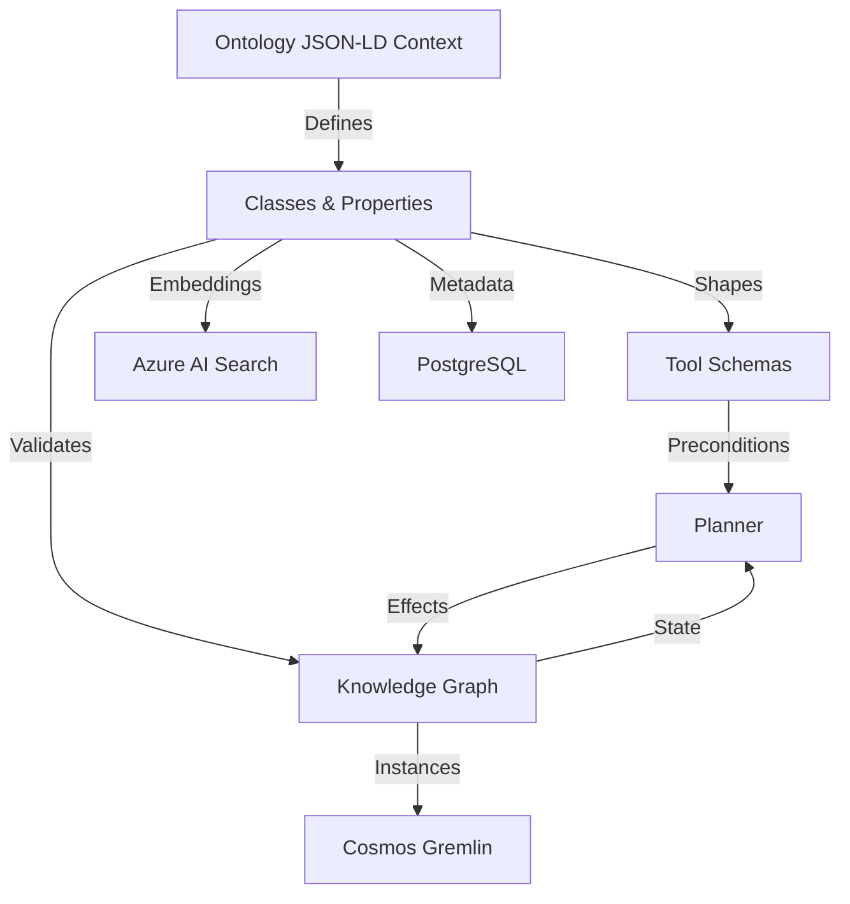
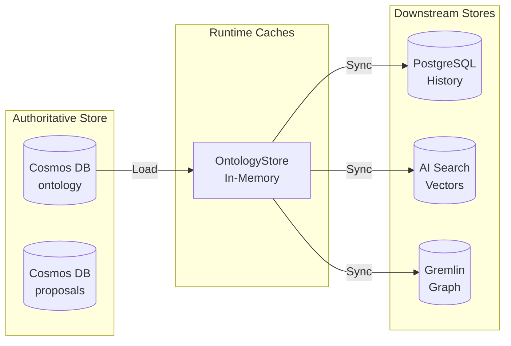
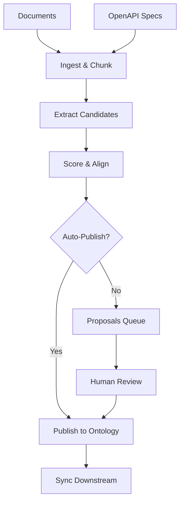
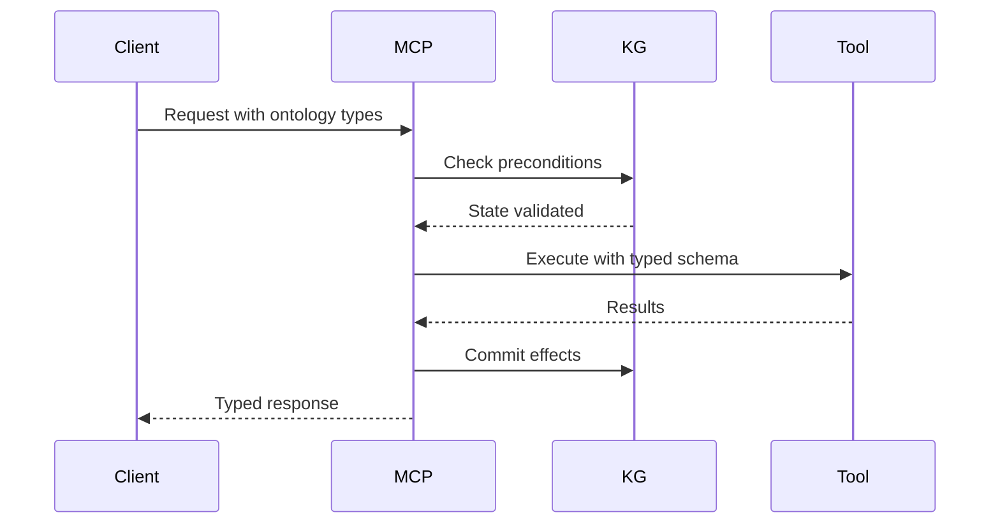

# LimboDancer Ontology Design and Implementation

## Overview

LimboDancer.MCP uses ontology as its **semantic backbone**, providing a formal vocabulary that ensures AI agents, tools, and services interpret and reason about information consistently. The ontology layer enables typed planning, reasoning, validation, and governance across the distributed system.

## Core Architecture

## Key Distinctions

**Ontology** = Schema and rules (classes, properties, constraints)  
**Knowledge Graph** = Data instances (actual entities and relationships)  
**Taxonomy** = Lightweight categorical hierarchies for filtering

The ontology defines what is possible; the KG records what exists.

## Multi-Tenant Architecture

Every ontology artifact is scoped by **hierarchical partition keys**:
- **Tenant** - Organization boundary
- **Package** - Module grouping (e.g., "travel", "core")
- **Channel** - Version stream (e.g., "current", "v1.3.0")

Cross-tenant queries are explicitly forbidden. All operations require full `{tenant, package, channel}` scope.

## Storage Architecture

## Ontology Artifacts

### Classes (EntityDef)
Domain concepts like `Person`, `Trip`, `Reservation`, `Tool`

### Properties (PropertyDef)  
Attributes with owner, range, cardinality (e.g., `Reservation.status`)

### Relations (RelationDef)
Typed edges between classes (e.g., `Reservation --forTrip--> Trip`)

### Enums (EnumDef)
Closed value sets (e.g., status ∈ {Active, Canceled})

### Aliases (AliasDef)
Canonical names + synonyms for robust matching

### Shapes (ShapeDef)
SHACL-like validation constraints per class

## Generation Pipeline

### Scoring Dimensions

Each artifact carries:
- **Confidence** (0-1) - Extraction quality
- **Complexity** (0-1) - Structural intricacy  
- **Depth** (0-1) - Distance from core classes

Auto-publish thresholds:
- Alias: 0.95
- Enum: 0.92
- Entity/Property/Relation: 0.90-0.92

## Tool Integration

Tools declare:
- Input/output schemas bound to ontology CURIEs
- Preconditions as KG queries
- Effects as state transitions

## Operational Flow

### Development Time
1. Ingest sources → Extract ontology candidates
2. Score candidates → Auto-publish or queue for review
3. Approve proposals → Publish to authoritative store
4. Export RDF/JSON-LD for external tools

### Runtime
1. Load ontology into memory (OntologyStore)
2. Tools validate inputs against schemas
3. Planner checks preconditions in KG
4. Execute tools → Commit effects to KG
5. Maintain consistency across stores

## Governance

- **Approval Gates**: New classes require human review
- **Constraints**: SHACL-style validators enforce rules
- **Provenance**: Every artifact tracks source documents
- **Versioning**: Channels enable controlled evolution

## Export Formats

- **JSON-LD**: Native format with @context
- **Turtle/RDF**: For external reasoning systems
- **Graph Schema**: Vertex/edge manifest for Gremlin

## Implementation Status

### Complete
- Multi-tenant Cosmos storage with HPK
- In-memory OntologyStore with indexes
- JSON-LD/RDF export services
- Tool schema binding framework
- Basic validators and governance

### In Progress
- Ontology Generator for automated extraction
- Change Feed synchronization
- Operator Console review UI

### Future
- OWL reasoning integration
- Cross-ontology mapping
- Advanced governance rules