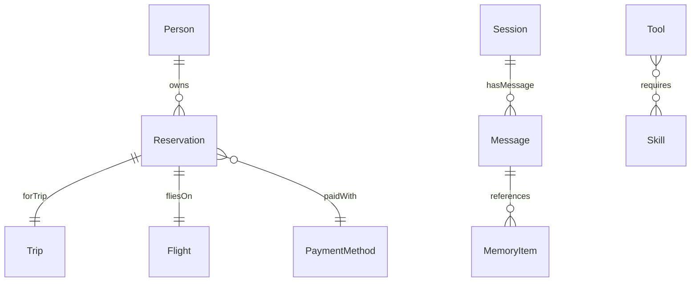

# LimboDancer Ontology Reference (`Ontology.md`)

Here’s a **starter `Ontology.md` reference file** you can drop into your `/docs` folder. It’s structured as a **living contract**: a glossary of ontology terms (classes, properties, constraints) that will evolve with the project and directly align with **Milestone 4 (Ontology v1)** in the Roadmap.

---


> This file is the **source of truth** for ontology terms used in LimboDancer.MCP.
> It complements [`Ontology and Agentic AI.md`](./Ontology%20and%20Agentic%20AI.md) (conceptual) and the [`Design Map`](./LimboDancer.MCP.md).
> It evolves milestone by milestone (see Roadmap).

---

## 1. Context

```json
{
  "@context": {
    "ldm": "https://limbodancer.ai/ontology/",
    "Person": "ldm:Person",
    "Trip": "ldm:Trip",
    "Reservation": "ldm:Reservation",
    "Flight": "ldm:Flight",
    "PaymentMethod": "ldm:PaymentMethod",
    "Session": "ldm:Session",
    "Message": "ldm:Message",
    "MemoryItem": "ldm:MemoryItem",
    "Tool": "ldm:Tool",
    "Skill": "ldm:Skill"
  }
}
```

---

## 2. Classes

| Class             | Description                                   | Example Instance             |
| ----------------- | --------------------------------------------- | ---------------------------- |
| **Person**        | A user or agent identity                      | `ldm:Person#user123`         |
| **Trip**          | A planned journey                             | `ldm:Trip#456`               |
| **Reservation**   | A booking for a trip or flight                | `ldm:Reservation#789`        |
| **Flight**        | A scheduled flight                            | `ldm:Flight#AA100`           |
| **PaymentMethod** | A credit card or account used in reservations | `ldm:PaymentMethod#card123`  |
| **Session**       | An MCP conversation session                   | `ldm:Session#42`             |
| **Message**       | A single turn in a session                    | `ldm:Message#101`            |
| **MemoryItem**    | A stored memory (vector, graph, reasoning)    | `ldm:MemoryItem#emb001`      |
| **Tool**          | An MCP-exposed capability                     | `ldm:Tool#cancelReservation` |
| **Skill**         | A requirement or precondition for a tool      | `ldm:Skill#reservationId`    |

---

## 3. Properties

| Property       | Domain      | Range         | Notes                                 |
| -------------- | ----------- | ------------- | ------------------------------------- |
| **owns**       | Person      | Reservation   | Person owns a reservation             |
| **forTrip**    | Reservation | Trip          | Reservation is for a trip             |
| **fliesOn**    | Reservation | Flight        | Reservation tied to flight            |
| **paidWith**   | Reservation | PaymentMethod | Reservation payment method            |
| **hasMessage** | Session     | Message       | Session contains messages             |
| **references** | Message     | MemoryItem    | Message references memory             |
| **requires**   | Tool        | Skill         | Tool requires skill/precondition      |
| **produces**   | Tool        | Reservation   | Tool produces or modifies reservation |

---

## 4. Constraints (Governance Rules)

* **Reservation must have exactly one Trip** (`forTrip` is mandatory).
* **Reservation must have at least one Person owner** (`owns`).
* **Tool requires → Skill** edges must be satisfied in KG before invocation.
* **Message references → MemoryItem** must point to valid, existing memory.
* **MemoryItem kind** ∈ {`vector`, `graph`, `reasoning`}.

---

## 5. Tool Schema Bindings

Example: *cancelReservation tool*

```json
{
  "name": "cancelReservation",
  "inputSchema": {
    "type": "object",
    "properties": {
      "reservationId": { "type": "string", "@id": "ldm:Reservation" }
    },
    "required": ["reservationId"]
  },
  "preconditions": [
    { "check": "exists", "subject": "ldm:Reservation", "status": "Active" }
  ],
  "effects": [
    { "update": "ldm:Reservation.status", "newValue": "Canceled" }
  ]
}
```

---

## 6. Knowledge Graph Shape



---

## 7. Milestone Evolution

* **Milestone 4 (Ontology v1):**
  Define classes, properties, JSON-LD context, and EF Core annotations.
* **Milestone 5:**
  Add precondition/effect rules for tools.
* **Milestone 6:**
  Load ontology instances into Cosmos Gremlin; enable neighborhood expansion.
* **Milestone 10:**
  Add SHACL-like validators and governance rules.

---

## 8. Future Extensions

* Add `Workspace`, `Document`, `Annotation` classes for ingestion.
* Expand governance with cardinality and type checks.
* RDF export for external reasoning (offline).

---

This doc is intentionally **mechanical and reference-style**, unlike the narrative in *Ontology and Agentic AI*.

---

👉 Would you like me to also generate a **starter `Ontology.cs` file** (C# constants/records for these URIs and classes) in the `/src/LimboDancer.MCP.Ontology` project so developers can use strongly-typed ontology terms in code?
