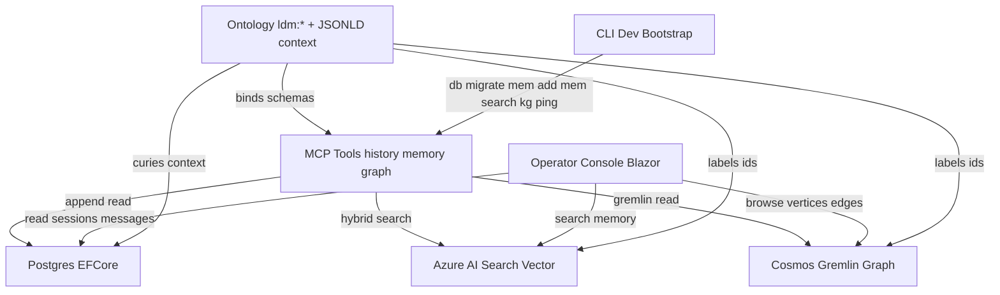
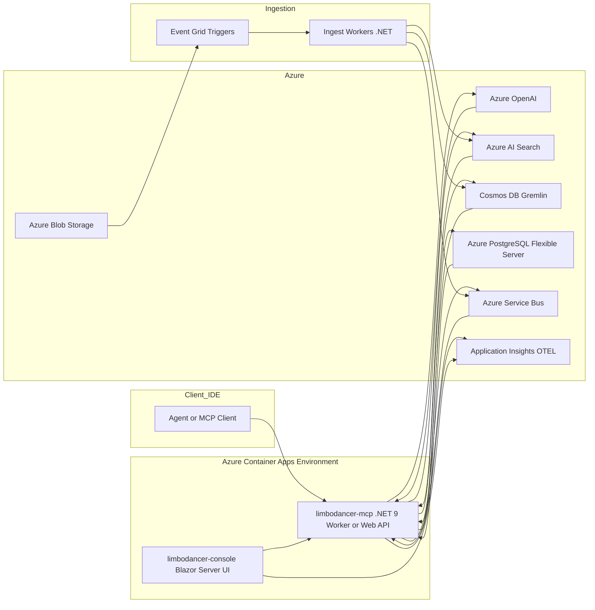
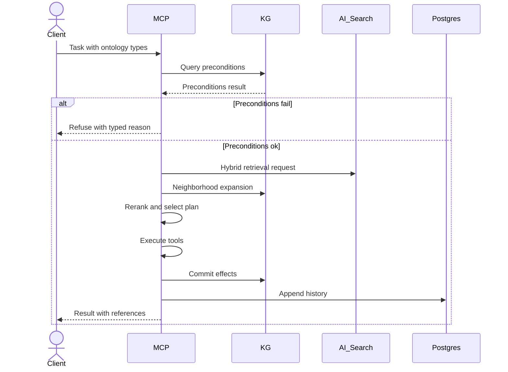
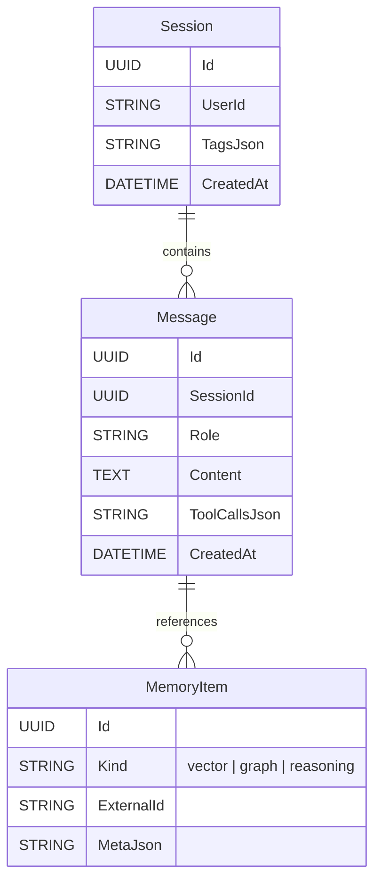
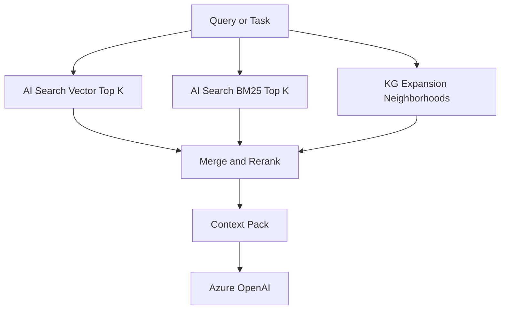
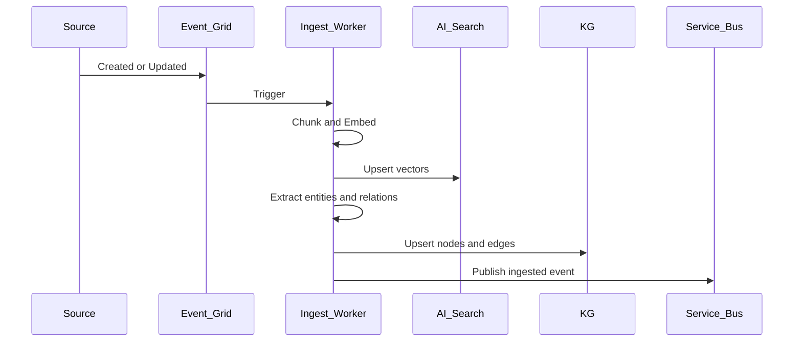

# LimboDancer.MCP — Architecture

> Target stack: .NET 9, Azure Container Apps, Azure OpenAI, Azure AI Search (vector/hybrid), Azure Cosmos DB (Gremlin API), Azure Database for PostgreSQL – Flexible Server, Azure Service Bus, Azure Blob Storage, Application Insights (OTEL).

## Architecture Diagram

---

## 1) Objectives

* Reimplement Cipher’s memory layer and MCP server in .NET with Azure-managed services.
* Treat ontology as first-class: typed entities, actions with preconditions and effects, ontology-bound tool schemas, KG-backed retrieval and governance.
* Support MCP stdio (local dev or agent embedding) and streamable HTTP (remote).
* Provide an operator UI (separate Blazor Server app) for admin, observability, memory and KG inspection.

Non-goals (v1):

* Heavy OWL reasoning in the hot path (prefer property graph plus lightweight validation).
* Multi-tenant SaaS control plane (single tenant first, keep hooks for future).

---

## 2) High-level system view

---

## 3) Component responsibilities

### 3.1 limbodancer-mcp (headless runtime)

The runtime executes MCP tools over stdio and HTTP. All requests carry an explicit **ontology scope** `{ tenant, package, channel }`. The planner, precondition checks, retrieval, and effect commits must propagate this scope end‑to‑end:

* **Planner & tools:** every step includes `{tenant,package,channel}` when invoking tools.
* **Retrieval:** AI Search queries filter on `tenant` (and optionally `package`,`channel`).
* **Knowledge Graph:** all traversals and upserts are scoped to the same tenant (partition or property guard).
* **History:** session and message reads/writes are scoped by tenant (service‑level guard; column optional).
* **Observability:** logs/traces tag the scope for isolation and triage.

---

### 3.2 limbodancer-console (Blazor Server UI)

* Operator dashboards: sessions and history, vector items, KG explorer, rule runs.
* Live tail of events via Service Bus subscription and trace views.

### 3.3 Libraries

* Core: contracts, tool and ontology interfaces, errors, result types.
* Llm: Microsoft.Extensions.AI adapters for Azure OpenAI (chat and embeddings).
* Vector.AzureSearch: vector CRUD and query, hybrid search, filters.
* Graph.CosmosGremlin: node and edge upsert, neighborhoods, precondition and effect helpers.
* Storage: EF Core models for sessions, messages, tool calls, memory metadata.
* Ontology: JSON LD context, URI constants, validators, tool schema annotations.

---

## 4) Ontology integration (first class)

**Action lifecycle**

**Governance**

* SHACL style validators implemented in code for speed.
* Rules run before tool invocation; audit results logged.

---

## 5) Data model (logical)

Graph (Cosmos Gremlin)

* Vertices: Person, Trip, Reservation, Flight, PaymentMethod, Skill, Tool
* Edges: owner(Person to Reservation), forTrip(Reservation to Trip), fliesOn(Reservation to Flight), requiresPrecondition(Tool to Skill), effect(Tool to Reservation)

---

## 6) Retrieval pipeline (hybrid GraphRAG)

* Chunking and embeddings: Ingest workers generate embeddings and upsert to AI Search.
* Graph summaries: Neighborhood descriptions cached in Blob.
* Filters: Ontology types and attributes applied to AI Search queries.

---

## 7) Transports and endpoints

* stdio: console entry point for MCP clients.
* HTTP streamable: `/mcp/tools/list`, `/mcp/invoke`, `/mcp/events` using SSE.
* Admin API: health, metrics, cache control, replay.

MCP runtime and Blazor Server UI are separate containers. MCP is stateless. UI uses sticky sessions only for operator circuits.

---

## **8) Azure services mapping (tenant isolation notes)**

| Concern           | Azure choice            | Notes                                                                                            |
| ----------------- | ----------------------- | ------------------------------------------------------------------------------------------------ |
| Chat & embeddings | Azure OpenAI            | Scope is metadata only; no tenant state is stored here.                                          |
| Vector retrieval  | Azure AI Search         | Add fields: `tenant` (required), `package`, `channel` (filterable). All queries filter `tenant`. |
| Knowledge graph   | Cosmos DB (Gremlin API) | Either tenant‑prefixed vertex IDs or a `tenant` property plus mandatory `.has('tenant', …)`.     |
| History           | Azure PostgreSQL        | Service‑level filter by tenant; add `TenantId` column when stronger isolation is needed.         |
| Events            | Service Bus             | Topic/subscription names include tenant or carry it in message properties.                       |
| Ontology store    | Cosmos DB (Core SQL)    | Authoritative HPK: `/tenant` → `/package` → `/channel`; no cross‑tenant queries.                 |

---

## **9) Security and tenancy**
Tenancy is a first‑class routing dimension throughout the system.

* **AuthZ:** User/app tokens resolve an active `{tenant,package,channel}`; HTTP requests without a resolvable tenant are rejected.
* **Routing:** All tool calls, storage requests, and graph/search operations must include the same scope.
* **Data plane isolation:**

  * **Ontology:** strictly per HPK `(tenant,package,channel)`; no cross‑tenant reads/writes.
  * **Vector:** every document stamped with `tenant`; queries require `tenant` filter.
  * **Graph:** enforce tenant either by vertex ID prefix or property guard in all traversals.
  * **History:** reads/writes are tenant‑scoped; `TenantId` column recommended for long‑term multi‑tenant ops.
* **Ops:** Observability data (logs/traces/metrics) include `tenant` labels. Backups/exports run per tenant.

---

## 10) Observability

* Traces: spans around MCP request, plan, tool calls, database, graph, search.
* Metrics: tool latency, vector and graph round trip, precondition failure rate.
* Logs: structured Serilog; correlation via trace id; PII scrubbing on write.
* Dashboards: workbooks and Kusto queries for errors and SLOs.

---

## 11) Ingestion flow

---

## 12) Failure modes and resilience

* LLM or embedding throttling: circuit breakers and backoff; cache embeddings.
* AI Search partial outage: degrade to BM25; log and surface warning.
* Cosmos RU pressure: adaptive queries; batch upserts; retry on 429.
* Service Bus backlog: KEDA scales consumers; DLQ with replay UI.
* Planner guardrails: precondition hard fail; max steps; tool allow list.

---

## 13) Developer experience and CI CD

* Local: SQLite, Azurite, Cosmos emulator optional, AI Search free tier.
* CLI: `limbodancer db migrate`, `mem add`, `mem search`, `kg upsert`, `kg query`, `serve --stdio`.
* CI CD: GitHub Actions build test publish containers and deploy to ACA; run EF migrations; smoke tests with MCP Inspector.

---

## **14) Versioning and compatibility**
Ontology **channels** (e.g., `current`, `v1.4.0`) are **per tenant**. Clients that require reproducibility must pin `{tenant,package,channel}` in requests and persisted artifacts. Server‑side defaults may resolve to `channel=current` but should never elide `tenant` in production paths.

---

## 15) Milestones

* Alpha: MCP stdio, history, embeddings, AI Search vector add and query, minimal ontology, one action with preconditions.
* Beta: reasoning and workspace memory, KG with preconditions and effects, HTTP transport, observability dashboards, ingestion pipeline.
* 1.0: compliance suite, packaging, governance rules, migration guides.

---

## 16) Open decisions

* Graph engine: Cosmos Gremlin managed versus Neo4j Aura with Cypher features. Start with Cosmos; revisit if queries demand Cypher.
* RDF and OWL: keep RDF export and offline validation; runtime stays property graph.
* Planner: start with typed ReAct; move to DAG or graph executor when tool chains grow.

---

### Notes on Mermaid rendering

* Keep types uppercase in ER diagrams: UUID, STRING, DATETIME, TEXT.
* Do not use comments inside Mermaid blocks.
* Avoid unicode arrows or special punctuation in labels.
* Avoid line breaks in labels; use concise ASCII text.

If you want, I can also push this as a PR-ready `docs/Architecture.md` with the exact content above.
