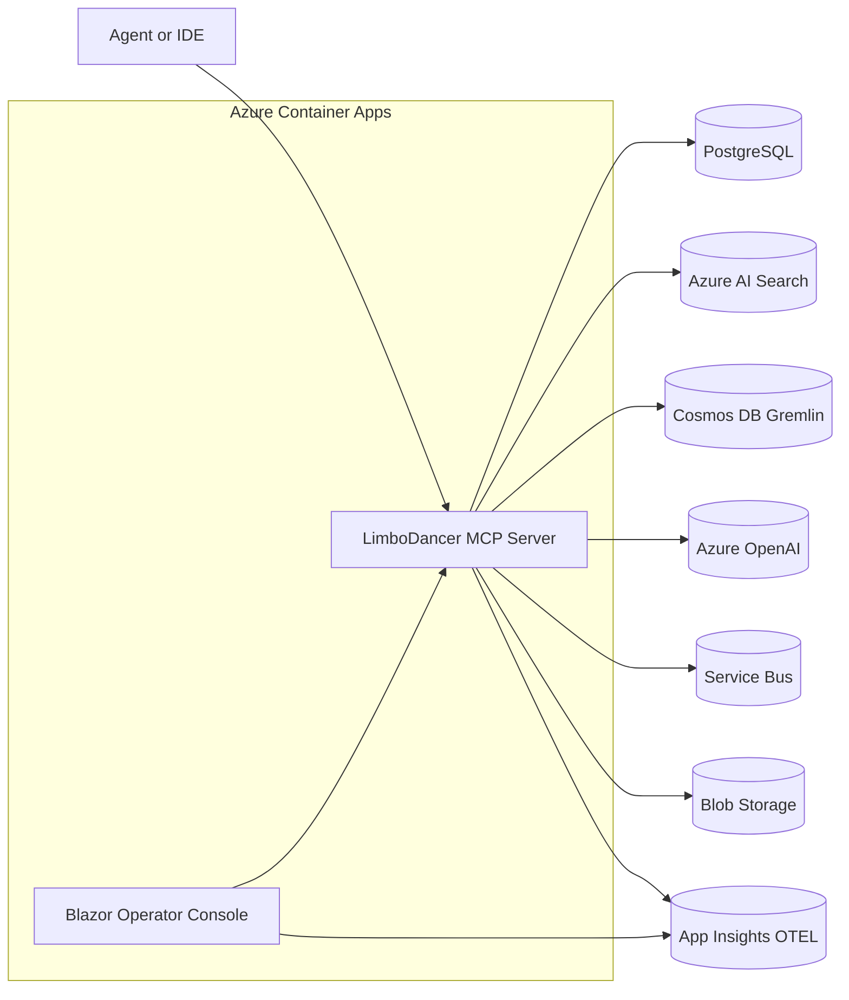

# LimboDancer.MCP — Design Map

## Purpose

LimboDancer.MCP is a **.NET 9** reimplementation of Cipher’s memory layer and Model Context Protocol (MCP) server, adapted to **Azure-first architecture** with strong **ontology integration**.

It provides:

* **MCP runtime**: headless worker/web API exposing tools over stdio and HTTP.
* **Persistence and memory**: relational history, vector store, and knowledge graph.
* **Ontology-driven planning**: typed schemas, preconditions, and effects.
* **Operator UI**: Blazor Server console for inspection and governance.

---

## Platform Targets

* **Language & Runtime**: .NET 9
* **Hosting**: Azure Container Apps (MCP runtime + Blazor console as separate containers)
* **Data Stores**:

  * PostgreSQL Flexible Server — sessions, history, metadata
  * Azure AI Search — vector and BM25 hybrid search
  * Cosmos DB Gremlin API — ontology-backed knowledge graph
  * Azure Blob Storage — artifacts, summaries, audit bundles
* **LLMs**: Azure OpenAI (chat and embeddings) via Microsoft.Extensions.AI
* **Events**: Azure Service Bus for ingestion and workflow signals
* **Observability**: Application Insights with OpenTelemetry

---

## Core Projects

```
/src
  LimboDancer.MCP.Core          // contracts, DTOs, result types
  LimboDancer.MCP.Storage       // EF Core models + migrations
  LimboDancer.MCP.Vector        // Azure AI Search integration
  LimboDancer.MCP.Graph         // Cosmos Gremlin graph integration
  LimboDancer.MCP.Llm           // Azure OpenAI adapters
  LimboDancer.MCP.Ontology      // ontology context, schemas, validators
  LimboDancer.MCP.McpServer     // MCP runtime (stdio + HTTP)
  LimboDancer.MCP.Cli           // CLI for dev and operators
  LimboDancer.MCP.BlazorConsole // Operator/admin UI
```

---

## Ontology Integration

* Ontology represented as **JSON-LD context** in `/src/LimboDancer.MCP.Ontology`.
* EF Core models and MCP tool schemas mapped to ontology URIs.
* **Precondition checks**: queries against KG before tool execution.
* **Effect commits**: tool results update KG and history with ontology semantics.
* **Governance**: lightweight SHACL-style validators applied at runtime.

---

## High-Level Architecture



---

## Functional Pillars

1. **History**

   * Sessions and messages persisted in PostgreSQL.
   * Linked to ontology entities when applicable.

2. **Vector Memory**

   * Embeddings generated by Azure OpenAI.
   * Indexed in Azure AI Search with hybrid retrieval (vector + BM25).
   * Ontology metadata stored alongside vectors for filtering.

3. **Knowledge Graph**

   * Ontology instances stored in Cosmos Gremlin.
   * Graph used for precondition validation and context expansion.

4. **Planning**

   * Typed ReAct loop with ontology-aware tool schemas.
   * Tool invocation governed by KG preconditions and effects.

5. **Operator Console**

   * Blazor Server dashboards for sessions, vectors, KG inspection, and event tails.
   * Governance violation logs and replay UI for DLQ.

---

## Deployment & CI/CD

* **Containers** for MCP server and Blazor console published via GitHub Actions.
* Deployment to **Azure Container Apps** with EF Core migrations applied.
* Observability auto-wired with OpenTelemetry and Application Insights.

---

## Development Notes

* **Local dev**: SQLite for Postgres substitute, Azurite for Blob, Cosmos emulator optional, AI Search free tier for testing.
* **CLI tooling** for migrations, memory ops, KG queries, and serving over stdio.
* **Future**: adopt **.NET Aspire** for local orchestration, telemetry defaults, and Azure service wiring.

---

## Alignment with Roadmap

* **Alpha**: stdio + persistence + embeddings/vector search.
* **Beta**: ontology, KG integration, planner, ingestion, HTTP transport.
* **1.0**: Blazor console, observability, governance, packaging.

---

Would you like me to also **update `Ontology and Agentic AI.md`** so it cross-references both this Design Map and the updated Roadmap (tying ontology milestones directly to engineering deliverables)?
