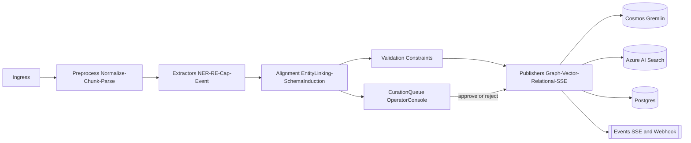

# **Ontology Generator** 
## Service for LimboDancer MCP

# What this service does (in one line)

Given any source of information, produce **first-class Ontology Artefacts** (entities, relations, events, capabilities, constraints, provenance) aligned to LimboDancer’s ontology, then publish them to our stores (graph + vectors + relational) for downstream agents and tools.

---

# Inputs → Outputs

**Inputs (examples)**

* Textual: product docs, design notes, transcripts, tickets, logs.
* Semi-structured: JSON/CSV, OpenAPI/GraphQL schemas, database schemas.
* Code: C# types, comments, attributes.
* Streams: SSE event logs, operator notes.

**Outputs (Ontology Artefacts)**

* **Concepts/Entities** (canonical nodes; IDs, labels, aliases)
* **Relations** (typed edges; direction, roles, cardinality)
* **Events** (domain events w/ actors, targets, time)
* **Capabilities/Tools** (actions an agent can take; MCP tool surface)
* **Taxonomy slots** (categories, tags)
* **Constraints** (validation rules; e.g., required attributes, allowed enums)
* **Provenance & confidence** (source URIs, spans, timestamps, model version)
* **Embeddings** (per-artefact and per-span)
* **Change deltas** (adds/updates/deprecations)

---

# High-level pipeline

1. **Ingest**

* Connectors (file, http, repo, transcript).
* Normalization to a common **DocumentEnvelope** (id, type, mime, language, timestamps).

2. **Preprocess**

* Chunking (semantic + structural).
* Lightweight parsing (JSON/XML/Markdown), code model extraction (C# roslyn when applicable).
* PII/sensitive screen if needed.

3. **Candidate Extraction**

* LLM-assisted NER/RE and schema probing.
* Deterministic patterns for known formats (OpenAPI, DB schemas → capability/entity drafts).
* Heuristics: title/entity priors, heading-to-attribute promotion.

4. **Ontology Alignment**

* Entity linking (string + embedding + alias tables).
* Relation typing against our predicate catalog.
* Schema induction (new class proposal) with **human-in-the-loop gate** and governance rules.
* Conflict resolution (existing vs. proposed; deprecation strategy).

5. **Validation**

* Structural checks (required fields).
* Constraint checks (cardinality, allowed values).
* Cross-store referential checks (IDs present in graph and relational).

6. **Publish**

* **Graph**: upsert nodes/edges (Cosmos DB Gremlin).
* **Vectors**: per-artefact & per-span embeddings (Azure AI Search hybrid).
* **Relational**: artefact registry, provenance ledger, review queues (Postgres/EF Core).
* **Events**: SSE/webhook (“ontology.updated”, “ontology.proposed”, “capability.generated”).

7. **Feedback & Curation**

* Operator Console surfaces diffs for approval.
* Active-learning loop to improve extraction prompts and matchers.

---

# Service responsibilities & boundaries

**Owns**

* Parsing + extraction + alignment logic.
* Artefact versioning & provenance.
* Publication fan-out and consistency.

**Collaborates**

* **History/Memory/Graph tools** (read/write).
* **Operator Console** (review/approve; diff UI).
* **Dev CLI** (batch runs, dry-run, reindex).
* **Auth/SSE** hardening (ingress + eventing).

---

# Core components (C#/.NET 8)

* `LimboDancer.MCP.OntologyGen` (service)

  * **Ingress**: `ISourceReader` (File/HTTP/Git/Transcript).
  * **Normalization**: `IDocNormalizer`.
  * **Extraction**:

    * `IChunker` (semantic + structural)
    * `IEntityExtractor`, `IRelationExtractor`, `IEventExtractor`
    * `ICapabilityExtractor` (OpenAPI/GraphQL → MCP tools)
  * **Alignment**:

    * `IEntityLinker` (aliases + embeddings)
    * `ISchemaInducer` (proposal objects)
    * `IConstraintApplier`
  * **Validation**: `IArtefactValidator`
  * **Publishers**:

    * `IGraphPublisher` (Cosmos Gremlin)
    * `IVectorPublisher` (Azure AI Search)
    * `IRelationalPublisher` (EF Core → Postgres)
    * `IEventPublisher` (SSE/Webhook)
  * **Governance**:

    * `ICurationQueue` (proposals needing approval)
    * `IVersioningService` (semver for ontology elements)
    * `IProvenanceService` (source spans, model hash)
  * **Observability**:

    * `IAuditLog`, `IMetrics`, `TraceContext`

* `LimboDancer.MCP.Contracts` (DTOs/interfaces)

  * `DocumentEnvelope`, `Chunk`, `Artefact` (base)
  * `Entity`, `Relation`, `Event`, `Capability`, `Constraint`
  * `Provenance`, `Confidence`, `ChangeDelta`

* `LimboDancer.MCP.Cli`

  * `ontogen ingest <path|url>` (single/batch)
  * `ontogen dry-run --emit json`
  * `ontogen publish --approve`
  * `ontogen reindex --vectors|--graph`
  * `ontogen link --reconcile`

---

# Data & storage model

**Graph (Cosmos Gremlin)**

* V: `Entity{key, kind, labels, attrs}`, `Event{…}`, `Capability{…}`
* E: typed relations (e.g., `USES`, `LOCATED_IN`, `PRODUCES`)
* Properties carry `version`, `provenance[]`, `confidence`

**Relational (Postgres)**

* `artefacts` (id, type, version, state, timestamps)
* `provenance` (artefact\_id, source\_uri, span\_start, span\_end)
* `curation_queue` (proposal\_id, reviewer, status, notes)
* `constraints` (target\_id, rule, args, status)

**Vector (Azure AI Search)**

* Index `ontology_chunks` (chunk\_text, embeddings, artefact\_refs\[], tags)
* Index `entities` (name, aliases, defs, embeddings)

---

# API surface (HTTP + SSE)

**HTTP**

* `POST /ingest`  → enqueue & normalize
* `POST /extract` → dry-run; returns candidate artefacts
* `POST /align`   → attempts entity linking; returns deltas
* `POST /validate`→ returns violations
* `POST /publish` → writes to stores; emits events
* `GET /proposals/:id` / `POST /proposals/:id/approve|reject`
* `GET /artefacts/:id` (with provenance & versions)

**SSE topics**

* `ontology.proposed`, `ontology.updated`, `capability.generated`, `validation.failed`

---

# Example artefact payloads (concise)

```json
{
  "type": "Entity",
  "id": "ent:Service:OntologyGenerator:1.0.0",
  "kind": "Service",
  "labels": ["Ontology Generator", "OntoGen"],
  "attributes": {
    "owner": "MCP.Core",
    "status": "Active"
  },
  "provenance": [
    {"source": "file:///docs/architecture.md", "span": [1220, 1540], "time": "2025-08-17T15:00:00Z"}
  ],
  "confidence": 0.86,
  "version": "1.0.0"
}
```

```json
{
  "type": "Relation",
  "id": "rel:OntologyGenerator->CosmosGraph:USES:1",
  "predicate": "USES",
  "from": "ent:Service:OntologyGenerator:1.0.0",
  "to": "ent:Service:CosmosGraph:1.0.0",
  "provenance": [{"source":"…"}],
  "confidence": 0.92
}
```

```json
{
  "type": "Capability",
  "id": "cap:GenerateMcpTool:1",
  "name": "Generate MCP Tool",
  "inputSchemaRef": "schema://openapi/op#/paths/~1tools/post",
  "outputSchemaRef": "schema://mcp/tool",
  "provenance": [{"source":"…"}]
}
```

---

# Validation & governance

* **Approval gates**:

  * New classes and predicates require human approval.
  * Safe merges for new instances/aliases under thresholds.
* **Constraints**:

  * Enforce mandatory attributes per class.
  * SHACL-like checks implemented as C# validators.
* **Confidence thresholds**:

  * `≥0.9` auto-publish; `0.6–0.89` propose; `<0.6` hold for review.
* **Drift detection**:

  * If repeated proposals conflict, open a “schema drift” review item.

---

# Operator Console (what we’ll add)

* “Ontology Proposals” grid (diff view: add/update/delete).
* Span-highlight viewer (left: source chunk; right: artefact preview).
* Alignment panel (choose existing vs. create new).
* One-click approve/rollback; emits SSE back to services.

---

# Quality & performance targets

* **Latency**: < 2s per 2k-token chunk end-to-end (cached models).
* **Throughput**: 50k chunks/day per node (batch mode).
* **Precision/Recall** (initial): P≥0.85 / R≥0.75 on entity linking for known domains; measurable via curated test corpora.
* **Idempotency**: re-ingest produces no net deltas when no content changes.

---

# Security

* Signed provenance records (hash over source bytes + model id).
* Least-privilege writers per store (separate service principals).
* Redaction hooks in preprocess; opt-out sources honored.
* Audit trail on all approvals and schema changes.

---

# Milestones (incremental)

1. **M0 — Skeleton**: envelopes, chunker, deterministic OpenAPI→Capabilities, graph & vector publish, CLI `ingest`, `dry-run`.
2. **M1 — Alignment**: entity linker (aliases + embeddings), proposals & curation queue, SSE events, Console list view.
3. **M2 — Rich Extraction**: relations/events from free text (LLM + patterns), validators, confidence thresholds.
4. **M3 — Governance**: schema induction with approval gates, versioning, drift detection, rollback.
5. **M4 — Scale & DX**: batching, retries, observability, full Console diff UI, CLI reindex/link tools.

---

## Component View



---

# What we’ll build (at a glance)

* **Accepts**: docs first (files/Markdown/Confluence/Git docs), OpenAPI next.
* **Produces**: ontology artefacts (Classes, Properties, RelationTemplates, Aliases, Enums/States, Mappings) with **provenance**, **confidence**, **complexity**, and **depth**.
* **Publishes**:

  * to **Postgres** (catalog + review queue),
  * to **Azure AI Search** (retrievability),
  * to **Cosmos Gremlin** (when auto-publish passes),
  * optional **RDF export** (Turtle & JSON-LD) using our existing `@context`.
* **Governance**: high **auto-publish** gates per artefact type; everything else flows to a **human review queue** in the Operator Console.

---

## 1) Artefact types (first cut)

1. **EntityClass** – a domain concept (e.g., Reservation).
2. **Property** – attribute of a class (e.g., Reservation.status).
3. **RelationTemplate** – edge schema between classes (e.g., Reservation —forTrip→ Trip).
4. **AliasMapping** – synonyms/canonical names for classes/properties (ground-truth tables).
5. **Enum/State** – closed sets (e.g., Reservation.status ∈ {Active, Canceled}).
6. **SourceMapping** – where/how an artefact was inferred from a source (OpenAPI schema → class/property; doc section → class).
7. **Justification** – machine-readable proof: snippets, retrieval scores, rule hits, model votes.

Each artefact is annotated with:

* `confidence` (0–1), `complexity` (0–1), `depth` (0–1), `status` (`proposed | published | conflicted`), `provenance[]`.

---

## 2) Connectors (docs now, OpenAPI next)

**Docs first** (as you asked). Pipeline:

* **Acquire** → **Chunk** (sentence/section aware) → **Embed** → **Hybrid retrieve** (BM25+vector) → **Extract** candidates → **Normalize** with **Alias Tables** (you curate) → **Score** → **Gate** → **Publish/Queue**.

OpenAPI next is a strong accelerator: we can deterministically map schemas to classes/properties and use text extraction only for descriptions and examples.

---

## 3) Scoring signals & gates

We’ll keep **auto-publish hard to earn**, and surface the rest for review.

### Confidence (0–1) = weighted blend

* **Source quality** (doc kind/owner/recency/section weight): 0.20
* **Retrieval clarity** (top-k margin, density of hits across chunks): 0.10
* **Extraction agreement** (self-consistency across prompts + second model sanity pass): 0.15
* **Alias coverage** (matches your curated tables; penalty if conflicting): 0.20
* **KG alignment** (links cleanly to existing nodes; no range/domain conflicts): 0.20
* **Constraint satisfaction** (enum closure, multiplicities verified against text/specs): 0.10
* **Temporal stability** (not contested by newer sources): 0.05

> Numbers are tunable; we’ll expose them as config.

### Complexity (0–1)

* Structural: #properties, #relations, presence of nested enumerations/constraints.
* Linguistic: domain-specific jargon density & ambiguity (higher ambiguity → higher complexity).
* Use: high complexity **raises** the bar for auto-publish (even with high confidence).

### Depth (0–1)

* Graph-aware: normalized shortest-path from this artefact to your **core classes**; deeper/leafier = higher depth.
* Use: high depth **lowers** auto-publish and **prioritizes** human review (it’s farther from the “known core”).

---

## 4) Auto-publish thresholds (initial policy)

| Artefact             | Min Confidence | Additional gates                                                   |
| -------------------- | -------------: | ------------------------------------------------------------------ |
| **AliasMapping**     |       **0.95** | Must not conflict existing alias; if conflict → review.            |
| **Enum/State**       |       **0.92** | All enumerants seen ≥2 sources or spec; no contradictions.         |
| **RelationTemplate** |       **0.90** | Domain/range align with existing; no cardinality conflict.         |
| **Property**         |       **0.90** | Range resolvable; not colliding with existing property semantics.  |
| **EntityClass**      |       **0.92** | Must connect to core via ≥1 credible relation or be spec-anchored. |
| **SourceMapping**    |       **0.88** | Deterministic transforms OK (OpenAPI); doc mapping needs ≥0.90.    |

Modifiers:

* If `complexity > 0.6` **or** `depth > 0.6`, add **+0.03** to threshold.
* If **spec-anchored** (OpenAPI schema, formal standards), allow **−0.02** leeway.

Everything below threshold → **review queue** with explanations & justifications attached.

---

## 5) Provenance & explainability (what we store)

Per artefact:

* `sources[]`: `{uri, section, chunkIds[], hash, retrievedAt}`
* `snippets[]`: minimally sufficient quotes (with offsets) proving the extraction
* `retrieval`: `topScore`, `margin`, `coverage`
* `validators`: `{ruleHits, enumClosure, kgChecks}` results
* `models`: prompts/versions + yes/no votes (no raw prompts in prod logs unless you want them)

---

## 6) RDF export (yes)

We’ll support **JSON-LD** and **Turtle**.

* JSON-LD uses your existing **`@context`** so CURIEs remain `ldm:*` and round-trip cleanly.
* Export can run for **selected artefacts**, a **patch set**, or the **entire catalog**.
* Wire an “Export → RDF” button in the review UI and a CLI verb (`onto export --format ttl|jsonld --filter ...`).

---

## 7) Data model (lean C#)

```csharp
public abstract class OntoArtefact {
  public required string Id { get; init; }               // ldm:Something#guid
  public required string Kind { get; init; }             // EntityClass|Property|RelationTemplate|AliasMapping|Enum
  public required string Curie { get; init; }            // ldm:Reservation, ldm:status, etc.
  public double Confidence { get; set; }
  public double Complexity { get; set; }
  public double Depth { get; set; }
  public string Status { get; set; } = "proposed";       // proposed|published|conflicted
  public required List<Provenance> Provenance { get; init; }
}

public sealed class EntityClassArtefact : OntoArtefact {
  public string? Label { get; set; }
  public List<string> SuggestedParents { get; set; } = [];
}

public sealed class PropertyArtefact : OntoArtefact {
  public required string OwnerClass { get; init; }       // CURIE
  public string? Range { get; set; }                     // CURIE|xsd:*
  public bool? IsRequired { get; set; }
}

public sealed class RelationTemplateArtefact : OntoArtefact {
  public required string OutClass { get; init; }         // CURIE
  public required string EdgeCurie { get; init; }        // ldm:forTrip
  public required string InClass { get; init; }          // CURIE
  public string? Multiplicity { get; set; }              // e.g., 0..*, 1..1
}

public sealed class AliasMappingArtefact : OntoArtefact {
  public required string CanonicalCurie { get; init; }
  public required List<string> Aliases { get; init; }
  public string? Locale { get; set; }
}

public sealed class EnumArtefact : OntoArtefact {
  public required string Owner { get; init; }            // class or property CURIE
  public required List<string> Values { get; init; }     // ["Active","Canceled"]
}

public sealed record Provenance(
  string Uri, string? Section, IReadOnlyList<string> ChunkIds,
  string Snippet, double RetrievalScore, DateTime RetrievedAtUtc);
```

Storage:

* **Postgres**: catalogue tables (`ontology_artefacts`, `provenance`) with `jsonb` detail and review flags.
* **Azure AI Search**: index each artefact for quick find/filter in console (title/content/tags → includes `ontologyClass`, `status`, `confidence`).
* **Gremlin**: only after publish → add/update labels/properties/edge templates.

---

## 8) Pipeline stages (service design)

1. **Gather** (Docs Connector)

   * crawl/ingest; normalize to text with source URIs
2. **Chunk & Embed**

   * reuse your existing chunker/embeddings; store chunk IDs & positions
3. **Candidate extraction**

   * LLM prompt templates (+ few rules/regex for enums/aliases) → artefact candidates
   * second-pass **critic model** for agreement
4. **Normalization**

   * canonicalize with **Alias Tables** (your curated truths)
   * detect collisions/conflicts with existing KG/catalog
5. **Alignment**

   * try linking classes/props to **existing KG**; compute `depth`
6. **Scoring**

   * compute `confidence`, `complexity`, apply modifiers
7. **Gate**

   * if above threshold & no conflicts → **publish**
   * else → **review queue** with explanations
8. **Commit & Export**

   * Postgres catalogue (always)
   * Gremlin (if published)
   * optional RDF artifact dump (per selection/patch/all)

---

## 9) Ground-truth alias tables

* **Authoritative source**: **your docs**, curated by you.
* Represent as **AliasMappingArtefact** rows plus an override table you can hand-edit.
* Precedence: **manual override > published alias > proposed alias**.
* During extraction, **penalize** candidates that contradict aliases; during review, show collisions.

---

## 10) Operator Console additions (review UX)

* **Review queue**: sort by *risk = (1−confidence) + complexity + depth/2*.
* Diff view: “Proposed vs Current KG” (domain/range, enums, edges).
* One-click: **Publish**, **Reject**, **Edit & Publish**, **Export RDF**.
* Filters: by artefact kind, status, class, confidence band.
* Drill-down shows **snippets** and **scores** that led to the proposal.

---

## 11) MCP & CLI surfaces

**MCP Tool** `ontology.generate`

* **Input** `{ sourceUri, sourceKind: "doc|openapi", target: "catalog|kg|both", autoPublish?: bool, minConfidenceOverride?: number, dryRun?: bool }`
* **Output** `{ summary, counts, published[], queued[], conflicts[] }`
* Schema embeds our JSON-LD `@context` so fields are ontology-bound.

**CLI** verbs

* `onto doc2artefacts --path <dir|file> --dry-run`
* `onto publish --min-confidence 0.92`
* `onto export --format ttl|jsonld --filter kind=Property,status=published`

---

## 12) Working with an existing KG (your note)

Exactly. That’s why we compute **depth** (graph distance from core) and **alignment** (domain/range checks, existing node matches). In practice:

* When **aligned** cleanly and **near core** (low depth), we can be generous about publish (still high thresholds).
* When **deep/leafy** or **weakly aligned**, the artefact lands in the **review queue** even with decent confidence.
* Conflict types we detect early: **range mismatch**, **edge multiplicity clash**, **alias collision**, **enum drift**.

---

## 13) Defaults that match your prefs

* **RDF export**: ✅ on, JSON-LD/Turtle.
* **High auto-publish bars**: ✅ table above; most complex or deep items head to review.
* **Connectors**: ✅ **Docs first**, OpenAPI next.
* **Alias tables**: ✅ sourced from your docs, curated by you, with hard precedence.

---

## 14) What you’ll see first (MVP cut)

* Service: `OntologyGenerator` (hosted alongside ingestion).
* New tables in Postgres + a small read model for the console.
* One MCP tool `ontology.generate` + two CLI verbs (`doc2artefacts`, `export`).
* Console: **Review queue** page with publish/export actions.
 
 ---
 
 # LimboDancer.MCP — Ontology Generator MVP

This package adds the **Postgres schema + EF Core entities**, an **MCP tool descriptor + HTTP controller**, and a **Blazor Operator Console review page** for ontology artefacts.

> Files below are ready-to-drop into your solution structure. Adjust namespaces to match your repo root if needed.

---

## 1) Database Schema (PostgreSQL)

**File:** `db/migrations/2025-08-17_ontology_catalog.sql`

```sql
-- Enable extensions we rely on
CREATE EXTENSION IF NOT EXISTS pgcrypto;   -- for gen_random_uuid()
CREATE EXTENSION IF NOT EXISTS pg_trgm;    -- for trigram indexes

-- Main artefact catalogue
CREATE TABLE IF NOT EXISTS ontology_artefacts (
  record_id         uuid PRIMARY KEY DEFAULT gen_random_uuid(),
  artefact_id       text NOT NULL UNIQUE,                -- stable logical id (e.g., ldm:Reservation#12b4)
  kind              text NOT NULL CHECK (kind IN ('EntityClass','Property','RelationTemplate','AliasMapping','Enum')),
  curie             text NOT NULL,                       -- canonical CURIE (e.g., ldm:Reservation)
  label             text,
  -- Type-specific columns (nullable by design)
  owner             text,                                -- e.g., Property/Enum owner CURIE
  range             text,                                -- e.g., xsd:string or ldm:Trip
  is_required       boolean,
  values            text[],                              -- Enum values
  aliases           text[],                              -- AliasMapping values
  out_class         text,
  in_class          text,
  edge_curie        text,
  multiplicity      text,

  -- Scoring & governance
  confidence        double precision NOT NULL,
  complexity        double precision NOT NULL,
  depth             double precision NOT NULL,
  status            text NOT NULL CHECK (status IN ('proposed','published','conflicted')),

  -- Arbitrary details and model-specific payloads
  data              jsonb NOT NULL DEFAULT '{}'::jsonb,

  created_at        timestamptz NOT NULL DEFAULT now(),
  updated_at        timestamptz NOT NULL DEFAULT now()
);

CREATE INDEX IF NOT EXISTS idx_onto_artefacts_kind_status ON ontology_artefacts(kind, status);
CREATE INDEX IF NOT EXISTS idx_onto_artefacts_curie_trgm ON ontology_artefacts USING gin (curie gin_trgm_ops);
CREATE INDEX IF NOT EXISTS idx_onto_artefacts_data_gin ON ontology_artefacts USING gin (data);
CREATE INDEX IF NOT EXISTS idx_onto_artefacts_scores ON ontology_artefacts(confidence, complexity, depth);

-- Provenance entries tied to artefacts
CREATE TABLE IF NOT EXISTS ontology_provenance (
  id                 uuid PRIMARY KEY DEFAULT gen_random_uuid(),
  artefact_record_id uuid NOT NULL REFERENCES ontology_artefacts(record_id) ON DELETE CASCADE,
  uri                text NOT NULL,
  section            text,
  chunk_ids          text[],
  snippet            text,
  retrieval_score    double precision,
  retrieved_at       timestamptz NOT NULL,
  extra              jsonb NOT NULL DEFAULT '{}'::jsonb
);

CREATE INDEX IF NOT EXISTS idx_onto_prov_art ON ontology_provenance(artefact_record_id);
CREATE INDEX IF NOT EXISTS idx_onto_prov_uri_trgm ON ontology_provenance USING gin (uri gin_trgm_ops);

-- Review queue for governance
CREATE TABLE IF NOT EXISTS ontology_review_queue (
  id                 uuid PRIMARY KEY DEFAULT gen_random_uuid(),
  artefact_record_id uuid NOT NULL REFERENCES ontology_artefacts(record_id) ON DELETE CASCADE,
  risk_score         double precision NOT NULL,
  reviewer           text,
  status             text NOT NULL CHECK (status IN ('pending','approved','rejected')),
  notes              text,
  proposed_patch     jsonb NOT NULL,   -- the proposed change/diff for editor UX
  created_at         timestamptz NOT NULL DEFAULT now(),
  decided_at         timestamptz
);

CREATE INDEX IF NOT EXISTS idx_review_status ON ontology_review_queue(status);
CREATE INDEX IF NOT EXISTS idx_review_risk ON ontology_review_queue(risk_score DESC);

-- Updated-at trigger
CREATE OR REPLACE FUNCTION set_updated_at()
RETURNS TRIGGER AS $$
BEGIN
  NEW.updated_at = now();
  RETURN NEW;
END; $$ LANGUAGE plpgsql;

DROP TRIGGER IF EXISTS trg_set_updated_at ON ontology_artefacts;
CREATE TRIGGER trg_set_updated_at
BEFORE UPDATE ON ontology_artefacts
FOR EACH ROW EXECUTE FUNCTION set_updated_at();

-- Helpful view for console listing
CREATE OR REPLACE VIEW vw_ontology_review_items AS
SELECT
  rq.id                AS review_id,
  rq.status            AS review_status,
  rq.risk_score,
  rq.reviewer,
  rq.created_at        AS review_created_at,
  ar.record_id         AS artefact_record_id,
  ar.artefact_id,
  ar.kind,
  ar.curie,
  ar.label,
  ar.confidence,
  ar.complexity,
  ar.depth,
  ar.status            AS artefact_status
FROM ontology_review_queue rq
JOIN ontology_artefacts   ar ON ar.record_id = rq.artefact_record_id;
```

---

## 2) EF Core Entities & DbContext (.NET 8)

**Project:** `src/LimboDancer.MCP.Persistence`

### 2.1 `OntologyCatalogDbContext.cs`

```csharp
using System.Text.Json;
using Microsoft.EntityFrameworkCore;

namespace LimboDancer.MCP.Persistence.Ontology;

public sealed class OntologyCatalogDbContext : DbContext
{
    public const string Schema = null!; // default public

    public DbSet<OntoArtefactRecord> Artefacts => Set<OntoArtefactRecord>();
    public DbSet<ProvenanceRecord> Provenances => Set<ProvenanceRecord>();
    public DbSet<ReviewItemRecord> ReviewItems => Set<ReviewItemRecord>();

    public OntologyCatalogDbContext(DbContextOptions<OntologyCatalogDbContext> options)
        : base(options) { }

    protected override void OnModelCreating(ModelBuilder b)
    {
        b.HasPostgresExtension("pg_trgm");

        b.Entity<OntoArtefactRecord>(e =>
        {
            e.ToTable("ontology_artefacts");
            e.HasKey(x => x.RecordId);
            e.Property(x => x.RecordId).HasColumnName("record_id");
            e.Property(x => x.ArtefactId).HasColumnName("artefact_id");
            e.Property(x => x.Kind).HasColumnName("kind").HasConversion<string>();
            e.Property(x => x.Curie).HasColumnName("curie");
            e.Property(x => x.Label).HasColumnName("label");
            e.Property(x => x.Owner).HasColumnName("owner");
            e.Property(x => x.Range).HasColumnName("range");
            e.Property(x => x.IsRequired).HasColumnName("is_required");
            e.Property(x => x.Values).HasColumnName("values");
            e.Property(x => x.Aliases).HasColumnName("aliases");
            e.Property(x => x.OutClass).HasColumnName("out_class");
            e.Property(x => x.InClass).HasColumnName("in_class");
            e.Property(x => x.EdgeCurie).HasColumnName("edge_curie");
            e.Property(x => x.Multiplicity).HasColumnName("multiplicity");
            e.Property(x => x.Confidence).HasColumnName("confidence");
            e.Property(x => x.Complexity).HasColumnName("complexity");
            e.Property(x => x.Depth).HasColumnName("depth");
            e.Property(x => x.Status).HasColumnName("status").HasConversion<string>();
            e.Property(x => x.Data).HasColumnName("data").HasColumnType("jsonb");
            e.Property(x => x.CreatedAt).HasColumnName("created_at");
            e.Property(x => x.UpdatedAt).HasColumnName("updated_at");

            e.HasIndex(x => new { x.Kind, x.Status });
            e.HasIndex(x => new { x.Confidence, x.Complexity, x.Depth });
        });

        b.Entity<ProvenanceRecord>(e =>
        {
            e.ToTable("ontology_provenance");
            e.HasKey(x => x.Id);
            e.Property(x => x.Id).HasColumnName("id");
            e.Property(x => x.ArtefactRecordId).HasColumnName("artefact_record_id");
            e.Property(x => x.Uri).HasColumnName("uri");
            e.Property(x => x.Section).HasColumnName("section");
            e.Property(x => x.ChunkIds).HasColumnName("chunk_ids");
            e.Property(x => x.Snippet).HasColumnName("snippet");
            e.Property(x => x.RetrievalScore).HasColumnName("retrieval_score");
            e.Property(x => x.RetrievedAt).HasColumnName("retrieved_at");
            e.Property(x => x.Extra).HasColumnName("extra").HasColumnType("jsonb");

            e.HasOne(x => x.Artefact)
             .WithMany(a => a.Provenances)
             .HasForeignKey(x => x.ArtefactRecordId)
             .OnDelete(DeleteBehavior.Cascade);
        });

        b.Entity<ReviewItemRecord>(e =>
        {
            e.ToTable("ontology_review_queue");
            e.HasKey(x => x.Id);
            e.Property(x => x.Id).HasColumnName("id");
            e.Property(x => x.ArtefactRecordId).HasColumnName("artefact_record_id");
            e.Property(x => x.RiskScore).HasColumnName("risk_score");
            e.Property(x => x.Reviewer).HasColumnName("reviewer");
            e.Property(x => x.Status).HasColumnName("status").HasConversion<string>();
            e.Property(x => x.Notes).HasColumnName("notes");
            e.Property(x => x.ProposedPatch).HasColumnName("proposed_patch").HasColumnType("jsonb");
            e.Property(x => x.CreatedAt).HasColumnName("created_at");
            e.Property(x => x.DecidedAt).HasColumnName("decided_at");

            e.HasOne(x => x.Artefact)
             .WithOne(a => a.ReviewItem)
             .HasForeignKey<ReviewItemRecord>(x => x.ArtefactRecordId)
             .OnDelete(DeleteBehavior.Cascade);

            e.HasIndex(x => x.Status);
            e.HasIndex(x => x.RiskScore);
        });
    }
}
```

### 2.2 `Records.cs`

```csharp
using System.Text.Json;

namespace LimboDancer.MCP.Persistence.Ontology;

public enum ArtefactKind { EntityClass, Property, RelationTemplate, AliasMapping, Enum }
public enum ArtefactStatus { proposed, published, conflicted }
public enum ReviewStatus { pending, approved, rejected }

public sealed class OntoArtefactRecord
{
    public Guid RecordId { get; set; }
    public required string ArtefactId { get; set; }
    public required ArtefactKind Kind { get; set; }
    public required string Curie { get; set; }
    public string? Label { get; set; }

    // Type-specific
    public string? Owner { get; set; }
    public string? Range { get; set; }
    public bool? IsRequired { get; set; }
    public List<string>? Values { get; set; }
    public List<string>? Aliases { get; set; }
    public string? OutClass { get; set; }
    public string? InClass { get; set; }
    public string? EdgeCurie { get; set; }
    public string? Multiplicity { get; set; }

    // Scores
    public double Confidence { get; set; }
    public double Complexity { get; set; }
    public double Depth { get; set; }
    public ArtefactStatus Status { get; set; } = ArtefactStatus.proposed;

    public JsonDocument Data { get; set; } = JsonDocument.Parse("{}");

    public DateTimeOffset CreatedAt { get; set; }
    public DateTimeOffset UpdatedAt { get; set; }

    public ICollection<ProvenanceRecord> Provenances { get; set; } = new List<ProvenanceRecord>();
    public ReviewItemRecord? ReviewItem { get; set; }
}

public sealed class ProvenanceRecord
{
    public Guid Id { get; set; }
    public Guid ArtefactRecordId { get; set; }
    public string Uri { get; set; } = string.Empty;
    public string? Section { get; set; }
    public List<string>? ChunkIds { get; set; }
    public string? Snippet { get; set; }
    public double? RetrievalScore { get; set; }
    public DateTimeOffset RetrievedAt { get; set; }
    public JsonDocument Extra { get; set; } = JsonDocument.Parse("{}");

    public OntoArtefactRecord Artefact { get; set; } = default!;
}

public sealed class ReviewItemRecord
{
    public Guid Id { get; set; }
    public Guid ArtefactRecordId { get; set; }
    public double RiskScore { get; set; }
    public string? Reviewer { get; set; }
    public ReviewStatus Status { get; set; } = ReviewStatus.pending;
    public string? Notes { get; set; }
    public JsonDocument ProposedPatch { get; set; } = JsonDocument.Parse("{}");
    public DateTimeOffset CreatedAt { get; set; }
    public DateTimeOffset? DecidedAt { get; set; }

    public OntoArtefactRecord Artefact { get; set; } = default!;
}
```

---

## 3) MCP Tool Descriptor + HTTP Controller (ASP.NET Core)

**Project:** `src/LimboDancer.MCP.McpServer.Http`

### 3.1 MCP Tool descriptor — `McpTools/ontology.generate.json`

```json
{
  "name": "ontology.generate",
  "description": "Ingest a source (doc/openapi), extract ontology artefacts, score, gate, then publish or queue for review.",
  "input_schema": {
    "$schema": "https://json-schema.org/draft/2020-12/schema",
    "type": "object",
    "additionalProperties": false,
    "properties": {
      "sourceUri": { "type": "string" },
      "sourceKind": { "type": "string", "enum": ["doc", "openapi"] },
      "target": { "type": "string", "enum": ["catalog", "kg", "both"] },
      "autoPublish": { "type": "boolean", "default": true },
      "minConfidenceOverride": { "type": "number", "minimum": 0.0, "maximum": 1.0 },
      "dryRun": { "type": "boolean", "default": false }
    },
    "required": ["sourceUri", "sourceKind"]
  },
  "output_schema": {
    "$schema": "https://json-schema.org/draft/2020-12/schema",
    "type": "object",
    "properties": {
      "summary": { "type": "string" },
      "counts": {
        "type": "object",
        "properties": {
          "proposed": { "type": "integer" },
          "published": { "type": "integer" },
          "conflicted": { "type": "integer" }
        }
      },
      "published": { "type": "array", "items": { "type": "string" } },
      "queued": { "type": "array", "items": { "type": "string" } },
      "conflicts": { "type": "array", "items": { "type": "string" } }
    },
    "required": ["summary", "counts"]
  }
}
```

### 3.2 DTOs — `Controllers/OntologyDtos.cs`

```csharp
namespace LimboDancer.MCP.McpServer.Http.Controllers;

public sealed record GenerateOntologyRequest(
    string SourceUri,
    string SourceKind,
    string Target = "catalog",
    bool AutoPublish = true,
    double? MinConfidenceOverride = null,
    bool DryRun = false);

public sealed record GenerateOntologyResponse(
    string Summary,
    Counts Counts,
    IReadOnlyList<string> Published,
    IReadOnlyList<string> Queued,
    IReadOnlyList<string> Conflicts)
{
    public sealed record Counts(int Proposed, int Published, int Conflicted);
}

public sealed record ReviewListItem(
    Guid ReviewId,
    string ReviewStatus,
    double RiskScore,
    Guid ArtefactRecordId,
    string ArtefactId,
    string Kind,
    string Curie,
    double Confidence,
    double Complexity,
    double Depth,
    string ArtefactStatus,
    DateTimeOffset CreatedAt);
```

### 3.3 Controller (Minimal API) — `Program.OntologyEndpoints.cs`

> If you already have a `Program.cs`, include just the `MapGroup` block inside your hosting setup.

```csharp
using System.Text.Json;
using LimboDancer.MCP.McpServer.Http.Controllers;
using LimboDancer.MCP.Persistence.Ontology;
using Microsoft.AspNetCore.Builder;
using Microsoft.AspNetCore.Http;
using Microsoft.EntityFrameworkCore;
using Microsoft.Extensions.DependencyInjection;

namespace LimboDancer.MCP.McpServer.Http;

public static class OntologyEndpoints
{
    public static RouteGroupBuilder MapOntologyApi(this IEndpointRouteBuilder app)
    {
        var g = app.MapGroup("/api/ontology");

        // 1) Generate (stub orchestration; plug in your pipeline here)
        g.MapPost("/generate", async (GenerateOntologyRequest req, OntologyCatalogDbContext db) =>
        {
            // TODO: wire to your actual pipeline: ingest → extract → score → gate → (publish|queue)
            // For now, behave as dry-run when DryRun=true, otherwise create a placeholder proposed artefact & review item

            var published = new List<string>();
            var queued = new List<string>();
            var conflicts = new List<string>();

            if (!req.DryRun)
            {
                var artefact = new OntoArtefactRecord
                {
                    RecordId = Guid.NewGuid(),
                    ArtefactId = $"ldm:Generated#{Guid.NewGuid():N}",
                    Kind = ArtefactKind.EntityClass,
                    Curie = "ldm:Example",
                    Label = "Example",
                    Confidence = 0.86,
                    Complexity = 0.42,
                    Depth = 0.31,
                    Status = ArtefactStatus.proposed,
                    Data = JsonDocument.Parse("{\"sourceUri\":\"" + req.SourceUri + "\"}")
                };
                db.Artefacts.Add(artefact);

                db.ReviewItems.Add(new ReviewItemRecord
                {
                    Id = Guid.NewGuid(),
                    ArtefactRecordId = artefact.RecordId,
                    RiskScore = (1 - artefact.Confidence) + artefact.Complexity + artefact.Depth / 2,
                    Status = ReviewStatus.pending,
                    ProposedPatch = JsonDocument.Parse("{}"),
                    CreatedAt = DateTimeOffset.UtcNow
                });

                await db.SaveChangesAsync();
                queued.Add(artefact.ArtefactId);
            }

            var resp = new GenerateOntologyResponse(
                Summary: $"Processed {req.SourceUri} (kind={req.SourceKind}).",
                Counts: new GenerateOntologyResponse.Counts(
                    Proposed: queued.Count,
                    Published: published.Count,
                    Conflicted: conflicts.Count),
                Published: published,
                Queued: queued,
                Conflicts: conflicts);

            return Results.Ok(resp);
        });

        // 2) Review list (filterable)
        g.MapGet("/review", async (HttpRequest http, OntologyCatalogDbContext db) =>
        {
            string? status = http.Query["status"].ToString();
            string? kind = http.Query["kind"].ToString();
            double minConf = double.TryParse(http.Query["minConfidence"], out var c) ? c : 0.0;
            string? search = http.Query["search"].ToString();

            var q = from r in db.Set<ReviewItemRecord>()
                    join a in db.Set<OntoArtefactRecord>() on r.ArtefactRecordId equals a.RecordId
                    select new ReviewListItem(
                        r.Id,
                        r.Status.ToString(),
                        r.RiskScore,
                        a.RecordId,
                        a.ArtefactId,
                        a.Kind.ToString(),
                        a.Curie,
                        a.Confidence,
                        a.Complexity,
                        a.Depth,
                        a.Status.ToString(),
                        r.CreatedAt);

            if (!string.IsNullOrWhiteSpace(status)) q = q.Where(x => x.ReviewStatus == status);
            if (!string.IsNullOrWhiteSpace(kind)) q = q.Where(x => x.Kind == kind);
            if (minConf > 0) q = q.Where(x => x.Confidence >= minConf);
            if (!string.IsNullOrWhiteSpace(search)) q = q.Where(x => EF.Functions.ILike(x.Curie, $"%{search}%"));

            var items = await q.OrderByDescending(x => x.RiskScore).Take(500).ToListAsync();
            return Results.Ok(items);
        });

        // 3) Approve / Reject
        g.MapPost("/review/{id:guid}/approve", async (Guid id, OntologyCatalogDbContext db) =>
        {
            var r = await db.ReviewItems.Include(r => r.Artefact).FirstOrDefaultAsync(x => x.Id == id);
            if (r is null) return Results.NotFound();
            r.Status = ReviewStatus.approved;
            r.DecidedAt = DateTimeOffset.UtcNow;
            r.Artefact.Status = ArtefactStatus.published;
            await db.SaveChangesAsync();
            // TODO: publish to Gremlin + emit SSE event
            return Results.NoContent();
        });

        g.MapPost("/review/{id:guid}/reject", async (Guid id, OntologyCatalogDbContext db) =>
        {
            var r = await db.ReviewItems.Include(r => r.Artefact).FirstOrDefaultAsync(x => x.Id == id);
            if (r is null) return Results.NotFound();
            r.Status = ReviewStatus.rejected;
            r.DecidedAt = DateTimeOffset.UtcNow;
            // keep artefact as proposed or set conflicted if desired
            await db.SaveChangesAsync();
            // TODO: emit SSE event
            return Results.NoContent();
        });

        // 4) Export RDF for a single artefact (placeholder)
        g.MapGet("/export", async (HttpRequest http, OntologyCatalogDbContext db) =>
        {
            string format = http.Query["format"].ToString(); // ttl|jsonld
            string artefactId = http.Query["artefactId"].ToString();
            var a = await db.Artefacts.FirstOrDefaultAsync(x => x.ArtefactId == artefactId);
            if (a is null) return Results.NotFound();

            // TODO: real RDF export; here we return a tiny TTL stub for the curie
            var ttl = $"@prefix ldm: <https://limbodancer.example/ns#> .\nldm:{a.Curie.Replace("ldm:", string.Empty)} a ldm:{a.Kind}; .\n";
            return Results.Text(ttl, "text/turtle");
        });

        return g;
    }
}
```

> **Registration:** In `Program.cs` of the HTTP service, add:
>
> ```csharp
> builder.Services.AddDbContext<OntologyCatalogDbContext>(o =>
>     o.UseNpgsql(builder.Configuration.GetConnectionString("Postgres"))
>      .UseSnakeCaseNamingConvention());
>
> var app = builder.Build();
> app.MapOntologyApi();
> app.Run();
> ```

---

## 4) Blazor Operator Console — Review Page (Radzen)

**Project:** `src/LimboDancer.MCP.BlazorConsole`

### 4.1 API client — `Services/OntologyApiClient.cs`

```csharp
using System.Net.Http.Json;

namespace LimboDancer.MCP.BlazorConsole.Services;

public sealed class OntologyApiClient(HttpClient http)
{
    public async Task<List<ReviewItemDto>> GetReviewItemsAsync(string? status = "pending", string? kind = null, double? minConfidence = null, string? search = null)
    {
        var url = $"/api/ontology/review?status={status}&kind={kind}&minConfidence={minConfidence}&search={search}";
        return await http.GetFromJsonAsync<List<ReviewItemDto>>(url) ?? new();
    }

    public async Task ApproveAsync(Guid reviewId)
        => await http.PostAsync($"/api/ontology/review/{reviewId}/approve", null);

    public async Task RejectAsync(Guid reviewId)
        => await http.PostAsync($"/api/ontology/review/{reviewId}/reject", null);

    public async Task<string> ExportTurtleAsync(string artefactId)
        => await http.GetStringAsync($"/api/ontology/export?format=ttl&artefactId={Uri.EscapeDataString(artefactId)}");
}

public sealed record ReviewItemDto(
    Guid ReviewId,
    string ReviewStatus,
    double RiskScore,
    Guid ArtefactRecordId,
    string ArtefactId,
    string Kind,
    string Curie,
    double Confidence,
    double Complexity,
    double Depth,
    string ArtefactStatus,
    DateTimeOffset CreatedAt);
```

> **Registration:** in `Program.cs` (Blazor Server):
>
> ```csharp
> builder.Services.AddHttpClient<OntologyApiClient>(c =>
>     c.BaseAddress = new Uri(builder.Configuration["Services:McpServerBaseUrl"]!));
> ```

### 4.2 Page — `Pages/OntologyReview.razor`

```razor
@page "/ontology/review"
@using LimboDancer.MCP.BlazorConsole.Services
@inject OntologyApiClient Api
@using Radzen
@using Radzen.Blazor

<PageTitle>Ontology Review</PageTitle>

<RadzenContent>
    <ChildContent>
        <div class="p-3">
            <div class="row g-2 align-items-end">
                <div class="col-auto">
                    <label>Status</label>
                    <RadzenDropDown @bind-Value="status" Data="statusOptions" Style="width: 160px" />
                </div>
                <div class="col-auto">
                    <label>Kind</label>
                    <RadzenDropDown @bind-Value="kind" Data="kindOptions" AllowClear="true" Style="width: 200px" />
                </div>
                <div class="col-auto">
                    <label>Min Confidence</label>
                    <RadzenNumeric @bind-Value="minConfidence" Min="0" Max="1" Step="0.01" Style="width: 140px" />
                </div>
                <div class="col-auto">
                    <RadzenTextBox @bind-Value="search" Placeholder="Search CURIE…" Style="width: 220px" />
                </div>
                <div class="col-auto">
                    <RadzenButton Icon="search" Text="Apply" Click="Load" ButtonStyle="ButtonStyle.Primary" />
                </div>
            </div>
        </div>

        <RadzenDataGrid TItem="ReviewItemDto" Data="items" @ref="grid" AllowSorting="true" AllowFiltering="false" AllowPaging="true" PageSize="20">
            <Columns>
                <RadzenDataGridColumn TItem="ReviewItemDto" Property="CreatedAt" Title="Created" Width="150px" FormatString="{0:yyyy-MM-dd HH:mm}" />
                <RadzenDataGridColumn TItem="ReviewItemDto" Property="Kind" Title="Kind" Width="140px" />
                <RadzenDataGridColumn TItem="ReviewItemDto" Property="Curie" Title="CURIE" />
                <RadzenDataGridColumn TItem="ReviewItemDto" Property="Confidence" Title="Conf" Width="90px" />
                <RadzenDataGridColumn TItem="ReviewItemDto" Property="Complexity" Title="Cx" Width="80px" />
                <RadzenDataGridColumn TItem="ReviewItemDto" Property="Depth" Title="Depth" Width="90px" />
                <RadzenDataGridColumn TItem="ReviewItemDto" Property="RiskScore" Title="Risk" Width="90px" />
                <RadzenDataGridColumn TItem="ReviewItemDto" Title="Actions" Width="320px">
                    <Template Context="row">
                        <RadzenButton Text="Approve" Icon="check" ButtonStyle="ButtonStyle.Success" Size="ButtonSize.Small" Click="() => Approve(row)" Class="me-2" />
                        <RadzenButton Text="Reject" Icon="close" ButtonStyle="ButtonStyle.Danger" Size="ButtonSize.Small" Click="() => Reject(row)" Class="me-2" />
                        <RadzenButton Text="Export RDF" Icon="save" Size="ButtonSize.Small" Click="() => Export(row)" Class="me-2" />
                        <RadzenButton Text="Edit & Publish" Icon="edit" Size="ButtonSize.Small" Path="/ontology/edit/@row.ReviewId" />
                    </Template>
                </RadzenDataGridColumn>
            </Columns>
        </RadzenDataGrid>
    </ChildContent>
</RadzenContent>

@code {
    RadzenDataGrid<ReviewItemDto>? grid;
    List<ReviewItemDto> items = new();

    string status = "pending";
    string? kind;
    double? minConfidence = 0.9; // default high bar
    string? search;

    readonly string[] statusOptions = new[] { "pending", "approved", "rejected" };
    readonly string[] kindOptions = new[] { "EntityClass","Property","RelationTemplate","AliasMapping","Enum" };

    protected override async Task OnInitializedAsync() => await Load();

    async Task Load()
    {
        items = await Api.GetReviewItemsAsync(status, kind, minConfidence, search);
        await InvokeAsync(StateHasChanged);
    }

    async Task Approve(ReviewItemDto row)
    {
        await Api.ApproveAsync(row.ReviewId);
        await Load();
    }

    async Task Reject(ReviewItemDto row)
    {
        await Api.RejectAsync(row.ReviewId);
        await Load();
    }

    async Task Export(ReviewItemDto row)
    {
        var ttl = await Api.ExportTurtleAsync(row.ArtefactId);
        await jsSave(ttl, $"{row.Curie.Replace(":","_")}.ttl");
    }

    [Inject] private Microsoft.JSInterop.IJSRuntime JS { get; set; } = default!;

    async Task jsSave(string content, string fileName)
    {
        await JS.InvokeVoidAsync("downloadFile", fileName, content);
    }
}
```

### 4.3 Tiny JS helper for downloads — `wwwroot/download.js`

```javascript
window.downloadFile = (fileName, content) => {
  const blob = new Blob([content], { type: 'text/plain' });
  const url = URL.createObjectURL(blob);
  const a = document.createElement('a');
  a.href = url;
  a.download = fileName;
  a.click();
  URL.revokeObjectURL(url);
};
```

> **Include in** `Pages/_Host.cshtml` or your layout: `<script src="download.js"></script>` (Blazor Server). If you’re using the newer App.Razor boot, add via `index.html` equivalent or the `_Layout` you have.

---

## 5) Notes & Next hooks

* Replace the `TODO` stubs in `/generate`, approval publishing, and RDF export with real integrations:

  * **Publish**: call your Gremlin publisher + Azure AI Search indexer.
  * **Events**: emit `ontology.proposed|updated` via your existing SSE infra.
  * **Export**: build JSON-LD/Turtle from artefact + context (we can add a reusable RDF builder service).
* The **risk score** matches our earlier definition. Tune in code/config as desired.
* The review grid defaults `minConfidence = 0.9` to emphasize high-signal items first.
* Add a route `/ontology/edit/{reviewId}` later for an in-console editor (pre-populate from `proposed_patch`).

---

### Connection String (appsettings)

```json
{
  "ConnectionStrings": {
    "Postgres": "Host=localhost;Username=ld;Password=ld;Database=limbodancer"
  },
  "Services": {
    "McpServerBaseUrl": "https://localhost:5001"
  }
}
```

---

That’s the full skeleton wired for DB, API, MCP tool surface, and Console review UX. Plug your extraction/gating pipeline into `/generate`, and we’re end-to-end.
