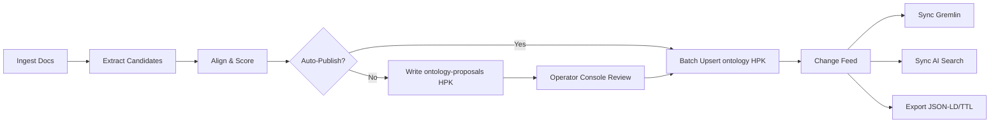

# LimboDancer.MCP — Ontology Implementation (Data‑First, Cosmos HPK)

> See also:
> - **MCP Tool Surface:** `_4. MCP tool surface for history/memory/graph (first useful tools).md`
> - **Architecture:** `LimboDancer.MCP — Architecture.md`
> - **Design Map:** `LimboDancer.MCP — Design Map.md`
> - **Vector Index:** `_2. Vector index for Azure AI Search (hybrid).md`
> - **Graph Scaffold:** `_3. Cosmos Gremlin graph scaffold.md`
> - **Persistence:** `_1. Persistence baseline (EF Core - Postgres).md.saved.md`


**Status:** Rewritten to reflect data‑first ontology, Cosmos DB (Core SQL API) as the authoritative store with **hierarchical partition keys (HPK)**, JSON as export/backup, and strongly‑typed .NET runtime.

---

## 1) Why data‑first

We expect frequent ontology evolution. Treating ontology as compiled C# constants couples changes to application rebuilds. A **data‑first** approach:

* makes ontology updates **transactional and governable** (proposals → review → publish),
* keeps the runtime **strongly typed** via POCOs + indexes,
* enables **RDF/JSON‑LD** export without code changes,
* supports **tenant/module** scoping and **versioned releases**.

---

## 2) Storage model (authoritative)

We use **Azure Cosmos DB (NoSQL/Core SQL API)** as the source of truth with **HPK**. JSON remains a deterministic export/backup bundle.

### 2.1 Containers

1. **`ontology`** — published ontology (read‑heavy, rare writes)

   * **HPK:** `/tenant` → `/package` → `/channel`
   * Typical values:

     * `tenant`: `"core"` (global) or a real tenant id.
     * `package`: module name (e.g., `"core"`, `"travel"`).
     * `channel`: `"current"` (live) or semantic version (e.g., `"v1.3.0"`).

2. **`ontology-proposals`** — proposals and change sets (write‑heavy)

   * **HPK:** `/tenant` → `/package` → `/changesetId`
   * Each generator/console session writes under one `changesetId` for atomic approve/rollback.

> Each batch publish or rollback uses a **single TransactionalBatch** per **full** HPK tuple.

### 2.2 Item shape (common fields)

```json
{
  "id": "ldm:Reservation@1.2.0",
  "type": "Entity|Property|Relation|Enum|Alias|Shape",
  "curie": "ldm:Reservation",
  "label": "Reservation",
  "status": "published|proposed|conflicted",
  "version": "1.2.0",
  "tenant": "core",
  "package": "travel",
  "channel": "current",
  "confidence": 0.97,
  "complexity": 0.35,
  "depth": 0.20,
  "provenance": [ { "uri": "file://docs/...", "retrievedAt": "2025-08-18T14:04:00Z" } ]
}
```

**Type‑specific fields:**

* **Entity**: `parents[]`
* **Property**: `owner`, `range`, `required`, `cardinality`
* **Relation**: `out`, `in`, `multiplicity`
* **Enum**: `owner`, `values[]`
* **Alias**: `canonical`, `aliases[]`, `locale?`
* **Shape**: `targetClass`, `constraints[]` (e.g., `{ "property": "ldm:status", "rule": "in", "args": ["Active","Canceled"] }`)

### 2.3 Indexing policy

Include fields we filter on: `/id`, `/type`, `/curie`, `/status`, `/version`, `/tenant`, `/package`, `/channel`, `/owner`, `/out`, `/in`.
Exclude heavy payloads: `/provenance/*`, `/data/*`.

---

## 3) Data contracts in .NET (runtime)

POCOs mirror stored JSON; no hard‑coded IDs. All artefacts carry governance scores.

```csharp
namespace LimboDancer.MCP.Ontology.Runtime;

public interface IScored
{
    double Confidence { get; }
    double Complexity { get; }
    double Depth { get; }
    string Status { get; } // proposed|published|conflicted
    string? Version { get; }
    IReadOnlyList<ProvenanceRef> Provenance { get; }
}

public sealed record ProvenanceRef(string Uri, DateTimeOffset? RetrievedAt = null, double? RetrievalScore = null);

public sealed record EntityDef(
    string Id,
    string? Label,
    IReadOnlyList<string> Parents,
    string Status,
    string? Version,
    double Confidence,
    double Complexity,
    double Depth,
    IReadOnlyList<ProvenanceRef> Provenance
) : IScored;

public sealed record PropertyDef(
    string Id,
    string? Label,
    string Owner,
    string Range,
    bool Required,
    string? Cardinality,
    string Status,
    string? Version,
    double Confidence,
    double Complexity,
    double Depth,
    IReadOnlyList<ProvenanceRef> Provenance
) : IScored;

public sealed record RelationDef(
    string Id,
    string? Label,
    string Out,
    string In,
    string Multiplicity,
    string Status,
    string? Version,
    double Confidence,
    double Complexity,
    double Depth,
    IReadOnlyList<ProvenanceRef> Provenance
) : IScored;

public sealed record EnumDef(
    string Id,
    string Owner,
    IReadOnlyList<string> Values,
    string Status,
    string? Version,
    double Confidence,
    double Complexity,
    double Depth,
    IReadOnlyList<ProvenanceRef> Provenance
) : IScored;

public sealed record AliasDef(
    string Canonical,
    IReadOnlyList<string> Aliases,
    string? Locale,
    string Status,
    double Confidence,
    double Complexity = 0,
    double Depth = 0,
    string? Version = null,
    IReadOnlyList<ProvenanceRef>? Provenance = null
) : IScored;

public sealed record ShapeConstraint(string Property, string Rule, IReadOnlyList<string>? Args = null);
public sealed record ShapeDef(string TargetClass, IReadOnlyList<ShapeConstraint> Constraints);
```

---

## 4) Cosmos repositories & HPK helpers

```csharp
using Microsoft.Azure.Cosmos;

namespace LimboDancer.MCP.Ontology.Runtime;

public sealed class CosmosOntologyRepo
{
    private readonly Container _ontology;
    private readonly Container _proposals;

    public CosmosOntologyRepo(Container ontology, Container proposals)
    { _ontology = ontology; _proposals = proposals; }

    // Point read (single logical partition via full HPK)
    public Task<ItemResponse<T>> ReadAsync<T>(string id, string tenant, string package, string channel)
        => _ontology.ReadItemAsync<T>(id, Hpk(tenant, package, channel));

    // Query helpers (scoped)
    public IAsyncEnumerable<T> QueryAsync<T>(string tenant, string package, string channel, string type)
    {
        var q = _ontology.GetItemQueryIterator<T>(
            new QueryDefinition("SELECT * FROM c WHERE c.tenant=@t AND c.package=@p AND c.channel=@ch AND c.type=@ty")
            .WithParameter("@t", tenant).WithParameter("@p", package)
            .WithParameter("@ch", channel).WithParameter("@ty", type),
            requestOptions: new QueryRequestOptions { PartitionKey = Hpk(tenant, package, channel) });
        return Enumerate(q);
    }

    // Batch publish (TransactionalBatch in one logical partition)
    public async Task PublishAsync(string tenant, string package, string channel, IEnumerable<object> items)
    {
        var batch = _ontology.CreateTransactionalBatch(Hpk(tenant, package, channel));
        foreach (var it in items) batch.UpsertItem(it);
        var resp = await batch.ExecuteAsync();
        if (!resp.IsSuccessStatusCode) throw new InvalidOperationException($"Publish failed: {resp.StatusCode}");
    }

    // Proposals are grouped by changesetId (3rd key)
    public async Task WriteProposalAsync(string tenant, string package, string changesetId, IEnumerable<object> items)
    {
        var batch = _proposals.CreateTransactionalBatch(Hpk(tenant, package, changesetId));
        foreach (var it in items) batch.UpsertItem(it);
        var resp = await batch.ExecuteAsync();
        if (!resp.IsSuccessStatusCode) throw new InvalidOperationException($"Proposal failed: {resp.StatusCode}");
    }

    private static PartitionKey Hpk(string a, string b, string c)
        => new PartitionKey(new PartitionKeyBuilder().Add(a).Add(b).Add(c).Build());

    private static async IAsyncEnumerable<T> Enumerate<T>(FeedIterator<T> it)
    {
        while (it.HasMoreResults)
            foreach (var item in await it.ReadNextAsync())
                yield return item;
    }
}
```

**Container creation (HPK):**

```csharp
var ontoProps = new ContainerProperties("ontology", new[] { "/tenant", "/package", "/channel" });
var propProps = new ContainerProperties("ontology-proposals", new[] { "/tenant", "/package", "/changesetId" });
await db.CreateContainerIfNotExistsAsync(ontoProps, throughput: 400);
await db.CreateContainerIfNotExistsAsync(propProps, throughput: 400);
```

---

## 5) In‑memory store, indexes, and validation

A fast, read‑optimized cache that the generator and services use.

```csharp
using System.Collections.Concurrent;

namespace LimboDancer.MCP.Ontology.Runtime;

public sealed class OntologyStore
{
    public IReadOnlyDictionary<string, EntityDef> Entities => _entities;
    public IReadOnlyDictionary<string, PropertyDef> Properties => _properties;
    public IReadOnlyDictionary<string, RelationDef> Relations => _relations;
    public IReadOnlyDictionary<string, EnumDef> Enums => _enums;
    public IReadOnlyDictionary<string, AliasDef> Aliases => _aliases;
    public IReadOnlyList<ShapeDef> Shapes => _shapes;

    private readonly Dictionary<string, EntityDef> _entities = new();
    private readonly Dictionary<string, PropertyDef> _properties = new();
    private readonly Dictionary<string, RelationDef> _relations = new();
    private readonly Dictionary<string, EnumDef> _enums = new();
    private readonly Dictionary<string, AliasDef> _aliases = new();
    private readonly List<ShapeDef> _shapes = new();

    private readonly Dictionary<string, List<PropertyDef>> _propsByOwner = new();
    private readonly Dictionary<string, List<RelationDef>> _relsByClass = new();
    private readonly Dictionary<string, HashSet<string>> _aliasIndex = new(StringComparer.OrdinalIgnoreCase);

    public static async Task<OntologyStore> LoadAsync(CosmosOntologyRepo repo, string tenant, string package, string channel)
    {
        var store = new OntologyStore();
        await foreach (var e in repo.QueryAsync<EntityDef>(tenant, package, channel, type: "Entity")) store._entities[e.Id] = e;
        await foreach (var p in repo.QueryAsync<PropertyDef>(tenant, package, channel, type: "Property")) store._properties[p.Id] = p;
        await foreach (var r in repo.QueryAsync<RelationDef>(tenant, package, channel, type: "Relation")) store._relations[r.Id] = r;
        await foreach (var en in repo.QueryAsync<EnumDef>(tenant, package, channel, type: "Enum")) store._enums[en.Id] = en;
        await foreach (var a in repo.QueryAsync<AliasDef>(tenant, package, channel, type: "Alias")) store._aliases[a.Canonical] = a;
        await foreach (var s in repo.QueryAsync<ShapeDef>(tenant, package, channel, type: "Shape")) store._shapes.Add(s);

        store.BuildIndexes();
        store.Validate();
        return store;
    }

    private void BuildIndexes()
    {
        foreach (var a in _aliases.Values)
            _aliasIndex[a.Canonical] = new HashSet<string>(a.Aliases.Append(a.Canonical), StringComparer.OrdinalIgnoreCase);

        foreach (var g in _properties.Values.GroupBy(p => p.Owner)) _propsByOwner[g.Key] = g.ToList();
        foreach (var g in _relations.Values.GroupBy(r => r.Out)) _relsByClass[g.Key] = g.ToList();
    }

    public IEnumerable<PropertyDef> GetPropertiesOf(string classCurie) => _propsByOwner.TryGetValue(classCurie, out var lst) ? lst : Enumerable.Empty<PropertyDef>();
    public IEnumerable<RelationDef> GetRelationsFrom(string classCurie) => _relsByClass.TryGetValue(classCurie, out var lst) ? lst : Enumerable.Empty<RelationDef>();

    public string Canonicalize(string nameOrAlias)
    {
        foreach (var (canon, set) in _aliasIndex)
            if (set.Contains(nameOrAlias)) return canon;
        return nameOrAlias;
    }

    private void Validate()
    {
        foreach (var p in _properties.Values)
        {
            if (!_entities.ContainsKey(p.Owner)) throw new InvalidOperationException($"Owner missing: {p.Owner}");
            if (!p.Range.StartsWith("xsd:") && !_entities.ContainsKey(p.Range))
                throw new InvalidOperationException($"Range missing: {p.Range}");
        }
        foreach (var r in _relations.Values)
        {
            if (!_entities.ContainsKey(r.Out) || !_entities.ContainsKey(r.In))
                throw new InvalidOperationException($"Relation endpoints missing: {r.Id}");
        }
        foreach (var s in _shapes)
        {
            foreach (var c in s.Constraints)
            {
                if (c.Rule == "required" && !_properties.Values.Any(p => p.Owner == s.TargetClass && p.Id == c.Property))
                    throw new InvalidOperationException($"Required property {c.Property} missing on {s.TargetClass}");
            }
        }
    }
}
```

---

## 6) RDF & JSON exports

Exports are generated from the **live `ontology` container** (or a frozen channel) to:

* `ontology.jsonld` — JSON‑LD with our prefixes/context
* `ontology.ttl` — compact Turtle
* `graph.schema.json` — vertices/edges manifest for Gremlin adapters

Create a reusable `RdfExportService` that:

* materializes an in‑memory context (`@context`) from your prefix map,
* emits class/property/edge triples for published items in a channel,
* signs the bundle (hash) and stores as a release artifact.

---

## 7) Change Feed

Attach a **Change Feed Processor** to the `ontology` container for events:

* **Synchronize** Gremlin schema and Azure AI Search indexes,
* **Notify** Operator Console (SSE) on ontology updates,
* **Regenerate** export bundles for channels that changed.

Minimal outline:

```csharp
ChangeFeedProcessor proc = _ontology.GetChangeFeedProcessorBuilder<dynamic>(
    processorName: "ontology-sync",
    onChangesDelegate: async (ctx, changes, ct) =>
    {
        foreach (var item in changes)
        {
            // route by item.type and status -> publish to downstreams
        }
    })
    .WithInstanceName(Environment.MachineName)
    .WithLeaseContainer(_leases)
    .Build();

await proc.StartAsync();
```

---

## 8) Governance & auto‑publish gates

We carry `confidence`, `complexity`, `depth` and evaluate:

* **Auto‑publish thresholds** (initial):

  * Alias 0.95, Enum 0.92, Relation 0.90, Property 0.90, Entity 0.92
* Modifiers: `+0.03` if `complexity > 0.6` or `depth > 0.6`; `−0.02` if spec‑anchored.
* Below threshold → **proposal queue** in `ontology-proposals`.

The Operator Console lists proposals, shows provenance snippets, and approves in batch (TransactionalBatch) into `ontology`.

---

## 9) CI/CD

* **Tests** (xUnit): schema coverage, referential checks, shape validation, export round‑trip.
* **Pipelines**:

  * PR: run tests, spin Cosmos emulator or dedicated account, validate change sets.
  * Tag `ontology/v*.*.*`: export JSON‑LD/TTL/manifest, attach to release; optionally seed `ontology` channel.
* **Backups**: signed JSON export per channel; can restore by seeding `ontology` with the same items.

---

## 10) Migration guide (from C# constants)

1. Export existing classes/properties/relations/enums/aliases into JSON items.
2. Seed `ontology` with HPK `(tenant="core", package="core", channel="current")`.
3. Replace code references to `Ldm.*` with lookups via `OntologyStore`.
4. Keep a **very thin** constants layer only if needed for ergonomic CURIEs (generated from data at build time).

---

## 11) Operational guidance

* Use **Session consistency** by default; raise if multi‑region strong reads are required.
* Keep items small (1–5 KB) and **index only** fields you query.
* Use **Autoscale RU/s** initially (low max) and raise during publish windows.
* Each full HPK tuple (logical partition) stays under \~20 GB (ontology datasets are typically much smaller); split by `package` or versioned `channel` if needed.

---

## 12) Example: end‑to‑end publish

1. Generator writes a proposal set to `ontology-proposals` under `(tenant, package, changesetId)`.
2. Reviewer approves in Console → service composes the canonical items and runs a **TransactionalBatch** upsert into `ontology` `(tenant, package, channel="current")`.
3. Change Feed reacts → Gremlin/AI Search sync → JSON‑LD/Turtle export regenerated.

---

## 13) Mermaid (component flow)



---

## 14) AppSettings (example)

```json
{
  "Cosmos": {
    "AccountEndpoint": "https://<account>.documents.azure.com:443/",
    "AccountKey": "<secret>",
    "Database": "ldm",
    "Containers": {
      "Ontology": "ontology",
      "Proposals": "ontology-proposals",
      "Leases": "leases"
    }
  }
}
```

```csharp
var client = new CosmosClient(cfg["Cosmos:AccountEndpoint"], cfg["Cosmos:AccountKey"]);
var db = client.GetDatabase(cfg["Cosmos:Database"]);
var ontology = db.GetContainer(cfg["Cosmos:Containers:Ontology"]);
var proposals = db.GetContainer(cfg["Cosmos:Containers:Proposals"]);
var repo = new CosmosOntologyRepo(ontology, proposals);
var store = await OntologyStore.LoadAsync(repo, tenant: "core", package: "core", channel: "current");
```

---

### Summary

* **Authoritative** ontology lives in Cosmos DB (NoSQL) with **HPK** for safe atomic releases and scalable tenants/modules.
* **Runtime** uses POCOs + `OntologyStore` for fast lookups and validation.
* **Governance** flows through proposals → review → batch publish, with Change Feed driving sync and exports.
* **JSON** remains an **export/backup**; **RDF** (JSON‑LD/Turtle) is generated from the live store.


---

## Appendix A: Previous C# Ontology example:  
**This is now ported to CosmosDB**
```csharp
// File: /src/LimboDancer.MCP.Ontology/Ontology.cs
// Purpose: Starter ontology surface for LimboDancer.MCP (URIs, CURIEs, JSON-LD context, typed enums, and minimal governance models).
// Notes: This is intentionally small and mechanical. Extend alongside docs/Ontology.md (Milestone 4+).

using System;
using System.Collections.Generic;
using System.Text.Json;
using System.Text.Json.Serialization;

namespace LimboDancer.MCP.Ontology
{
    /// <summary>
    /// Canonical CURIEs and URIs for the LimboDancer ontology.
    /// Keep these constants in lockstep with docs/Ontology.md.
    /// </summary>
    public static class Ldm
    {
        public const string Prefix = "ldm";
        public const string Namespace = "https://limbodancer.ai/ontology/";

        public static class Classes
        {
            public const string Person         = $"{Prefix}:Person";
            public const string Trip           = $"{Prefix}:Trip";
            public const string Reservation    = $"{Prefix}:Reservation";
            public const string Flight         = $"{Prefix}:Flight";
            public const string PaymentMethod  = $"{Prefix}:PaymentMethod";
            public const string Session        = $"{Prefix}:Session";
            public const string Message        = $"{Prefix}:Message";
            public const string MemoryItem     = $"{Prefix}:MemoryItem";
            public const string Tool           = $"{Prefix}:Tool";
            public const string Skill          = $"{Prefix}:Skill";
            public const string State          = $"{Prefix}:State"; // e.g., Canceled, Active
        }

        public static class Properties
        {
            public const string Owns                 = $"{Prefix}:owns";            // Person -> Reservation
            public const string ForTrip              = $"{Prefix}:forTrip";         // Reservation -> Trip
            public const string FliesOn              = $"{Prefix}:fliesOn";         // Reservation -> Flight
            public const string PaidWith             = $"{Prefix}:paidWith";        // Reservation -> PaymentMethod
            public const string HasMessage           = $"{Prefix}:hasMessage";      // Session -> Message
            public const string References           = $"{Prefix}:references";      // Message -> MemoryItem
            public const string Requires             = $"{Prefix}:requires";        // Tool -> Skill
            public const string Produces             = $"{Prefix}:produces";        // Tool -> Entity changed/created
            public const string Status               = $"{Prefix}:status";          // Generic status property
            public const string Kind                 = $"{Prefix}:kind";            // MemoryItem kind
            public const string Label                = $"{Prefix}:label";           // Optional human label
        }

        /// <summary>
        /// Expand ldm:* CURIE to absolute URI.
        /// </summary>
        public static Uri Expand(string curie)
        {
            if (string.IsNullOrWhiteSpace(curie)) throw new ArgumentNullException(nameof(curie));
            if (!curie.StartsWith($"{Prefix}:", StringComparison.Ordinal)) return new Uri(curie, UriKind.Absolute);
            var local = curie[(Prefix.Length + 1)..];
            return new Uri(Namespace + local);
        }

        /// <summary>
        /// Try to compact an absolute URI back to ldm:* CURIE.
        /// Returns input if not under the ldm namespace.
        /// </summary>
        public static string Compact(Uri uri)
        {
            var s = uri?.ToString() ?? string.Empty;
            return s.StartsWith(Namespace, StringComparison.Ordinal)
                ? $"{Prefix}:{s.Substring(Namespace.Length)}"
                : s;
        }
    }

    /// <summary>
    /// JSON-LD context materialized as a JsonDocument for embedding in tool schemas or payloads.
    /// </summary>
    public static class JsonLdContext
    {
        /// <summary>
        /// Returns a canonical JSON-LD context object as a JSON string.
        /// </summary>
        public static string GetContextJson()
        {
            var ctx = new Dictionary<string, object?>
            {
                ["@context"] = new Dictionary<string, object?>
                {
                    [Ldm.Prefix] = Ldm.Namespace,

                    // Classes
                    ["Person"]        = Ldm.Classes.Person,
                    ["Trip"]          = Ldm.Classes.Trip,
                    ["Reservation"]   = Ldm.Classes.Reservation,
                    ["Flight"]        = Ldm.Classes.Flight,
                    ["PaymentMethod"] = Ldm.Classes.PaymentMethod,
                    ["Session"]       = Ldm.Classes.Session,
                    ["Message"]       = Ldm.Classes.Message,
                    ["MemoryItem"]    = Ldm.Classes.MemoryItem,
                    ["Tool"]          = Ldm.Classes.Tool,
                    ["Skill"]         = Ldm.Classes.Skill,
                    ["State"]         = Ldm.Classes.State,

                    // Properties
                    ["owns"]           = Ldm.Properties.Owns,
                    ["forTrip"]        = Ldm.Properties.ForTrip,
                    ["fliesOn"]        = Ldm.Properties.FliesOn,
                    ["paidWith"]       = Ldm.Properties.PaidWith,
                    ["hasMessage"]     = Ldm.Properties.HasMessage,
                    ["references"]     = Ldm.Properties.References,
                    ["requires"]       = Ldm.Properties.Requires,
                    ["produces"]       = Ldm.Properties.Produces,
                    ["status"]         = Ldm.Properties.Status,
                    ["kind"]           = Ldm.Properties.Kind,
                    ["label"]          = Ldm.Properties.Label
                }
            };

            return JsonSerializer.Serialize(ctx, new JsonSerializerOptions { WriteIndented = true });
        }

        /// <summary>
        /// Create a JsonDocument ready to embed (for APIs that want a parsed instance).
        /// </summary>
        public static JsonDocument GetContextDocument()
            => JsonDocument.Parse(GetContextJson());
    }

    /// <summary>
    /// Memory kinds as used in docs/Architecture.md ER diagram and Roadmap.
    /// Serialized as strings via System.Text.Json.
    /// </summary>
    [JsonConverter(typeof(JsonStringEnumConverter))]
    public enum MemoryKind
    {
        Vector,
        Graph,
        Reasoning
    }

    /// <summary>
    /// Minimal model for a tool schema binding to ontology. Keep this alongside your MCP tool definitions.
    /// </summary>
    public sealed class ToolSchemaBinding
    {
        public required string Name { get; init; }                       // e.g., cancelReservation
        public required Dictionary<string, ToolField> Input { get; init; } = new(); // name -> field
        public Dictionary<string, ToolField>? Output { get; init; }      // optional

        public List<ToolPrecondition> Preconditions { get; init; } = new();
        public List<ToolEffect> Effects { get; init; } = new();
        public string? JsonLdContext { get; init; } = JsonLdContext.GetContextJson();
    }
    
    //**MCP Integration Note:** All MCP tool `input_schema` fields should include `@id` values that reference `ldm:*` CURIEs from this file (see `Ldm` constants) and merge the JSON-LD `@context` from `JsonLdContext.GetContextJson()` directly into the tool schema object.


    public sealed class ToolField
    {
        /// <summary>JSON Schema "type" (string, integer, object, array, etc.).</summary>
        public required string Type { get; init; }

        /// <summary>Ontology CURIE or absolute URI (e.g., ldm:Reservation).</summary>
        public required string OntologyId { get; init; }

        /// <summary>Optional human label.</summary>
        public string? Label { get; init; }

        /// <summary>Optional "required" flag (defaults handled by the tool schema itself).</summary>
        public bool? Required { get; init; }
    }

    /// <summary>
    /// A simple, explicit precondition that can be evaluated against the KG.
    /// For richer logic, extend with expression trees or query templates.
    /// </summary>
    public sealed class ToolPrecondition
    {
        /// <summary>Ontology class or property this precondition refers to (CURIE or absolute URI).</summary>
        public required string Subject { get; init; } // e.g., ldm:Reservation

        /// <summary>Predicate identifier (CURIE or absolute URI). When null, implies "exists".</summary>
        public string? Predicate { get; init; } // e.g., ldm:status

        /// <summary>Expected value (string-typed for portability).</summary>
        public string? Equals { get; init; } // e.g., "Active"

        /// <summary>Optional textual description for audits.</summary>
        public string? Description { get; init; }
    }

    /// <summary>
    /// Declarative effect (state transition) to commit to KG or relational store post tool success.
    /// </summary>
    public sealed class ToolEffect
    {
        /// <summary>Target ontology subject (class or instance type).</summary>
        public required string Subject { get; init; } // e.g., ldm:Reservation

        /// <summary>Property to update (CURIE or absolute URI).</summary>
        public required string Property { get; init; } // e.g., ldm:status

        /// <summary>New value as string; adapters may coerce types as needed.</summary>
        public required string NewValue { get; init; } // e.g., "Canceled"

        /// <summary>Optional label for UX or audit trails.</summary>
        public string? Label { get; init; }
    }

    /// <summary>
    /// Minimal KG primitives for Cosmos Gremlin usage.
    /// These are just labels and field keys you can reuse in the graph adapter.
    /// </summary>
    public static class Kg
    {
        public static class Labels
        {
            // Vertex labels
            public const string Person         = "Person";
            public const string Trip           = "Trip";
            public const string Reservation    = "Reservation";
            public const string Flight         = "Flight";
            public const string PaymentMethod  = "PaymentMethod";
            public const string Session        = "Session";
            public const string Message        = "Message";
            public const string MemoryItem     = "MemoryItem";
            public const string Tool           = "Tool";
            public const string Skill          = "Skill";
            public const string State          = "State";

            // Edge labels (mirror ontology property local names)
            public const string Owns           = "owns";
            public const string ForTrip        = "forTrip";
            public const string FliesOn        = "fliesOn";
            public const string PaidWith       = "paidWith";
            public const string HasMessage     = "hasMessage";
            public const string References     = "references";
            public const string Requires       = "requires";
            public const string Produces       = "produces";
        }

        public static class Fields
        {
            public const string Id        = "id";        // graph id
            public const string Curie     = "curie";     // ldm:* identifier when applicable
            public const string Uri       = "uri";       // absolute URI
            public const string Label     = "label";     // human-readable label
            public const string Status    = "status";    // e.g., Active, Canceled
            public const string Kind      = "kind";      // MemoryItem kind
        }
    }
}  
```